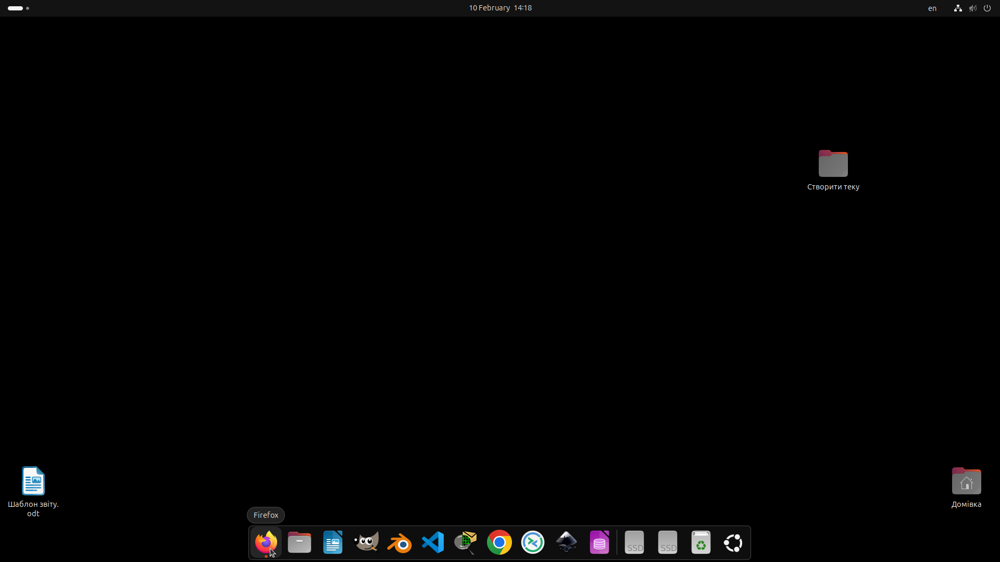
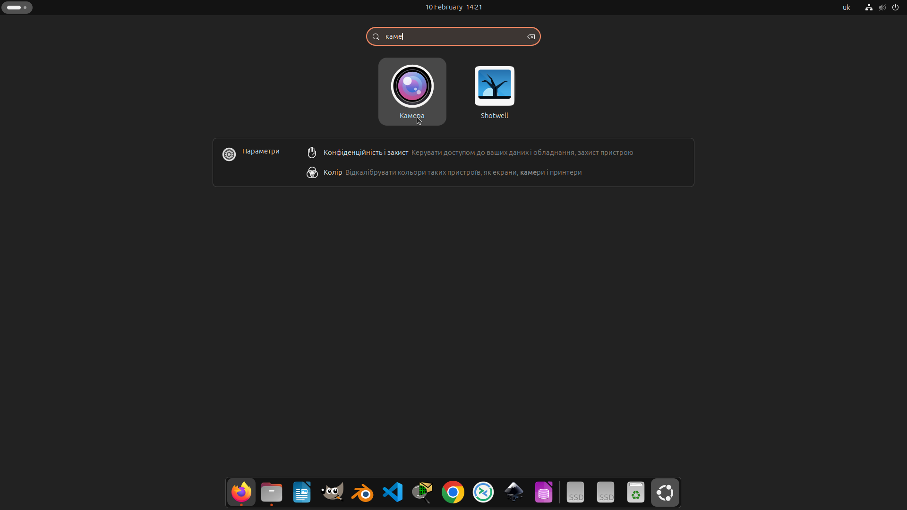
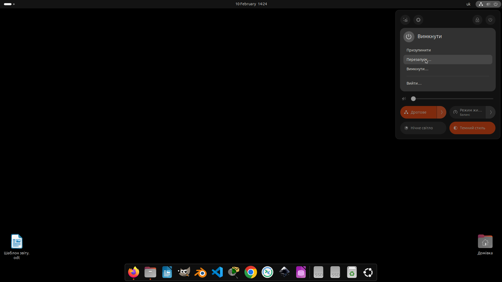
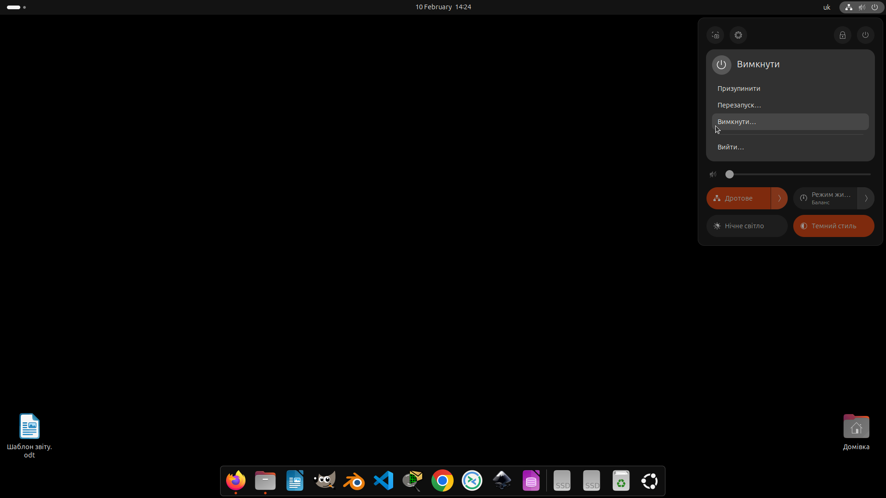

# Лабораторна робота №2
## Дисципліна: Операційні системи
## Тема: “Знайомство з інтерфейсом та можливостями ОС Linux”
### Виконав: студент групи РПЗ-33, Руденко Дмитро

---

### Мета роботи:
1. Знайомство з інтерфейсами ОС Linux.  
2. Отримання практичних навиків роботи в середовищах ОС Linux та мобільної ОС – їх графічною оболонкою, входом і виходом з системи, ознайомлення зі структурою робочого столу, вивчення основних дій та налаштувань при роботі в системі.

### Матеріальне забезпечення занять:  
1. ЕОМ типу IBM PC.  
2. ОС сімейства Windows та віртуальна машина Virtual Box (Oracle).  
3. ОС GNU/Linux (будь-який дистрибутив).  
4. Сайт мережевої академії Cisco netacad.com та його онлайн курси по Linux.

### Завдання для попередньої підготовки.   
**1.** ***Прочитайте короткі теоретичні відомості до лабораторної роботи та зробіть невеликий словник базових англійських термінів з питань призначення команд та їх параметрів.**

_Словник базових англійських термінів_

| № | Слово | Пояснення |
| :--- | :--- | :--- |
| 1 | **Command Line Interface (CLI)** | Інтерфейс командного рядка; текстова система для введення команд та керування комп'ютером |  
| 2 | **Kernel** | Ядро; центральна частина ОС, яка керує ресурсами, пам'яттю та процесами |  
| 3 | **Process** | Процес; окреме завдання або запущена програма, яку відстежує ядро |  
| 4 | **Multitasking** | Багатозадачність; здатність ОС перемикатися між завданнями, створюючи ілюзію одночасної роботи |  
| 5 | **Desktop Application** | Настільний додаток; ПЗ, з яким користувач взаємодіє безпосередньо через інтерфейс (браузери, плеєри) |  
| 6 | **Server Application** | Серверний додаток; ПЗ для обробки даних або надання інформації іншим комп'ютерам (клієнтам) |  
| 7 | **Compiler** | Компілятор; інструмент, що перетворює вихідний код у виконувану програму |  
| 8 | **Resource Allocation** | Розподіл ресурсів; процес виділення ядром пам'яті, процесорного часу та дискового простору |  
| 9 | **Terminal / X-term** | Термінал; програма, що емулює вікно консолі в графічному середовищі |  
| 10 | **Source Code** | Вихідний код; текст програми, написаний людиночитаною мовою програмування |  
| 11 | **Application Programming Interface (API)** | Програмний інтерфейс додатків; набір правил, за якими додатки звертаються до ядра за ресурсами |  
| 12 | **Network File Share** | Мережевий спільний ресурс; доступ до файлів, що зберігаються на іншому комп'ютері через мережу |  

**2. Вивчіть матеріали онлайн-курсу академії Cisco “NDG Linux Essentials”:**

&nbsp;&nbsp;&nbsp;- Chapter 3 - Working in Linux  
&nbsp;&nbsp;&nbsp;- Chapter 4 - Open Source Software and Licensing

**3. Пройдіть тестування у курсі 	NDG Linux Essentials за такими темами:**

&nbsp;&nbsp;&nbsp;- Chapter 03 Exam  
&nbsp;&nbsp;&nbsp;- Chapter 04 Exam  

 
  
**4.** ****Дайте визначення наступним поняттям:**

&nbsp;&nbsp;&nbsp;- CLI-режим  

<blockquote>
  
**CLI-режим (Command Line Interface)** - це інтерфейс командного рядка; текстова система введення даних, яка використовується для керування комп’ютером шляхом написання команд (від простих слів до складних скриптів). На відміну від графічного інтерфейсу, де використовується миша, CLI передбачає пряму взаємодію з системою через текст.

</blockquote>

&nbsp;&nbsp;&nbsp;- Термінал на основі графічного інтерфейсу користувача 

<blockquote>
  
**Термінал на основі графічного інтерфейсу (GUI-based Terminal)** - це спеціальна програма (емулятор), яка запускається всередині графічного середовища (наприклад, GNOME або KDE). Вона створює вікно, що імітує роботу класичного термінала. Це дозволяє користувачеві одночасно бачити робочий стіл, відкриті вікна браузера та використовувати командний рядок. Прикладами є GNOME Terminal, Konsole або Xterm.
  
</blockquote>

&nbsp;&nbsp;&nbsp;- Віртуальний термінал

<blockquote>

**Віртуальний термінал (Virtual Terminal)** - це повноекранний текстовий режим роботи, який працює паралельно з графічним інтерфейсом, але незалежно від нього. Він не потребує графічної оболонки для своєї роботи. У Linux зазвичай існує кілька таких терміналів (доступ до них часто здійснюється через комбінації клавіш Ctrl+Alt+F1...F6). Перед початком роботи у віртуальному терміналі користувач обов'язково має пройти процедуру авторизації (ввести логін і пароль).

</blockquote>

## Хід роботи

**1. Робота в графічному режимі в ОС сімейства Linux (робота з інтернет-джерелами):**

<blockquote>
  
**1.1. Оберіть графічну оболонку для ОС сімейства Linux, яку  ви хочете розглянути (в 401 ауд. це Gnome). Розгляньте структуру робочого простору користувача, та опишіть основні його компоненти:**  

&nbsp;&nbsp;&nbsp;**- Основне меню** 

<blockquote>
  
В GNOME доступ до основного списку програм здійснюється через кнопку з дев'ятьма крапками (сітка) на панелі Dash. Коли ми натискаємо цю кнопку, весь робочий простір заповнюється іконками встановлених програм, які можна об’єднувати в папки, просто перетягуючи одну іконку на іншу. Ви можете змінювати порядок програм вручну, щоб найважливіші були на першій сторінці. Як тільки ви відкриваєте це меню і починаєте друкувати назву програми, інтерфейс миттєво фільтрує іконки, залишаючи лише ті, що відповідають запиту.

</blockquote>
  
&nbsp;&nbsp;&nbsp;**- Панелі швидкого доступу**

<blockquote>
  
Коли відкриваємо "Activities", знизу (або збоку) з'являється панель з іконками. Тут закріплені улюблені додатки (браузер, термінал, файловий менеджер) та відображаються ті, що запущені зараз. Кнопка «Показати додатки» відкриває повний список усіх встановлених програм (аналог меню «Пуск»).

</blockquote>

&nbsp;&nbsp;&nbsp;**- Пошук**

<blockquote>
  
Пошуковий рядок з'являється автоматично, як тільки натискаємо клавішу Windows і починаємо щось друкувати. Він шукає не тільки програми, а й файли, налаштування, контакти та навіть виконує прості математичні розрахунки. Це найшвидший спосіб запустити будь-який інструмент.

</blockquote>

&nbsp;&nbsp;&nbsp;**- Доступ до нових робочих столів**

<blockquote>
  
У верхній частині екрана огляду (Activities) відображаються мініатюри робочих столів. GNOME використовує динамічні робочі столи. Як тільки ти займаєш останній вільний стіл, система автоматично створює новий. Це дозволяє зручно групувати завдання (наприклад, на одному столі — термінал і код, на іншому — документація в браузері).

</blockquote>

&nbsp;&nbsp;&nbsp;**- Верхня панель**

<blockquote>
  
Натиснувши на дату/час по центру, можна побачити календар та список системних сповіщень. В правому куті (System Menu) знаходяться швидкі налаштування: Wi-Fi, гучність, яскравість, стан батареї та кнопки вимкнення/перезавантаження.

</blockquote>

&nbsp;&nbsp;&nbsp;**- Огляд діяльності**

<blockquote>
  
Отримати до нього доступ можна, натиснувши кнопку Activities у верхньому лівому куті або клавішу Windows на клавіатурі. Тут відображаються всі запущені вікна та робочі столи.

</blockquote>

 

**1.2.** ***Запуск програм. Дослідіть можливості запуску додатків різними способами (описати спосіб і по-можливості показати скріншоти):**

&nbsp;&nbsp;&nbsp;**- Запуск програм через панель швидкого запуску**

<blockquote>

На скріншоті ми бачимо панель Dash, яка в цій конфігурації GNOME розташована в нижній частині екрана. Це найшвидший спосіб доступу до програм, якими ми користуємося найчастіше. Користувач просто натискає лівою кнопкою миші на іконку потрібної програми на панелі. На скріншоті курсор наведений на браузер Firefox. Тут зазвичай закріплені основні інструменти (браузер, файловий менеджер, VS Code, термінал тощо). Якщо програма вже запущена, під її іконкою з'являється індикатор (крапка). Будь-яку програму можна додати на цю панель або видалити з неї, натиснувши на іконку правою кнопкою миші та обравши відповідний пункт.

</blockquote>

&nbsp;&nbsp;&nbsp;**- Запуск програм через пошук в меню / глобальне меню**

<blockquote>

На скріншоті продемонстровано роботу інтелектуального пошуку GNOME, який є найшвидшим способом запуску програм, що не закріплені на панелі швидкого доступу. Користувач натискає клавішу Windows або кнопку Activities і просто починає друкувати назву програми. На скріншоті ми бачимо введене слово «каме», і система миттєво відфільтрувала результати, пропонуючи не лише відповідну програму (застосунок «Камера»), а й суміжні інструменти (Shotwell) та навіть специфічні розділи системних параметрів (Конфіденційність, Колір).
Цей пошук є глобальним — він дозволяє знаходити не лише софт, а й файли або налаштування системи без необхідності вручну переглядати всі списки меню.

</blockquote>

&nbsp;&nbsp;&nbsp;**- Запуск програм через віджет запуску**

<blockquote>

На скріншоті зображено режим Activities Overview (Огляд діяльності), який активується натисканням клавіші Windows або переміщенням курсора у верхній лівий кут екрана. У цьому режимі система відображає всі відкриті вікна і панель додатків одночасно. Користувач може запустити нову програму, вибравши її з панелі Dash внизу, або переключитися на вже запущену програму, просто натиснувши на її зменшене вікно. Цей віджет дозволяє не лише запускати софт, а й зручно керувати багатозадачністю — наприклад, перетягувати вікна між різними робочими столами, які видно на задньому плані. На скріншоті бачимо спливаючу підказку «Нещодавнє» при наведенні на іконку провідника, що допомагає користувачеві орієнтуватися у функціях додатків ще до їх відкриття.
  
</blockquote>

**1.3.** ***Вихід з системи та завершення роботи в Linux. Як виконати в графічному інтерфейсі наступні дії (наведіть скріни):**

&nbsp;&nbsp;&nbsp;**- Зміна користувача на root**

<blockquote>

На скріншоті показано системне меню, яке викликається натисканням на групу іконок (мережа, звук, акумулятор) у верхньому правому куті екрана. Для того, щоб змінити поточного користувача на root (або іншого), необхідно натиснути на кнопку живлення в меню, що розгорнулося, і обрати пункт «Вийти...» (Log Out), на який наведено курсор на скріншоті. Після підтвердження виходу система поверне тебе до екрана входу (GDM — GNOME Display Manager). На екрані входу зазвичай відображається список звичайних користувачів. Щоб увійти як root, потрібно обрати варіант «Not listed?» (Немає у списку?) та вручну ввести логін root і відповідний пароль. У багатьох сучасних дистрибутивах Linux (як-от Ubuntu чи Fedora) прямий вхід у графічну оболонку під користувачем root заблокований з міркувань безпеки. У такому разі для виконання адміністративних дій під root краще використовувати термінал та команду sudo.
  
</blockquote>

&nbsp;&nbsp;&nbsp;**- Перезавантаження системи**

<blockquote>

На скріншоті продемонстровано використання системного меню для виконання перезапуску комп'ютера. Спочатку необхідно відкрити системне меню у правому верхньому куті екрана. У меню, що з'явилося, потрібно натиснути на головну кнопку живлення (іконка з написом «Вимкнути»). Відкриється підменю з варіантами завершення сеансу. На скріншоті курсор наведений на пункт «Перезапуск...» (Restart). Після натискання система виведе фінальне вікно підтвердження з 60-секундним таймером. Якщо натиснути кнопку «Перезапустити» повторно, комп'ютер негайно закриє всі програми та почне процес перезавантаження.
  
</blockquote>

&nbsp;&nbsp;&nbsp;**- Вимкнення системи**

<blockquote>

На скріншоті показано завершальний етап роботи з комп'ютером — повне вимкнення живлення через графічний інтерфейс. Користувач відкриває системне меню у верхньому правому куті, натискає на розгорнутий список керування живленням і вибирає пункт «Вимкнути...» (Power Off).
Після натискання з’явиться системне діалогове вікно, яке запропонує вимкнути комп’ютер негайно або зачекати 60 секунд (автоматичне вимкнення). Це запобігає випадковому вимкненню та дає час повернутися до роботи, якщо кнопка була натиснута помилково. Під час цієї процедури ядро Linux надсилає сигнал усім запущеним процесам для коректного завершення роботи та збереження даних на диск, після чого живлення апаратних компонентів припиняється.
  
</blockquote>

</blockquote>

**2.** ***Робота в середовищі мобільної ОС.**

<blockquote>

**2.1. Опишіть головне меню вашої мобільної ОС, який графічний інтерфейс вона використовує?**

Пристрій використовує оболонку HyperOS, яка базується на Android. Вона вирізняється сучасним "скляним" дизайном (blur ефекти), великими закругленими іконками та розвиненою системою віджетів. На скріншоті ми бачимо робочий стіл із сіткою додатків. Внизу розташована панель із найважливішими програмами (Телефон, Повідомлення, Камера, Налаштування). У верхній частині екрана відображається статусний рядок (час, мережа (4G+), заряд батареї). По центру розташований пошуковий віджет Google.

**2.2. Опишіть меню налаштувань компонентів мобільного телефону.**

На скріншоті видно структуру налаштувань (Settings). Розділ "Про телефон" використовується для перевірки версії ОС та технічних характеристик. Керування Wi-Fi, Bluetooth та мобільним інтернетом винесено в окремий блок для швидкого доступу. Налаштування екрана блокування та сповіщень дозволяють адаптувати інтерфейс під себе. Зверху є рядок "Search settings", що дозволяє миттєво знайти потрібний параметр за ключовим словом.

**2.3. Використання комбінацій клавіш для виконання спеціальних дій.**

Хоча інтерфейс сенсорний, використовуються комбінації фізичних клавіш, як от скріншот (одночасне натискання клавіші "Гучність вниз" + "Живлення" (або жест трьома пальцями вниз по екрану). Примусове перезавантаження відбудеться, якщо здійснити тривале затискання кнопки живлення (більше 10 секунд). На подвійне натискання кнопки живлення можна налаштувати швидкий запуск камери, ліхтарик та інші функції у налаштуваннях в розділі "Спеціальні можливості". 

**2.4. Вхід у систему та завершення роботи пристрою. Особливості налаштувань живлення батареї.**

Вхід у систему здійснюється через екран блокування за допомогою біометрії (відбиток пальця, розпізнавання обличчя) або графічного ключа/PIN-коду. На скріншоті видно меню живлення. Воно реалізоване у вигляді вертикального слайдера: рух вгору — Power off (вимкнення), рух вниз — Reboot (перезавантаження). В системі є розділ "Battery", де можна увімкнути режим економії енергії (Battery saver) або "Ультра-економію", яка вимикає всі фонові процеси, залишаючи лише базові функції зв'язку. Також система аналізує використання батареї кожним додатком.

</blockquote>

