# Лабораторна робота №3
## Дисципліна: Операційні системи
## Тема: “Знайомство з базовими командами CLI-режиму в Linux”
### Виконав: студент групи РПЗ-33, Руденко Дмитро

---

### Мета роботи:
1. Знайомство з базовими командами CLI-режиму в Linux.  
2. Знайомство з базовими текстовими командами в термінальному режимі роботи в різних ОС.  

### Матеріальне забезпечення занять:  
1. ЕОМ типу IBM PC.  
2. ОС сімейства Windows та віртуальна машина Virtual Box (Oracle).  
3. ОС GNU/Linux (будь-який дистрибутив).  
4. Сайт мережевої академії Cisco netacad.com та його онлайн курси по Linux.  

### Завдання для попередньої підготовки.

**1.** ***Прочитайте короткі теоретичні відомості до лабораторної роботи та зробіть невеликий словник базових англійських термінів з питань призначення команд та їх параметрів.**

_Словник базових англійських термінів_

| № | Слово | Пояснення |
| :--- | :--- | :--- |
| 1 | **The Shell** | Оболонка — командний інтерпретатор, який перекладає команди, введені користувачем, у конкретні дії, що виконуються операційною системою |
| 2 | **CLI (Command Line Interface)** | Інтерфейс командного рядка — текстовий інтерфейс для взаємодії з комп'ютером, який забезпечує точне керування, високу швидкість та можливість автоматизації завдань |
| 3 | **Terminal** | Термінал — програмне середовище або вікно, яке приймає текстове введення від користувача та передає його до оболонки для подальшої обробки |
| 4 | **Command line interpreter** | Інтерпретатор командного рядка — програма (оболонка), яка читає введені текстові рядки, аналізує їх та викликає відповідні системні функції |
| 5 | **Prompt** | Рядок запиту (запрошення) — візуальний індикатор у терміналі (наприклад, знак $ або #), який повідомляє користувачу, що система готова до прийняття нової команди |
| 6 | **Command line history** | Історія командного рядка — функція оболонки, яка зберігає список раніше виконаних команд для їх швидкого пошуку та повторного використання |
| 7 | **Inline editing** | Вбудоване редагування — можливість змінювати, коригувати або доповнювати текст команди безпосередньо в рядку введення перед тим, як вона буде відправлена на виконання |
| 8 | **Scripting** | Скриптинг — процес написання послідовності команд у текстовий файл для їх автоматичного виконання оболонкою як єдиного цілого (автоматизація) |
| 9 | **Alias** | Псевдонім — можливість створювати короткі власні назви або «нікнейми» для довгих і складних команд з метою значного пришвидшення роботи користувача |
| 10 | **Argument** | Аргумент — додаткова інформація, що передається команді (наприклад, ім’я конкретного файлу або шлях до директорії), над якою повинна бути виконана дія |
| 11 | **Option (Parameter/Flag)** | Параметр (Опція або Прапорець) — спеціальний ключ (зазвичай починається з дефісу), який змінює або уточнює стандартну поведінку команди під час її виконання |
| 12 | **Manual page (man page)** | Сторінка посібника — вбудована електронна документація в Linux, яка містить детальний опис призначення команди, її повного синтаксису та всіх доступних параметрів |

 

**2. Вивчіть матеріали онлайн-курсу академії Cisco “NDG Linux Essentials”:**

&nbsp;&nbsp;&nbsp;- Chapter 5 - Command Line Skills  
&nbsp;&nbsp;&nbsp;- Chapter 6 - Getting Help

**3. Пройдіть тестування у курсі NDG Linux Essentials за такими темами:**

&nbsp;&nbsp;&nbsp;- Chapter 05 Exam  
&nbsp;&nbsp;&nbsp;- Chapter 06 Exam

 
  
**4.** ***Дайте визначення наступним поняттям:**

&nbsp;&nbsp;&nbsp;- Командний інтерпретатор

<blockquote>

**Командний інтерпретатор** - це спеціальна програма, головним завданням якої є зчитування введених користувачем текстових рядків, їх аналіз та перетворення на конкретні системні функції або дії, 
які має виконати операційна система. Інтерпретатор працює в циклі: чекає на введення, обробляє запит, виконує дію та знову виводить рядок запрошення (prompt).

</blockquote>

&nbsp;&nbsp;&nbsp;- Оболонка

<blockquote>

**Оболонка (Shell)** - це програмний шар, який слугує посередником (інтерфейсом) між користувачем і ядром операційної системи. Вона «огортає» ядро, захищаючи його від прямого доступу та надаючи користувачеві 
зручний спосіб керування ресурсами комп'ютера. Оболонки можуть бути графічними (GUI) або текстовими (CLI). У системах Linux найпоширенішою текстовою оболонкою є Bash.

</blockquote>

&nbsp;&nbsp;&nbsp;- Команда

<blockquote>

**Команда** - це конкретна вказівка або інструкція, яку користувач вводить у терміналі, щоб змусити комп'ютер виконати певну задачу. У середовищі Linux стандартна команда зазвичай має чітку структуру:

- Ім’я команди — назва програми, яку потрібно запустити (наприклад, ls).  
- Параметри (Опції/Прапорці) — ключі, що змінюють або уточнюють поведінку команди (наприклад, -l).  
- Аргументи — об’єкти, над якими виконується дія (наприклад, шлях до папки або ім’я файлу).

</blockquote>

 

**5.** ****Дайте відповіді на наступні питання:**

&nbsp;&nbsp;&nbsp;- Яку базову інформацію надає рядок запрошення prompt?

<blockquote>

**Рядок запрошення (prompt)** — це візуальний індикатор, який повідомляє, що оболонка готова до прийняття команди. Зазвичай він містить:

- Ім'я користувача (наприклад, centos або root).  
- Ім'я хоста (назва комп'ютера, наприклад, localhost).  
- Поточну директорію (наприклад, Desktop або символ ~ для домашньої папки).  
- Статус привілеїв: символ $ означає звичайного користувача, а # — суперкористувача (адміністратора).  

</blockquote>

&nbsp;&nbsp;&nbsp;- Для чого команді потрібні параметри та аргументи?

<blockquote>

**Аргументи** вказують на об'єкт, над яким потрібно виконати дію (наприклад, назва файлу, який треба прочитати, або шлях до папки).
**Параметри** потрібні для зміни або уточнення стандартної поведінки команди. Вони зазвичай починаються з дефісу (наприклад, -l).

</blockquote>

&nbsp;&nbsp;&nbsp;- Яке призначення команд ls, які параметри та аргументи вона може мати? Наведіть 3 приклади. 

<blockquote>

Команда **ls (list)** призначена для перегляду вмісту директорій. До прикладів параметрів можна віднести -l (детальний формат), -a (показувати приховані файли), -R (рекурсивний показ підпапок).
А до приклади аргументів - конкретний шлях до папки (наприклад, /etc).

Розглянемо 3 приклади використання:

- _ls -l_ — вивести вміст поточної папки у вигляді детального списку (права доступу, власник, розмір).

- _ls -a_ — показати всі файли, включаючи приховані (ті, що починаються з крапки).

- _ls /home_ — вивести вміст конкретної директорії /home.

</blockquote>

&nbsp;&nbsp;&nbsp;- Яким чином можна використати історію команд, які переваги це надає?

<blockquote>

Історію можна використати за допомогою команди history або клавіш навігації (стрілки вгору/вниз). Також існують швидкі виклики, наприклад !! (повтор останньої команди) або !-5 (повтор команди, що була 5 кроків тому).
Серед переваг варто виокремити швидкість (не потрібно вводити довгі команди заново), точність (зменшується ризик помилок при повторенні складних інструкцій та навчання (можливість згадати, які дії виконувалися раніше під час роботи над проєктом).

</blockquote>

&nbsp;&nbsp;&nbsp;- Яке призначення команди echo?

<blockquote>

Команда **echo** використовується для виведення тексту або значень змінних у термінал. Це часто застосовується у скриптах для інформування користувача або для перевірки вмісту системних змінних (наприклад, echo $PATH).

</blockquote>

&nbsp;&nbsp;&nbsp;- Охарактеризуйте поняття змінної в оболонці Bash, які типи змінних вона підтримує? 

<blockquote>

**Змінна** — це іменована область пам'яті, що зберігає певні дані, до яких можна звернутися за іменем.

Розрізняють такі типи змінних у Bash:

- **Локальні змінні.** Існують лише в поточному сеансі оболонки (наприклад, створені користувачем для тимчасових розрахунків).   
- **Змінні оточення (Environment variables).** Глобальні змінні, які доступні не лише оболонці, а й усім програмам та підпроцесам, що запускаються з неї (наприклад, $PS1, $PATH, $USER).

</blockquote>

&nbsp;&nbsp;&nbsp;- Яке призначення команд env, export та unset?

<blockquote>

**- env** — використовується для перегляду списку всіх поточних змінних оточення.   
**- export** — дозволяє зробити локальну змінну глобальною (змінною оточення), щоб вона була доступна підпроцесам.    
**- unset** — видаляє змінну (як локальну, так і змінну оточення) з пам'яті поточної сесії.

</blockquote>

&nbsp;&nbsp;&nbsp;- Які команди для отримання довідки по командам в терміналі ви знаєте?

<blockquote>

**1. man (manual)** — детальний посібник до команди.   
**2. info** — більш структурована та інтерактивна документація.   
**3. --help** — параметр, який виводить коротку довідку про використання команди безпосередньо в термінал.   
**4. help** — вбудована команда Bash для отримання допомоги по внутрішніх функціях оболонки.

</blockquote>

 

## Хід роботи

**1. Опрацюйте всі приклади команд, що представлені у лабораторній роботі курсу NDG Linux Essentials - Lab 5: Command Line Skills та Lab 6: Getting Help. Створіть таблицю для опису цих команд.**

| Назва команди&nbsp;&nbsp;&nbsp;&nbsp;&nbsp;&nbsp;&nbsp;&nbsp;&nbsp;&nbsp;&nbsp;&nbsp;&nbsp;&nbsp;&nbsp;&nbsp;&nbsp;&nbsp;&nbsp;&nbsp;&nbsp;&nbsp;&nbsp;&nbsp;&nbsp;&nbsp;&nbsp;&nbsp;&nbsp;&nbsp;&nbsp;&nbsp;&nbsp;&nbsp;&nbsp;&nbsp;&nbsp; | Її призначення та функціональність | 
| :--- | :--- |
| ls | Виводить інформації про каталоги та файли. За замовчуванням без аргументів відображає інформацію для поточного каталогу |
| ls -l | Використанні параметру -l в команді ls дозволяє відобразити інформацію про файли, розташовані в поточному робочому каталозі, у довгому форматі, який надає більш розширену додаткову інформацію |
| ls -l /tmp | Використання аргументу /tmp в поєднанні з параметром -l в команді ls дозволяє відобразити детальну інформацію про файли в каталозі /tmp |
| whoami | Відображає ім'я поточного користувача. Хоча в цьому випадку ім'я користувача відображається в запиті, цю команду можна використовувати для отримання цієї інформації в ситуації, коли запит її не містить |
| uname | Дозволяє побачити назву ядра, що використовується |
| uname -n uname --nodename| Відобразить ім'я хоста мережевого вузла, яке також знаходиться в командному рядку |
| pwd | Використовується для відображення вашого поточного "розташування" або поточного "робочого" каталогу |
| history | Дозволяє побачити пронумерований список історії команд. Номер, вказаний ліворуч від команди, можна використовувати для повторного виконання команди. Команда history також має ряд опцій та аргументів, які можуть маніпулювати тим, які команди будуть збережені або відображені |
| date | Виводить поточний час та дату |
| which date | Команда which використовується, щоб визначити, чи існує виконуваний файл, у цьому випадку з назвою date, який знаходиться в каталозі, зазначеному в значенні PATH |
| clear | Очищує екран |
| alias | Визначає, які псевдоніми встановлено в поточній оболонці |
| echo Today is `date` echo Today is $(date) | Команда echo використовується, щоб вивести текст і значення змінної на екран, а також щоб показати, як середовище оболонки розширює метасимволи. Дана команда також використовує зворотні лапки ` для виконання команди date в рядку команди echo. Також можна поставити $( перед командою та ) після команди, щоб виконати підстановку команд |
| echo This is the command '`date`' echo This is the command \`date\` | Щоб зворотні лапки не використовувалися для виконання команди, варто помістити їх в одинарні лапки. Або можна поставити символ зворотної скісної риски \ перед кожним символом зворотної лапки |
| echo "D*" | Подвійні лапки впливатимуть на символи підстановки, вимикаючи їхнє спеціальне значення |
| echo $HISTSIZE | Змінна HISTSIZE визначає, скільки попередніх команд зберігати у списку історії. Очікуваний вивід: 1000 |
| echo $PATH | Змінна PATH використовується для пошуку розташування команд |
| echo Hi; echo Linux; echo Student | Використання крапки з комою між кількома командами дозволяє виконувати їх одну за одною, послідовно зліва направо |
| echo Hi && echo Bye| Команди, розділені символом &&, виконуються умовно. Якщо команда ліворуч від && виконана успішно, то команда праворуч від && також буде виконана. Якщо команда ліворуч від && не виконана, то команда праворуч від && не виконується |
| false \|\| echo True| Коли команди розділені символом \|\|, то команда праворуч від \|\| виконується лише у випадку невдалого виконання команди ліворуч від \|\|. Якщо команда ліворуч від \|\| виконується успішно, то команда праворуч від \|\| не виконається |
| type command | Може бути використана для визначення інформації про тип команди |
| type cp | Для зовнішніх команд команда type відображає розташування команди |
| type -a ls | Використання опції -a команди type відображає всі розташування, що містять команду |
| type vi | Команда vi використовується для пошуку оболонкою файлу PATH та виконання програми |
| man -k password apropos password | Параметр -k для команди man використовується у тих випадках, коли треба згадати точну назву команди. Надавши ключове слово "password" як аргумент, відображеться зведення всіх сторінок довідки, опис яких містить це ключове слово. Зробити подібне можна також за допомогою команди apropos |
| man -f passwd whatis passwd | Дані варіації написання використовуються, коли існує кілька сторінок довідки з однаковою назвою, щоб переглянути сторінки довідки для певного слова (наприклад, passwd) |
| man 5 passwd | Віжображає сторінку довідки для іншого розділу, номер якого вказано як перший аргумент команди man |
| man date | Переходить на сторінку довідки для команди (в даному випадку date) |
| info date | Переходить на сторінку більш розширеної довідки для певної команди |
| date --help | Інший спосіб отримати довідку. Більшість команд дозволяють передавати аргумент --help для перегляду основних функцій команди |
| ls /usr/share/doc | Використовується для перегляду вмісту детальнішої довідникової документації, що розташована в структурі каталогів /usr/share/doc |
| locate crontab | Простий спосіб пошуку файлу. Наприклад, можна знайти розташування файлу crontab, виконавши цю команду |
| locate -b "\crontab" | Знаходить файли з конкретною назвою (наприклад, crontab), а не як частину свого імені |
| whereis passwd | Якщо потрібно знайти, де знаходиться команда (або її сторінки довідки) |

 

**2. Робота в в терміналі (закріплення практичних навичок) обов'язково представити свої скріншоти:**

<blockquote>

**2.1. Робота зі змінними (Variables) та псевдонімами (Aliases) в терміналі:**

&nbsp;&nbsp;&nbsp;- Створіть змінні, що будуть містити Ваші імена та прізвища $var_name1, $var_name2, $var_name3.  

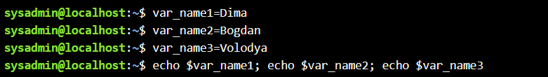

&nbsp;&nbsp;&nbsp;- За допомогою команди echo виведіть імена студентів вашої команди.  

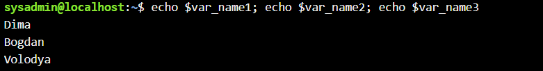

&nbsp;&nbsp;- Створіть псевдоніми mycal1, mycal2, mycal3 для команди cal для автоматичного виведення календарю вашого року народження. 

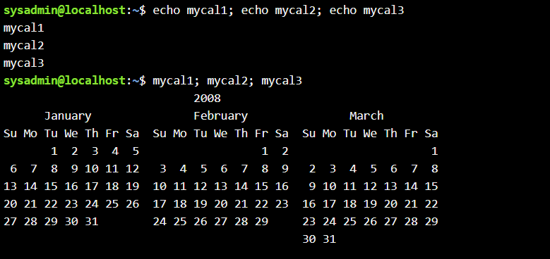  
  
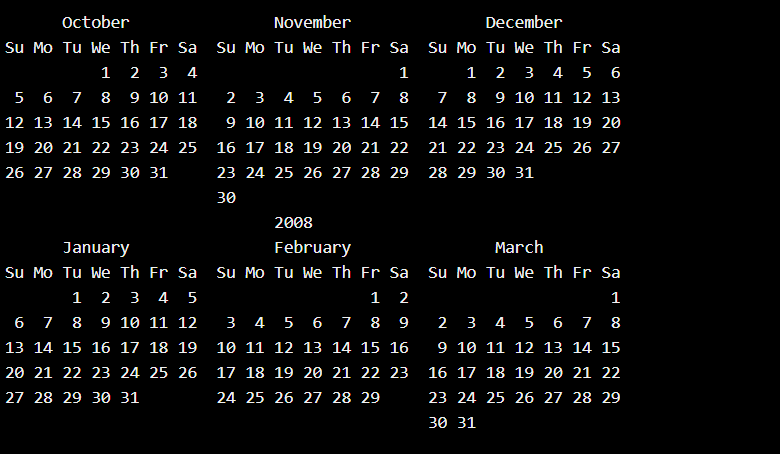  
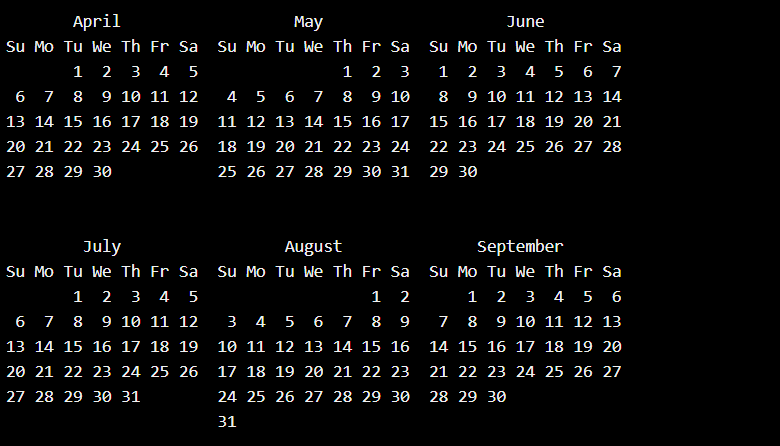  
  
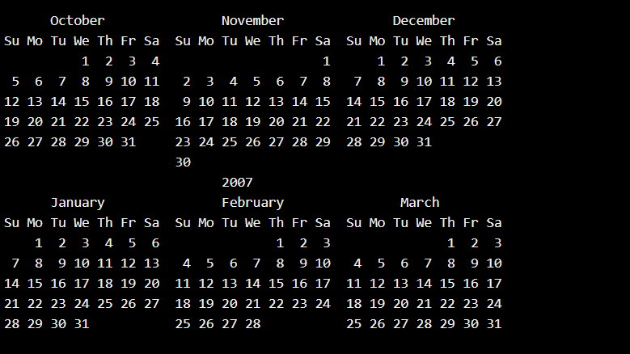  
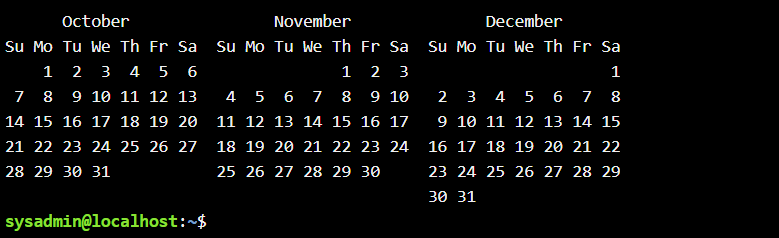  

 

 

**2.2.** ***Робота з функціями (Functions) в терміналі:**

&nbsp;&nbsp;&nbsp;- Створіть функцію students_report, що порядково буде виводити спочатку імена студентів Вашої команди, а потім роки їх народження.  

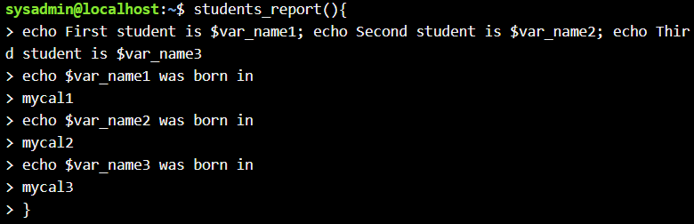  
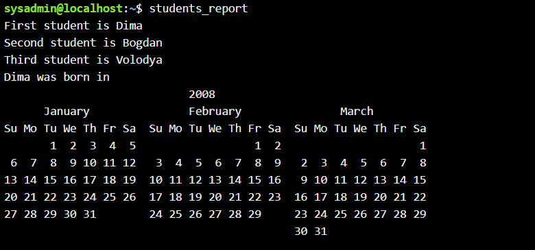   
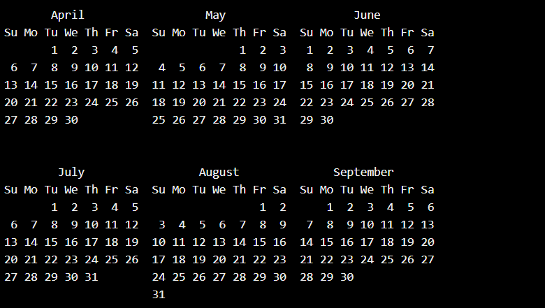  
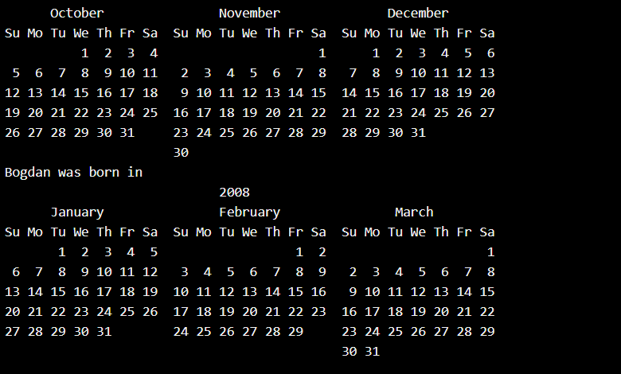  
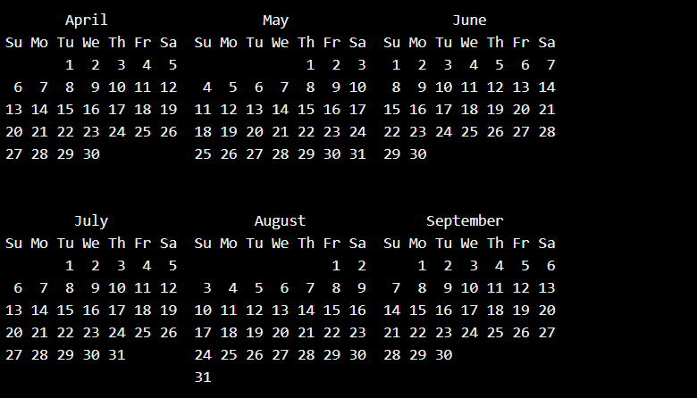  
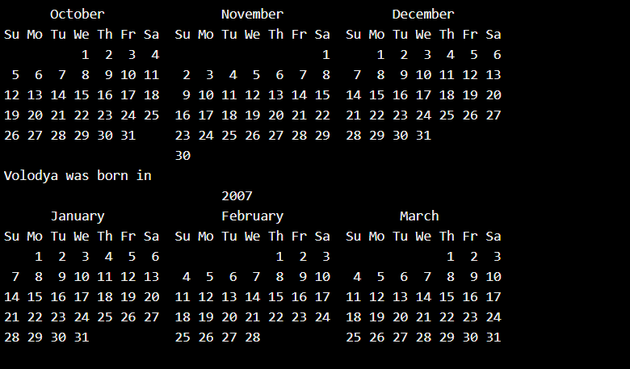  
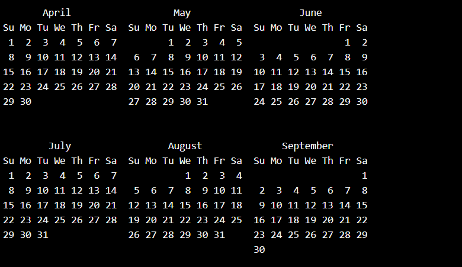  
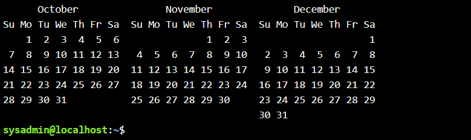

 

 

**2.3.** ***Робота з лапками (Quoting) в терміналі. Виведіть в командному рядку наступні речення:**

&nbsp;&nbsp;&nbsp;- “We create such variables as $var_name1, $var_name2, $var_name3, which stored our names Name1, Name2, Name3” (у реченні спочатку виводимо назви змінних, а потім їх вміст).    

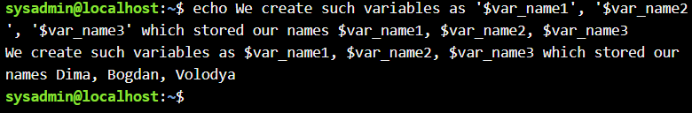

&nbsp;&nbsp;&nbsp;- “We create such Aliases as mycal1, mycal2, mycal3, which can show our calendars: Calendar1, Calendar2, Calendar3”  (у реченні спочатку виводимо назву команди-псевдонімів, потім вивід цих команд). 

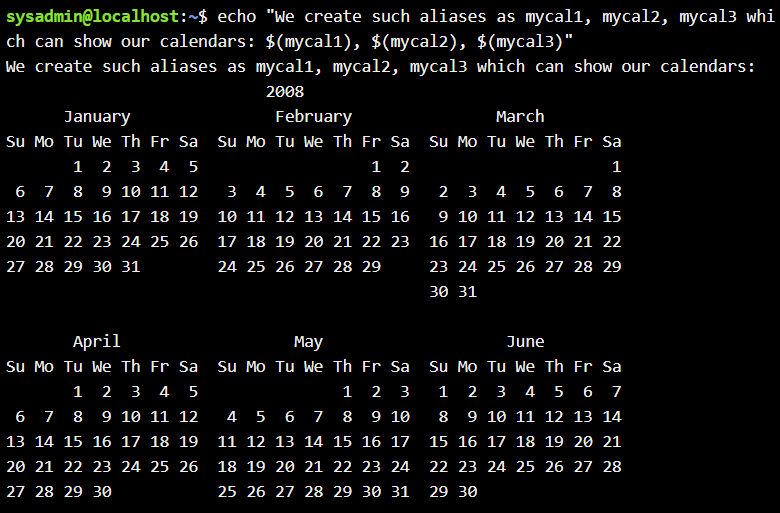  
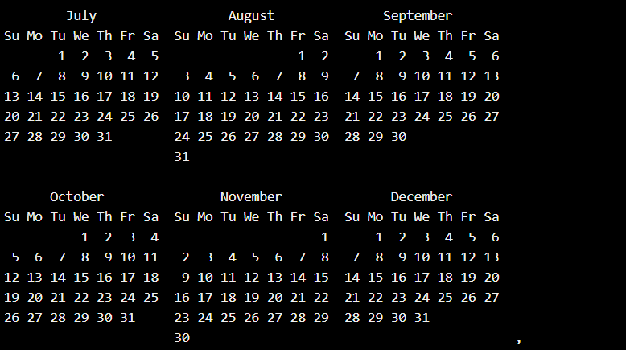  
   
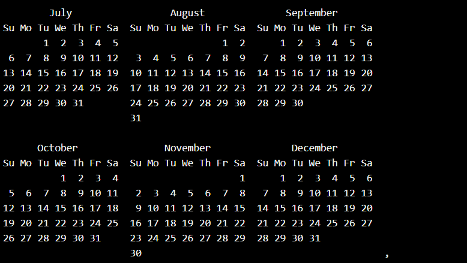  
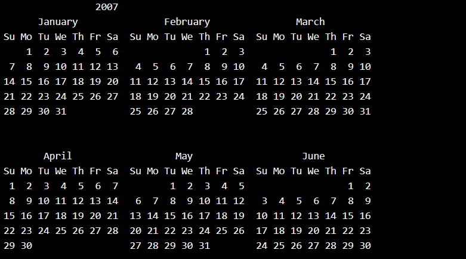  
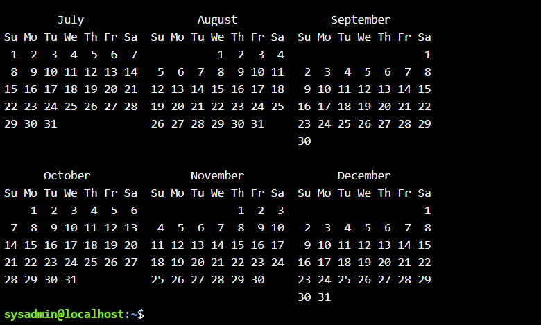

 

 

**2.4.** ***Робота з інструкціями керування (Control Statements) в терміналі:***

&nbsp;&nbsp;&nbsp;- Чи можна завдання 2.1 та 2.2 ходу роботи виконати через інструкції керування без написання окремої функції, як це буде виглядати?

Так, це завдання можна виконати за допомогою операторів послідовного виконанання або логічних ланцюжків. 

1. Послідовне виконання (за допомогою ;):

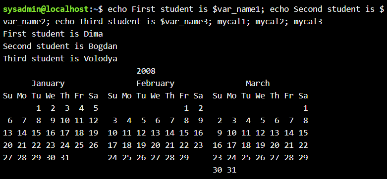  
   
  
  
  
  

 

2. Логічний ланцюжок (через &&):

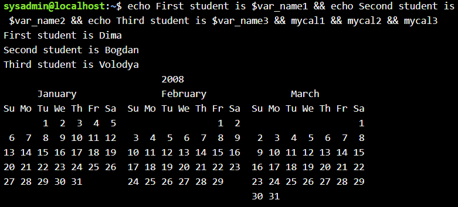  
   
  
  
  
  

**2.5. Робота з командами довідки (Man Pages) в терміналі:**

&nbsp;&nbsp;&nbsp;- На прикладі команди uname продемонструйте як отримати довідку. На основі отриманої додаткової інформації наведіть 5 різних варіантів виводу результату інформації по даній команді з використанням 5 різних параметрів (Options).

</blockquote>

