# Лабораторна робота №4
## Дисципліна: Операційні системи
## Тема: “Команди Linux для управління процесами”
### Виконав: студент групи РПЗ-33, Руденко Дмитро

---

 
  
### Мета роботи:
1. Отримання практичних навиків роботи з командною оболонкою Bash.   
2. Знайомство з базовими командами для управління процесами. 

### Матеріальне забезпечення занять:  
1. ЕОМ типу IBM PC.    
2. ОС сімейства Windows та віртуальна машина Virtual Box (Oracle).    
3. ОС GNU/Linux (будь-який дистрибутив).   
4. Сайт мережевої академії Cisco netacad.com та його онлайн курси по Linux.  

### Завдання для попередньої підготовки.

#### 1. *Прочитайте короткі теоретичні відомості до лабораторної роботи та зробіть невеличкий словник базових англійських термінів з питань призначення команд та їх параметрів.

_Словник базовиз англійських термінів_

| № | Слово | Пояснення |
| :--- | :--- | :--- |
| 1 | Process | Процес — програма, що виконується в системі в даний момент |
| 2 | PID (Process ID) | Унікальний ідентифікатор процесу в системі |
| 3 | Snapshot | Знімок — стан системи або процесів у конкретний момент часу (характерно для команди ps) |
| 4 | Background | Фоновий режим — виконання програми без блокування термінала |
| 5 | Foreground | Передній план (активний режим) — виконання програми з безпосереднім доступом до термінала |
| 6 | Utility | Утиліта — невелика допоміжна програма для виконання конкретних завдань |
| 7 | Command Line Parameter / Option | Параметр або опція команди — додаткові символи (наприклад, -a, -u), що змінюють поведінку команди | 
| 8 | Real-time monitoring | Моніторинг у реальному часі — безперервне відстеження змін стану системи |
| 9 | Signal | Сигнал — програмне сповіщення, що надсилається процесу (наприклад, для його завершення) |

#### 2. На базі розглянутого матеріалу дайте відповіді на наступні питання:

 
  
<blockquote>
  
**2.1.** ***Які команди для моніторингу стану процесів ви знаєте. Як переглянути їх можливі параметри?**

Для моніторингу процесів найчастіше використовуються команди ps (статичний список), top (динамічний монітор) та htop (покращений інтерактивний монітор). Щоб переглянути всі можливі параметри будь-якої команди, необхідно скористатися вбудованою довідкою системи, ввівши в терміналі man <назва_команди> (наприклад, man ps) або додавши прапорець допомоги: <назва_команди> --help.

**2.2.** ***Чи може команда ps у реальному часі відслідковувати стан процесів?**

Ні, команда ps не призначена для відстеження процесів у реальному часі. Вона робить «миттєвий знімок» (snapshot) стану процесів саме в ту секунду, коли була натиснута клавіша Enter. Для динамічного спостереження, яке оновлюється щосекунди, слід використовувати команди top або htop.

**2.3.** ****За якими параметрами можливе сортування процесів в команді top? Як переключатись між ними?**

Утиліта top дозволяє сортувати процеси за багатьма параметрами, найважливішими з яких є використання ресурсів процесора (%CPU), використання оперативної пам'яті (%MEM), ідентифікатор (PID) та час роботи (TIME+). Перемикатися між ними в інтерактивному режимі можна за допомогою гарячих клавіш:

- M — сортування за використанням пам'яті.
- P — сортування за використанням процесора.
- T — сортування за часом виконання.
- N — сортування за PID.

**2.4.** ****Які команди для завершення роботи процесів ви знаєте?**

Для припинення виконання процесів у Linux існують такі основні команди:

- kill [PID] — надсилає сигнал завершення конкретному процесу за його ідентифікатором (за замовчуванням SIGTERM).
- killall [назва_програми] — завершує всі процеси, що мають однакову назву (наприклад, усі вікна браузера).
- pkill [шаблон] — дозволяє завершувати процеси за частиною їхньої назви або іншими атрибутами.
- xkill — графічна утиліта, яка дозволяє завершити програму, просто клікнувши мишкою по її завислому вікну.

</blockquote>
  
#### 3. Прочитати матеріал про роботу з процесами у терміналі:
- [Процеси в Linux. Управління процесами](https://acode.com.ua/processes-in-linux/)  
- [Find out what processes are running in the background on Linux](https://www.cyberciti.biz/faq/find-out-what-processes-are-running-in-the-background-on-linux/)

#### 4. Підготувати в електронному вигляді початковий варіант звіту:

- Титульний аркуш, тема та мета роботи  
- Словник термінів  
- Відповіді на п.2.1-2.4 з завдань для попередньої підготовки

## Хід роботи

#### 1. Початкова робота в CLI-режимі в Linux ОС сімейства Linux:

<blockquote>
  
**1.1. Запустіть операційну систему Linux Ubuntu. Виконайте вхід в систему та запустіть термінал (якщо виконуєте ЛР у 401 ауд.).**

**1.2. Запустіть віртуальну машину Ubuntu_PC (якщо виконуєте завдання ЛР через академію netacad)** 

**1.3. Запустіть свою операційну систему сімейства Linux (якщо працюєте на власному ПК та її встановили) та запустіть термінал.**

Під час виконання роботи я буду використовувати свою, встановлену під час виконання Work-case 2, операційну систему сімейства Linux:

</blockquote>

#### 2. Дайте відповіді на наступні питання:
  
- Як вивести вміст директорії /proc? Де вона знаходиться та для чого призначена? Охарактеризуйте інформацію про її вміст?

<blockquote>
  
Вміст директорії /proc можна вивести за допомогою команди ls /proc. Вона розташована в кореневому каталозі та є віртуальною файловою системою, що існує лише в оперативній пам'яті та слугує інтерфейсом до структур даних ядра Linux. Її вміст характеризується наявністю числових папок, кожна з яких відповідає ідентифікатору конкретного запущеного процесу (PID), а також системних файлів, що відображають стан пам'яті (meminfo), процесора (cpuinfo) та інших апаратних ресурсів у реальному часі.

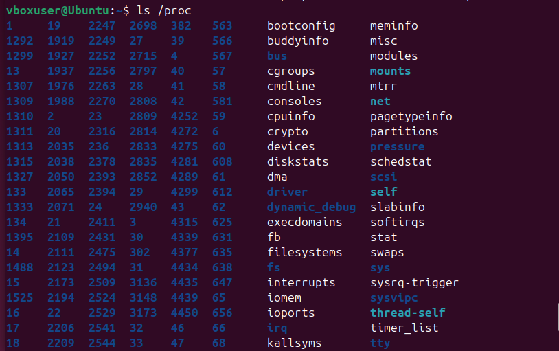

</blockquote>

- Як вивести інформацію про поточні сеанси користувачів. Якою командою це можна зробити?

<blockquote>

Для виведення інформації про поточні сеанси користувачів найчастіше використовується команда w, яка надає детальні дані про залогінених користувачів, час їхнього входу та назви запущених ними процесів. Також для отримання списку активних терміналів можна використовувати команду who, а для виведення лише імен підключених на даний момент користувачів — команду users.

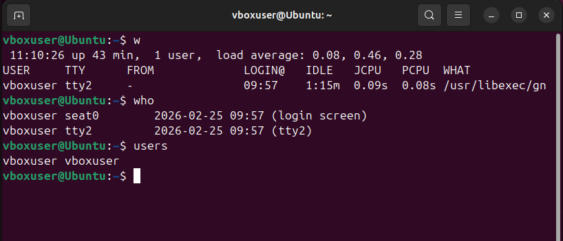

</blockquote>

- Які дії можна зробити в терміналі за допомогою комбінацій Ctrl + C, Ctrl + D та Ctrl + Z?

<blockquote>

У терміналі комбінація Ctrl+C надсилає сигнал SIGINT для негайного припинення (переривання) виконання поточної програми. Ctrl+D використовується для надсилання символу кінця файлу (EOF), що зазвичай призводить до виходу з поточного сеансу командної оболонки або завершення введення даних. Ctrl+Z надсилає сигнал SIGTSTP, який призупиняє виконання процесу та переводить його у фоновий режим зі статусом "Stopped", звільняючи командний рядок для інших дій.

</blockquote>

- *Чим відрізняється фоновий процес від звичайного. Де вони використовуються?

<blockquote>

Звичайний процес (foreground) виконується на передньому плані, повністю займає термінал і блокує введення нових команд до свого завершення, тоді як фоновий процес (background) працює паралельно з оболонкою, не потребуючи взаємодії з користувачем, при цьому не обмежуючи роботу в консолі. Фонові процеси використовуються для виконання тривалих системних завдань, таких як копіювання великих масивів даних, архівація або мережеве сканування, щоб забезпечити можливість подальшої роботи в тому ж терміналі.

</blockquote>

- *Опишіть наступні команди та поясніть що вони виконують – команда jobs, bg, fg.

<blockquote>

Команда jobs виводить список усіх фонових та призупинених завдань у межах поточного сеансу командної оболонки з їхніми порядковими номерами. Команда bg (background) відновлює виконання призупиненого процесу у фоновому режимі, дозволяючи йому працювати без блокування термінала. Команда fg (foreground) повертає вибраний фоновий або призупинений процес на передній план для безпосередньої взаємодії з користувачем.

</blockquote>

- **Якою командою можна переглянути інформацію про запущені в системи фонові процеси та задачі?

<blockquote>

Для перегляду списку фонових завдань, що були запущені в поточному сеансі Bash, використовується команда jobs. Якщо ж необхідно побачити всі процеси в системі, включно з фоновими службами інших користувачів, використовується команда ps з відповідними аргументами (наприклад, ps -aux) або динамічний монітор top.

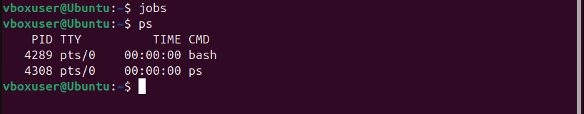

</blockquote>

- **Як призупинити фоновий процес, як його потім відновити та при необхідності перезапусти?

<blockquote>

Щоб призупинити активний процес, необхідно натиснути Ctrl + Z, що переведе його в стан зупинки у фоні. Для його подальшого відновлення використовується команда bg (якщо процес має продовжувати роботу у фоновому режимі) або fg (якщо потрібно повернути його в активний режим), а для перезапуску процесу з новими параметрами його зазвичай необхідно завершити та ініціалізувати команду заново.

</blockquote>
  
#### 3. Запустіть термінал, та в командному рядку виконайте наступні дії для ознайомлення з роботою з процесами:

- запустіть команду top, проаналізуйте отриманий в цій команді результат та охарактеризуйте найбільш активні процеси у системі;

<blockquote>

Після запуску каманди top можна побачити час роботи системи та кількість користувачів, які знаходиться в першому рядку (top). В другому рядку (Tasks) відображається загальна кількість запущених, сплячих та зупинених процесів. Нижче (%Cpu) пишеться наскільки завантажений процесор. Якщо там високий відсоток id (idle) - процесор відпочиває. І в останніх двох рядках (MiB Mem/Swap) ми бачимо скільки оперативної пам'яті використано:

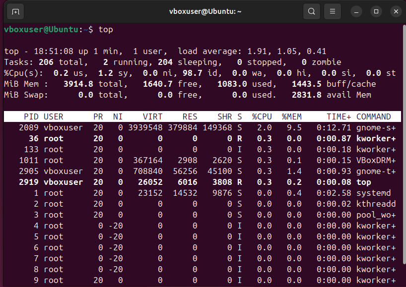

До основних колонок таблиці можна віднести наступні:

- **PID**: Унікальний номер процесу.
- **USER**: Хто запустив цей процес (логін або root).
- **%CPU**: Скільки відсотків потужності процесора забирає програма.
- **%MEM**: Скільки оперативної пам'яті вона споживає.
- **COMMAND**: Назва програми (наприклад, gnome-shell, Xorg, bash).

</blockquote>

- призупинити виконання команди top (треба використати комбінацію клавіш);

<blockquote>

Не виходячи з програми (не натискаючи q), натискаємо комбінацію клавіш Ctrl + Z. В результаті у терміналі з'явиться повідомлення [1]+ Stopped top. Це означає, що процес не завершено, а тимчасово "заморожено" і переведено у фоновий режим:

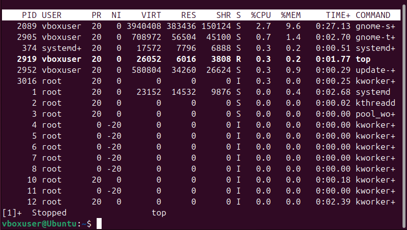

</blockquote>

- вивести інформацію про процеси за допомогою команди ps;

<blockquote>

Ввівши команду ps без параметрів, можна побачити короткий список процесів, запущених у поточному вікні термінала. Зазвичай це сама оболонка bash та команда ps, яку щойно було введено:

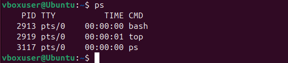

</blockquote>

- *наведіть 5 прикладів з використанням різних параметрів команди ps (наприклад, вивести тільки системні процеси, вивести процеси конкретного користувача, вивести дерево процесів тощо). Опишіть, що саме роблять обрані Вами параметри.

<blockquote>
  
1. ps -e — виводить абсолютно всі процеси, які зараз запущені в системі (системні та користувацькі):

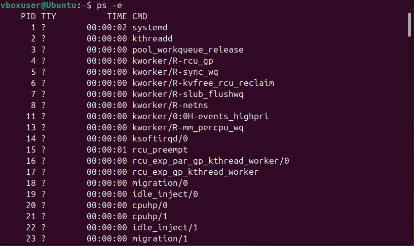

2. ps -u dima (замість dima вписується логін користувача) — виводить процеси, які належать лише конкретному користувачу:

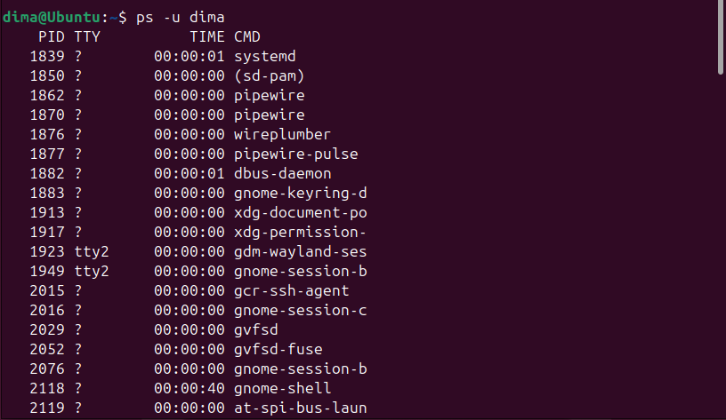

3. ps -f — виводить повний формат списку (Full-format), що додає колонки з часом старту та назвою батьківського процесу (PPID):

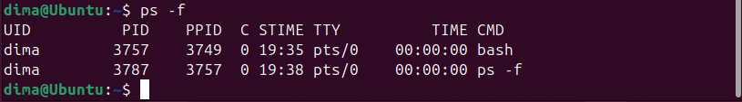

4. ps -axjf або ps --forest — виводить ієрархію процесів у вигляді "дерева", де наочно видно, який процес запустив інший:

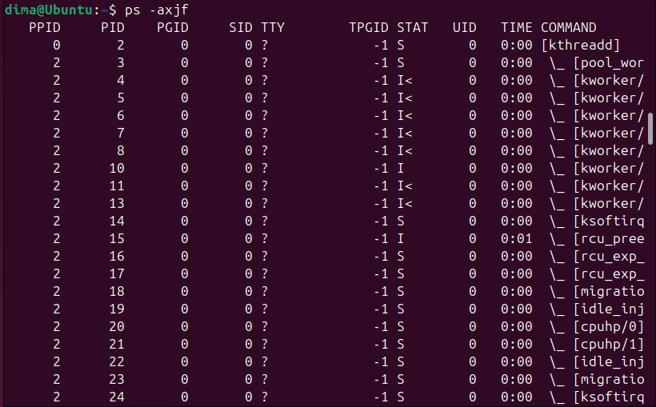

5. ps -p 123 (замість 123 впишу будь-який PID) — виводить інформацію про один конкретний процес за його ідентифікатором:

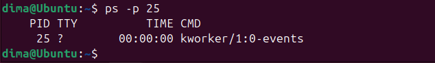

</blockquote>

- **передивіться чи є у Вас запущені фонові процеси, які саме?

<blockquote>
  
Для перегляду запущених фонових процесів варто ввести команду jobs. Перед нами відкриється список усіх фонових задач цього термінала. Наразі там має бути рядок [1]+ Stopped top. Це і є мій призупинений фоновий процес:

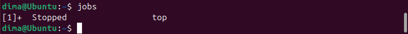

</blockquote>

- **відновити виконання призупиненого фонового процесу спочатку у позиції “на передньому плані” (foreground), потім ще раз його призупинити, а потім відновити його виконання у позиції “на задньому плані” (background).

<blockquote>

Для повернення на передній план скористаємося командою fg. Команда top знову відкриється на весь екран і стане активною:

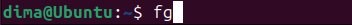
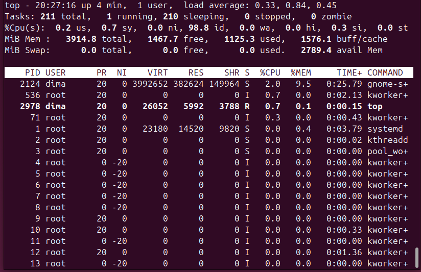

Знову призупинемо, натиснувши Ctrl + Z, після чого відновимо роботу у фоні, ввівши команду bg (background):

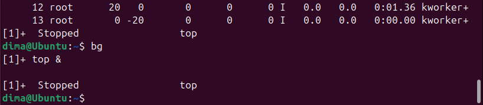

Для такої інтерактивної програми як top, вона залишиться у статусі "Stopped" без виводу на екран, але для звичайних скриптів ця команда змушує їх продовжувати виконання, не займаючи термінал.
  
</blockquote>

- завершити роботу даного фонового процесу.

<blockquote>

Для цього введемо команду для завершення задачі за її номером. Після цього введу jobs ще раз та побачу статус Done (процес повністю завершено):

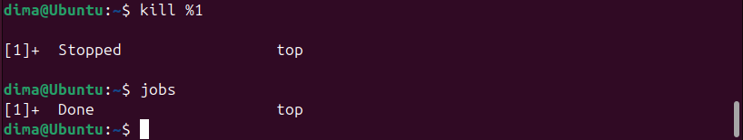
  
</blockquote>
  
### Контрольні запитання:

**1. Яке призначення директорії /proc в системах Linux. Яку інформацію вона зберігає?**

Вона призначена для зберігання віртуальної файлової системи, яка виступає інтерфейсом до структур даних ядра Linux у реальному часі. Ця директорія не містить реальних файлів на диску, а зберігає інформацію про апаратне забезпечення (наприклад, cpuinfo, meminfo), параметри налаштування ядра та детальні дані про кожен запущений процес у системі, структуровані за їхніми ідентифікаторами (PID).

**2. Як серед будь-яких трьох процесів динамічно визначати, який з них в поточний момент часу використовує найбільший обсяг пам'яті? Який відсоток пам’яті він споживає від загального обсягу?**

Для цього використовується команда top, яка в реальному часі відображає список активних процесів. Щоб визначити лідера за споживанням ресурсів, необхідно натиснути клавішу M, що відсортує список за колонкою %MEM. Ця колонка вказує точний відсоток оперативної пам'яті, який конкретний процес використовує від загального обсягу доступної RAM.

**3. Як отримати ієрархію батьківських процесів в системах Linux? Наведіть її структуру та охарактеризуйте.**

Отримати структуру взаємозв'язків можна за допомогою команди pstree. Вона візуалізує процеси у вигляді дерева, де кожен дочірній процес відгалужується від свого батьківського (Parent Process). Корінням цієї ієрархії в сучасних системах Linux є процес systemd (PID 1), який ініціалізує всі інші служби та користувацькі сеанси.

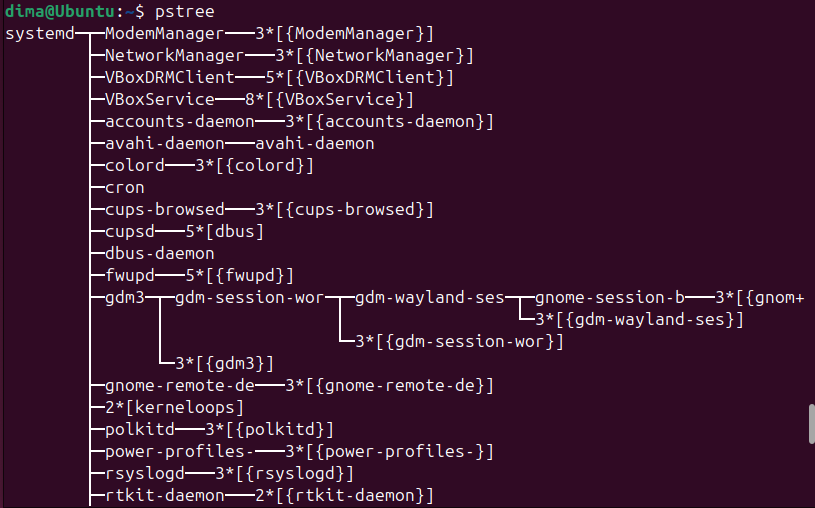

 

 

**4.** ***Чим відрізняється команда top від ps?**

Головна різниця полягає у способі подачі даних: команда ps надає статичний «знімок» (snapshot) стану процесів на момент запуску команди, тоді як top працює інтерактивно і динамічно оновлює інформацію щосекунди. ps частіше використовується для скриптів або пошуку конкретних параметрів, а top — для постійного моніторингу завантаження системи.

**5.** ***Які додаткові можливості реалізує htop в порівнянні з top?**

Утиліта htop реалізує більш зручний кольоровий інтерфейс з графічними шкалами завантаження ядер процесора та пам'яті. Вона підтримує керування за допомогою миші, дозволяє прокручувати список процесів вертикально та горизонтально, а також надає можливість завершувати процеси або змінювати їхній пріоритет за допомогою функціональних клавіш без необхідності введення PID вручну.

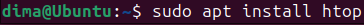
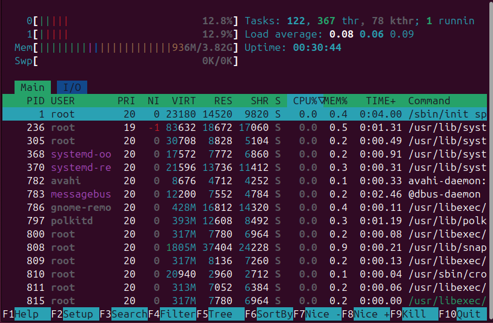

 

 

**6.** ****Опишіть компоненти вашої мобільної ОС для здійснення моніторингу запущених в системі процесів?**

У системі Android основними компонентами моніторингу є розділ «Running Services» (Запущені послуги) у меню для розробників, а також системна утиліта «Battery» (Батарея), яка відстежує енергоспоживання додатків. Ці інструменти дозволяють бачити, які програми працюють у фоні, скільки оперативної пам'яті вони займають та як впливають на загальну продуктивність пристрою.

**7.** ****Чи підтримує Ваша мобільна ОС термінальне керування роботою процесів, опишіть як саме.**

Так, мобільна ОС на моєму телефоні може підтримувати термінальне керування через спеціальні додатки-емулятори, такі як Termux для Android або iSH для iOS. Встановивши їх, користувач отримує доступ до класичного середовища Linux і може виконувати стандартні команди управління процесами, такі як ps, top та kill, за умови наявності відповідних прав доступу. Приклад роботи з Termux на моєму телефоні зображено нижче:

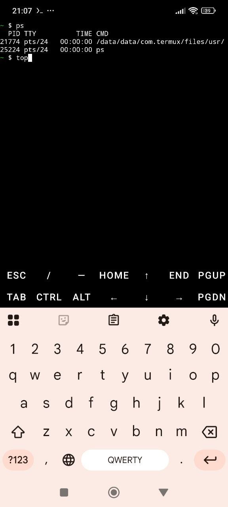 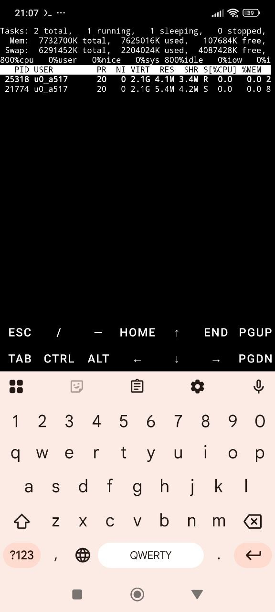

**8.** ****Чи можливо поставити сторонні програмні засоби, що дозволяють організувати управління та моніторинг роботою процесів у Вашому мобільному телефоні. Коротко опишіть їх.**

Для розширеного моніторингу можна встановити додатки на кшталт Simple System Monitor, DevCheck або 3C All-in-One Toolbox. Вони дозволяють детально аналізувати активність кожного ядра процесора, відстежувати температуру компонентів, переглядати логи системи та примусово зупиняти фонові процеси, які надмірно споживають ресурси телефону.

## Conclusions:

&nbsp;&nbsp;&nbsp;In this laboratory work, I gained practical experience in managing processes within the Linux environment using the Bash command shell. I learned how to monitor system activity using the ps and top utilities, understanding the key differences between static snapshots and real-time monitoring. I also mastered essential process control techniques, such as moving tasks to the background, resuming them, and terminating unresponsive programs using signals. Furthermore, I explored the /proc virtual filesystem and its role in providing access to kernel data. These skills are fundamental for effective system administration and software development.
