# Лабораторна робота №5
## Дисципліна: Операційні системи
## Тема: “Знайомство з командами навігації по файловій системі та керування файлами та каталогами”**  
### Виконав: студент групи РПЗ-33, Руденко Дмитро

---

 
  
### Мета роботи:
1. Отримання практичних навиків роботи з командною оболонкою Bash.   
2. Знайомство з базовими командами навігації по файловій системі.  
2. Знайомство з базовими командами для керування файлами та каталогами. 

### Матеріальне забезпечення занять:  
1. ЕОМ типу IBM PC.    
2. ОС сімейства Windows та віртуальна машина Virtual Box (Oracle).    
3. ОС GNU/Linux (будь-який дистрибутив).   
4. Сайт мережевої академії Cisco netacad.com та його онлайн курси по Linux.  

### Завдання для попередньої підготовки.

#### 1. *Прочитайте короткі теоретичні відомості до лабораторної роботи та зробіть невеличкий словник базових англійських термінів з питань призначення команд та їх параметрів.

_Словник базових англійських термінів_

| № | Слово | Пояснення |
| :--- | :--- | :--- |
| 1 | Filesystem | Файлова система — ієрархічна структура організації та зберігання файлів у Linux |
| 2 | Directory | Каталог (директорія) — тип файлу, що використовується для зберігання інших файлів; аналог папки у Windows |
| 3 | Root directory | Кореневий каталог — найвищий рівень файлової системи Linux, який позначається символом / |
| 4 | Home directory | Домашній каталог — унікальний каталог, закріплений за обліковим записом користувача, у якому починається сеанс роботи в командному рядку |
| 5 | Source | Джерело — файл або каталог, який потрібно скопіювати або перемістити |
| 6 | Destination | Призначення — місце розташування (або нове ім'я), куди копіюється або переміщується вихідний файл |
| 7 | Glob characters (Wild cards) | Символи підстановки — спеціальні символи (наприклад, *, ?), що мають особливе значення для оболонки та дозволяють задавати шаблони для пошуку імен файлів |
| 8 | Recursive | Рекурсивний (режим) — параметр (зазвичай -r), що дозволяє застосовувати команди (наприклад, копіювання чи видалення) до каталогів та всього їхнього вмісту, включаючи вкладені файли |
| 9 | Interactive | Інтерактивний (режим) — параметр (наприклад, -i), який запитує підтвердження користувача перед виконанням небезпечної дії, як-от перезапис або видалення файлу |
| 10 | No Clobber | Без перезапису — параметр (-n), що забороняє перезаписувати вміст уже існуючого файлу призначення |
| 11 | Verbose | Докладний (режим) — параметр (наприклад, -v), при якому команда виводить повідомлення про результати свого успішного виконання |
| 12 | Overwrite | Перезапис — процес повної заміни вмісту існуючого файлу призначення вмістом вихідного файлу |

#### 2. На базі розглянутого матеріалу дайте відповіді на наступні питання:

 
  
#### 2.1. Порівняйте файлові структури Windows-подібної та Linux-подібної системи.

| Характеристика | Windows-подібні системи | Linux-подібні системи |
| :--- | :--- | :--- |
| Кореневий каталог та ієрархія | Структура базується на логічних дисках (томах). Кожен диск або пристрій має власну незалежну літеру та свій корінь (наприклад, C:\, D:\, E:\) | Має єдину глобальну деревоподібну ієрархію. Усе починається з єдиного кореневого каталогу, який позначається прямим слешем /. Всі інші розділи дисків, флешки чи мережеві диски монтуються у вигляді звичайних папок всередині цього єдиного дерева (наприклад, у каталог /mnt або /media) |
| Роздільник каталогів у шляху | Використовує зворотний слеш (backslash): C:\Users\Name\Documents\file.txt | Використовує прямий слеш (forward slash): /home/name/documents/file.txt |
| Регістрозалежність (Case sensitivity) | Зазвичай не розрізняє великі та малі літери. Файли Report.txt та report.txt вважаються одним і тим самим файлом | Жорстко чутлива до регістру. File.txt, file.txt та FILE.TXT — це три абсолютно різні файли, які можуть одночасно знаходитися в одній папці |
| Розширення файлів | Покладається на розширення (наприклад, .exe, .txt), щоб розуміти, якого типу файл і якою програмою його відкривати | Розширення є необов'язковими і слугують скоріше підказкою для користувача. Тип файлу та те, чи є він виконуваним (програмою), визначається його вмістом та правами доступу, а не розширенням |

#### 2.2. *Розкрийте поняття FHS. Як даний стандарт використовується в контексті файлових систем?

<blockquote>

**FHS (Filesystem Hierarchy Standard — Стандарт ієрархії файлової системи)** — це уніфікований стандарт, який визначає структуру каталогів та їхнє призначення у Linux та інших Unix-подібних операційних системах.

FHS гарантує, що незалежно від того, який дистрибутив Linux використовується (Ubuntu, Debian, Fedora чи CentOS), базова структура папок залишатиметься однаковою. Це надзвичайно важливо для розробників програмного забезпечення та системних адміністраторів, оскільки вони точно знають, де шукати ті чи інші компоненти системи. Згідно з FHS, кожен каталог має своє суворе функціональне призначення. Ось кілька ключових прикладів стандарту:

- `/bin` — базові виконувані програми (утиліти), доступні всім користувачам (наприклад, `ls`, `cp`).
- `/etc` — загальносистемні конфігураційні файли.
- `/home` — домашні каталоги звичайних користувачів (їхні особисті файли).
- `/var` — файли, що постійно змінюються (змінні дані), такі як системні журнали (логи), бази даних.
- `/tmp` — тимчасові файли.

</blockquote>
  
#### 2.3. **Перерахуйте основні команди для роботи з файлами та каталогами в Linux: створення, переміщення, копіювання, видалення.

<blockquote>
  
**1. Створення:**

- `touch [ім'я_файлу]` — створення нового порожнього файлу (або оновлення мітки часу існуючого).  
- `mkdir [ім'я_каталогу]` — створення нового каталогу (папки).

**2. Переміщення (та перейменування):**

- `mv [джерело] [призначення]` — переміщення файлу або каталогу в інше місце. Ця ж команда використовується для перейменування файлів (якщо перемістити файл у ту саму папку під іншим іменем).
  
**3. Копіювання:**

- `cp [джерело] [призначення]` — копіювання файлів.  
- `cp -r [джерело] [призначення]` — рекурсивне копіювання цілих каталогів разом з їхнім вмістом.

**4. Видалення:**

- `rm [ім'я_файлу]` — видалення одного або кількох файлів (безповоротно).  
- `rmdir [ім'я_каталогу]` — видалення каталогу (спрацює лише якщо він повністю порожній).  
- `rm -r [ім'я_каталогу]` — рекурсивне видалення каталогу разом з усіма файлами та підкаталогами всередині нього.

</blockquote>
  
#### 3. Вивчіть матеріали онлайн-курсу академії Cisco “NDG Linux Essentials”:

- Chapter 7 - Navigating the Filesystem  
- Chapter 8 - Managing Files and Directories

#### 4. Пройдіть тестування у курсі NDG Linux Essentials за такими темами:

- Chapter 07 Exam  
- Chapter 08 Exam  

#### 5. Підготувати в електронному вигляді початковий варіант звіту:

- Титульний аркуш, тема та мета роботи  
- Словник термінів
- Відповіді на п.2.1-2.3 з завдань для попередньої підготовки

## Хід роботи

#### 1. Початкова робота в CLI-режимі в Linux ОС сімейства Linux:
  
**1.1. Запустіть операційну систему Linux Ubuntu. Виконайте вхід в систему та запустіть термінал (якщо виконуєте ЛР у 401 ауд.).**

**1.2. Запустіть віртуальну машину Ubuntu_PC (якщо виконуєте завдання ЛР через академію netacad)** 

**1.3. Запустіть свою операційну систему сімейства Linux (якщо працюєте на власному ПК та її встановили) та запустіть термінал.**

<blockquote>
  
Під час виконання роботи я буду використовувати свою, встановлену під час виконання Work-case 2, операційну систему сімейства Linux:

</blockquote>

#### 2. Опрацюйте всі приклади команд, що представлені у лабораторних роботах курсу NDG Linux Essentials - Lab 7: Navigating the Filesystem та Lab 8: Managing Files and Directories. Створіть таблицю для опису цих команд.
  
| Назва команди | ЇЇ призначення та функціональність |
| :--- | :--- |
| `pwd` | Визначає місце знаходження користувача у файловій системі, показує поточну робочу директорію (print working directory) |
| `cd Documents` | Команда cd здійснює перехід до каталогу, який у неї вказаний як аргумент. В даному випадку це каталог Documents |
| `cd ~` | За допомогою команди можна повернутися до домашнього каталогу |
| `echo  ~ ~sysadmin ~root ~mail ~nobody` | Команда echo в цьому випадку використовується для відображення деяких інших прикладів використання тильди як частини шляху |
| `echo *` | Ця команда echo використовується, щоб відобразити всі імена файлів у поточному каталозі, які відповідають шаблону glob * |
| `echo D*`   `echo P*` | Наступні команди відображатимуть усі файли в поточному каталозі, які починаються з літери D та літери P |
| `echo *s` | Зірочку * можна використовувати будь-де в рядку. Наступна команда відобразить усі файли у поточному каталозі, які закінчуються на літеру s |
| `echo D*n*s` | Варто звернути увагу, що зірочка також може з'являтися кілька разів або посередині кількох символів |
| `echo ??????` | Оскільки кожен знак питання відповідає одному невідомому символу, введення шести з них відповідатиме шестисимвольним іменам файлів. Наступний код відображатиме імена файлів, які складаються рівно з шести символів |
| `echo D????????` | Використання знака питання з іншими символами обмежить кількість збігів. Наступний код відобразить імена файлів, які починаються з літери D і складаються рівно з дев'яти символів |
| `echo ?????*s` | Символи підстановки або глобальні символи можна комбінувати. Наступна команда відобразить імена файлів, які містять щонайменше шість символів і закінчуються літерою s |
| `echo [DP]*`   `echo [!DP]*` | Тут використовується пара квадратних дужок [ ], щоб вказати, який саме символ буде дозволено. Дозволені символи можуть бути вказані як діапазон, список або так званий клас символів. У першому прикладі перший символ імені файлу може бути D або P. У другому прикладі перший символ може бути будь-яким символом, крім D або P |
| `echo [D-P]*`   `echo [!D-P]*` | В цих прикладах вказано діапазон символів. У першому прикладі першим символом імені файлу може бути будь-який символ, що починається з D і закінчується на P. У другому прикладі цей діапазон символів заперечується, тобто будь-який окремий символ буде відповідати, якщо він не знаходиться між літерами D та P |
| `cd ..` | Використання відносного шляху дозволяє перейти до каталогу, розташованого вище за поточний |
| `cd ../dict` | Використання відносного шляху також допомагає перейти на один рівень вище з поточний каталог, а потім вниз, в даному випадку до каталогу dict |
| `ls -a` | Щоб відобразити всі файли, включаючи приховані файли, використовується команда ls з параметром -a |
| `ls -l` | Надає розширену інформацію про файл, а саме: звичайний файл ("-") чи каталог ("d"), дозволи файлу (наприклад, "rw-r--r--"), кількість жорстких посилань (наприклад, "1"), користувача-власника та групу-власника файлу (наприклад, "root"), розмір файлу в байтах та дату/час останньої зміни файлу |
| `ls -R /etc/udev` | Опція -R означає «рекурсивний». Будуть відображені всі файли в каталозі /etc/udev, а також усі файли в кожному підкаталозі. |
| `ls -d` | Параметр -d запобігає відображенню файлів з підкаталогів. Його завжди слід використовувати з командою ls, коли використовується глобалізація файлів |
| `ls -d /etc/????` | Символ "?" можна використовувати для пошуку рівно одного символу в імені файлу. Виконання такої команди відобразить всі файли в каталозі /etc, які мають довжину рівно чотири символи |
| `ls –d /etc/[abcd]*` | Використовуючи квадратні дужки [], можна вказати окремий символ, який потрібно знайти з набору символів. Виконання такої команди відобразить всі файли в каталозі /etc, які починаються з літер a, b, c або d |
| `rm hosts` | Команда rm використовується для видалення файлу |
| `cp -v /etc/hosts hosts` | Ключ -v відображає джерело та ціль під час виконання команди cp |
| `cp –p hosts /home/sysadmin` | За допомогою параметра -p можна зберегти атрибути файлу |
| `cp –R /etc/udev Myetc` | Щоб скопіювати всі файли в каталозі, варто використати параметр -R. Для цього завдання відбудеться копіювання каталогу /etc/udev у новий каталог |
| `mkdir Myetc` | Звичайно, каталог має бути створений, перш ніж до нього можна буде додавати файли. У цьому прикладі використовуються налаштування за замовчуванням для mkdir, щоб створити каталог «Myetc». Для команди mkdir доступні параметри для встановлення безпеки, дозволів та інших атрибутів нового каталогу |
| `rm -r Myetc` | Щоб видалити каталог, використовується опція -r команди rm |
| `touch premove` | Створює порожній файл з назвою premove |
| `mv premove postmove` | Ця команда «вирізає» файл premove та «вставляє» його у файл з назвою postmove |
| `rm postmove` | Видаляє файл після переміщення |
  
#### 3. Робота в в терміналі (закріплення практичних навичок) обов'язково представити свої скріншоти:

- Визначте ваш поточний робочий каталог;  

- Перейдіть до кореневого каталогу та визначте Ваш поточний робочий каталог (дві команди);  

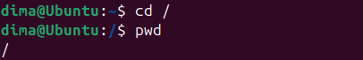

- Перегляньте вміст поточного каталогу у довгому форматі (скористайтесь відповідним ключем команди ls);

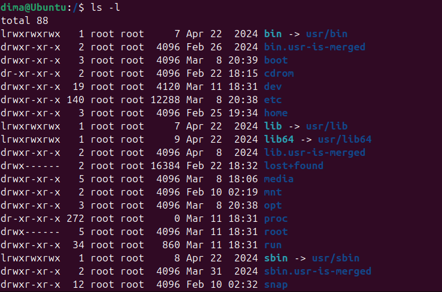  

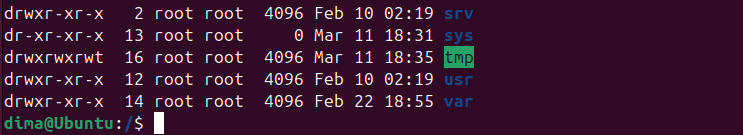

- Перейдіть до каталогу /usr/share та визначте Ваш поточний робочий каталог (дві команди);  

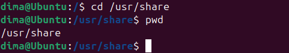

- Перегляньте вміст поточного каталогу включаючи і приховані файли (hidden files) (скористайтесь відповідним ключем команди ls);

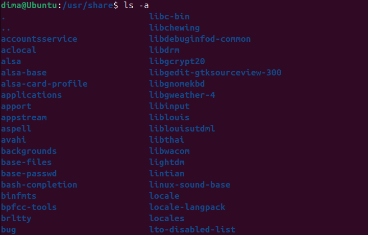

- *Перейдіть до каталогу /etc;  

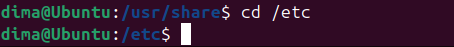

- *Перегляньте вміст даного каталогу, але щоб виводило тільки назви файлів, що починаються з літери вашого імені;  

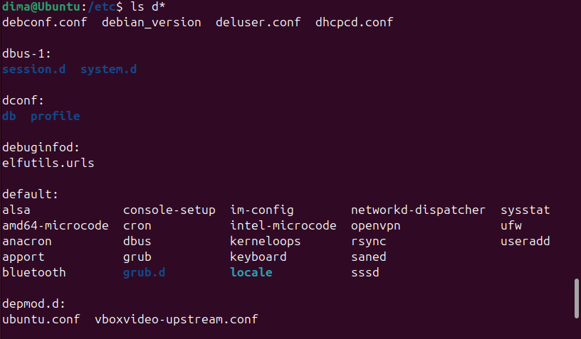

- *Перегляньте вміст даного каталогу, але щоб виводило тільки файли, назви яких складаються з 6 літер;  

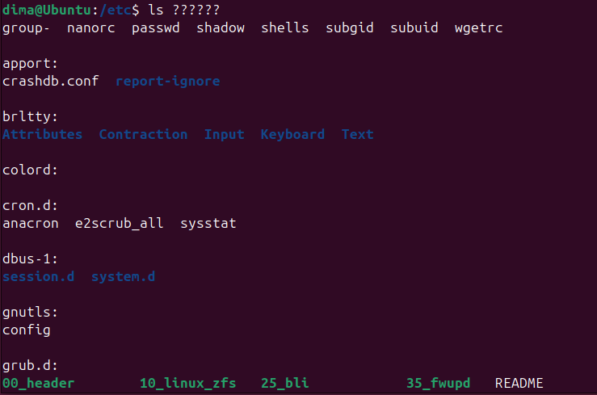

- **Перегляньте вміст даного каталогу, але щоб виводило тільки файли, назви яких закінчуються на літери ваших імен, наприклад якщо ваші імена Ivan, Anna, Maks, то вибірку робиму, щоб назви файлів закінчувались на літери [i,a,m];

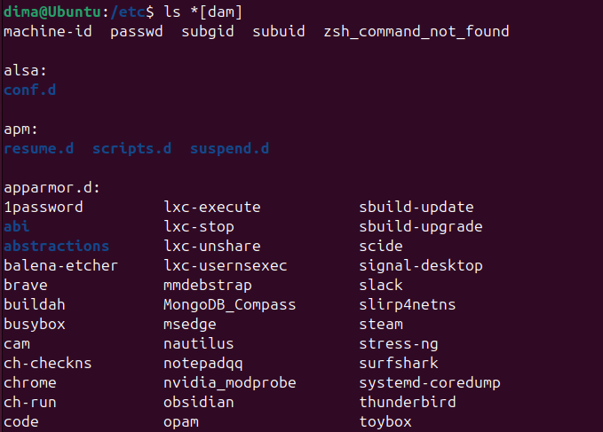

- **Перейдіть до домашнього каталогу поточного користувача та перегляньте його вміст у рекурсивному (зворотному до алфавітного) форматі (виконати цю дію через конвеєр команд);  

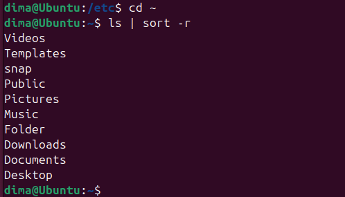

- В поточній директорії створити директорію з назвою вашої групи;  

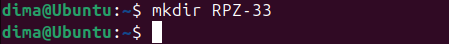

- Переглянути оновлений вміст домашнього каталогу поточного користувача. Скористайтесь ключем -r команди ls, яку інформацію ви отримаєте? 

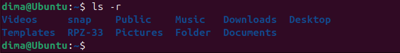

Я отримав список файлів та каталогів домашньої директорії, відсортований у зворотному алфавітному порядку (від Z до A). Ключ -r означає reverse.

- Перейдіть у створену вами директорію з назвою Вашої групи та створіть у ній порожній файл lab5; 

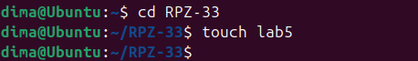

- Створити в даній директорії 3 директорії з прізвищами студентів вашої команди surname1, surname2, surname3 (команда mkdir мульти аргумента, тому всі три каталоги можна створити однією командою);  

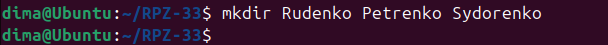

- Перейдіть у перший підкаталог surname1 та створіть порожній файл з ім'ям першого студента name1;  

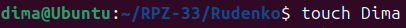

- За допомогою команди echo "Hello, my name is Name1" > name1 внесіть у цей файл дані про студента (символ > дозволяє вивід команди echo перенаправити одразу у файл name1;

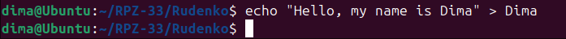

- Перегляньте вміст файлу name1 за допомогою команди cat name1 (має містити щойно введену Вами інформацію);  

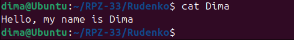

- Зробіть копію першого файлу name1 та перейменуйте її у файл з другим ім'ям студенту Вашої команди name2;  

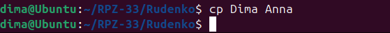

- Перегляньте вміст каталогу, обидва файли мають з'явитися; 

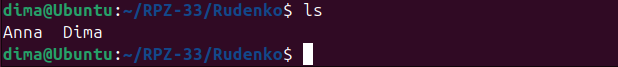

- Перегляньте вміст другого файлу cat name2 (він має поки що містити повну копію вмісту файлу name1);   

- Замініть зміст файлу name2, щоб він містив відповідне ім'я другого студента за допомогою команди echo "Hello, my name is Name2" > name2;  

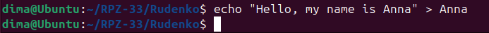

- Перегляньте вміст другого файлу cat name2 (він вже має містити оновлену інформацію);  

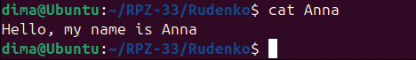

- Перемістіть файл name2 у директорію surname2;  

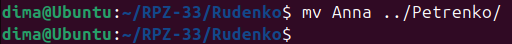

- Зробіть копію першого файлу name1 та перейменуйте її у файл з третім ім'ям студенту Вашої команди name3;  

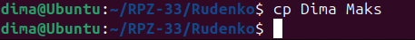

- Перемістіть файл name3 у директорію surname3;  

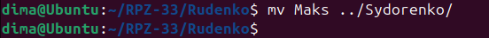

- Перейдіть до директорії  surname3;

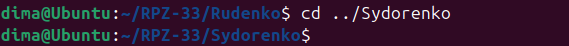

- Перегляньте вміст третього файлу командою cat name3 (він має містити дані про другого студента);  

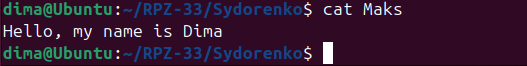

- Замініть зміст файлу name3, щоб він містив відповідне ім'я третього студента за допомогою команди echo "Hello, my name is Name3" > name3;  

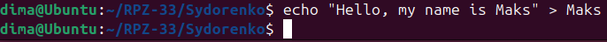

- Перегляньте вміст файлу за допомогою  cat name3 (він вже має містити оновлену інформацію);  

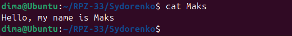

- Поверніться до домашнього каталогу користувача; 

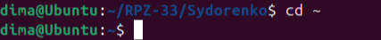

- **Перегляньте вміст даного каталогу, але щоб виводило тільки Ваш підкаталог з назвою групи та весь його вміст (підкаталоги surname1, surname2, surname3 та файли name1, name2, name3) до того ж файли та катлоги були відкоремлені кольорами (скористайтесь відповідним ключем -R команди ls та не забудьте використати спеціальний glob-шаблон [імя каталогу]).  

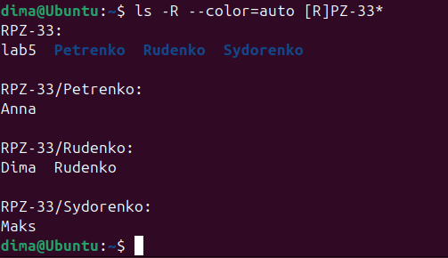

#### 4. Опишіть дії, які виконують команди для переміщення по системі каталогів:

- команда `cd /` - перехід до кореневого каталогу (root directory). Це найвищий рівень файлової системи Linux (початок дерева каталогів).
- команда `cd /home` - перехід до каталогу home за абсолютним шляхом. У цьому каталозі зазвичай знаходяться персональні (домашні) папки всіх звичайних користувачів системи.
- команда `cd ~` - перехід до домашнього каталогу поточного користувача (наприклад, у /home/student). Символ тильди (~) в Linux автоматично замінюється системою на шлях до вашої домашньої папки.
- команда `cd` (без аргумента) - виконує абсолютно ту саму дію, що й cd ~. Якщо ввести команду cd без жодних додаткових вказівок, система за замовчуванням поверне вас у ваш домашній каталог.
- команда `cd ..` - перехід на один рівень вгору (до батьківського каталогу) відносно того місця, де ви знаходитесь зараз. (Наприклад, якщо ви у /home/student/KN-21, ця команда поверне вас у /home/student). 
- команда `cd ../..` - перехід одразу на два рівні вгору по дереву каталогів. (Наприклад, з /home/student/KN-21 ви потрапите одразу в /home).
- команда `cd -` - повернення до попереднього робочого каталогу. Система пам'ятає папку, в якій ви знаходилися до останнього використання команди cd, і ця команда працює як кнопка "Назад" у браузері.

### Контрольні запитання:

**1. Як можна переглянути шлях до домашньої директорії користувача за допомогою команди echo? Існує 2 способи, наведіть обидва приклади у терміналі (відповідь є у матеріалах академії cisco на сайті netacad.com)**

Існує два основних способи зробити це за допомогою командної оболонки Bash:

- Спосіб 1 (з використанням метасимволу тильди): `echo ~`. Символ тильди (~) у Linux є шорткатом (скороченням), який оболонка автоматично розгортає в абсолютний шлях до домашнього каталогу користувача ще до того, як команда echo виконається (це називається tilde expansion).  
- Спосіб 2 (з використанням системної змінної): `echo $HOME`. Оболонка зберігає абсолютний шлях до домашнього каталогу поточного користувача у спеціальній змінній середовища `$HOME`. Команда `echo` просто виводить значення цієї змінної на екран.

**2.** ***Чи можна переглянути вміст кореневого каталогу, перебуваючи у домашньому каталозі користувача без переходу у кореневий каталог? Продемонструйте це в командному рядку.**

Так, можна. Для цього не потрібно використовувати команду cd. Достатньо передати команді ls абсолютний шлях до каталогу, вміст якого ви хочете переглянути, незалежно від вашого поточного місцезнаходження. Приклад в командному рядку (`ls /` або `ls -l /` для перегляду у довгому форматі з деталями) зображено нижче. Команда виведе вміст кореневого каталогу, при цьому поточний робочий каталог залишиться незмінним):

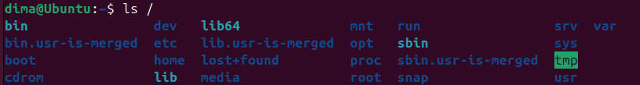

**3.** ***Яким чином в терміналі можна додати інформацію в порожній файл?**

Найшвидший спосіб зробити це без відкриття повноцінних текстових редакторів — використати команду echo разом з оператором перенаправлення виводу > (наприклад, `echo "Ваш текст" > ім'я_файлу.txt`). Команда `echo` генерує текст, а символ > перенаправляє цей текст прямо у вказаний файл (якщо файл порожній, він наповниться; якщо там щось було — воно перезапишеться). Також можна використати команду `cat > ім'я_файлу.txt`, ввести необхідний текст з клавіатури та натиснути Ctrl+D для збереження та виходу.

**4.** ****Як скопіювати та видалити існуючий каталог? Чи буде відмінність в командах, якщо каталог буде не порожній при цьому?**

Для копіювання каталогів завжди використовується команда `cp` з обов'язковим рекурсивним ключем -r (або -R). Немає значення, порожній він чи ні (`cp -r [каталог_джерело] [каталог_призначення]`).
Якщо каталог порожній, можна використати безпечну команду `rmdir [ім'я_каталогу]` для його видалення. Вона видаляє тільки порожні папки. Якщо каталог не порожній, команда `rmdir` видасть помилку. Щоб видалити каталог разом з усіма файлами та підкаталогами всередині, необхідно використовувати команду `rm` з рекурсивним ключем -r (`rm -r [ім'я_каталогу]` (для безпеки часто додають ключ -i, щоб підтверджувати видалення кожного файлу: `rm -ri`).

**5.** ****У якому з наведених нижче прикладів відбувається переміщення файлу? його перейменування? одночасно обидві дії?**

- `mv /work/tech/comp.png. /Desktop`  
Тільки переміщення. Файл переноситься з каталогу /work/tech/ до каталогу /Desktop. Оскільки нове ім'я файлу не вказано, він зберігає свою оригінальну назву comp.png.

- `mv /work/tech/comp.png. /work/tech/my_car.png`   
Тільки перейменування. Шлях до файлу (його місцезнаходження /work/tech/) залишається тим самим, змінюється лише його ім'я з comp.png на my_car.png.

- `mv /work/tech/comp.png. /Desktop/computer.png`  
Одночасно переміщення та перейменування. Файл змінює своє місцезнаходження (переміщується у /Desktop/) і при цьому отримує нову назву (computer.png).

## Conclusions:

&nbsp;&nbsp;&nbsp;During this laboratory work, I successfully gained practical skills in working with the Linux command-line shell (Bash). I learned how to efficiently navigate the filesystem using commands such as cd, ls, and pwd, and clearly understood the difference between absolute and relative paths.  
&nbsp;&nbsp;&nbsp;Furthermore, I practiced essential file and directory management operations. I successfully created, copied, moved, renamed, and deleted files and directories using commands like mkdir, touch, cp, mv, and rm. I also learned how to use wildcards (glob characters) for flexible file searching and pattern matching, and how to redirect text output directly into files using the echo command. Overall, this lab provided a strong foundation for managing a Linux OS without a graphical user interface.

