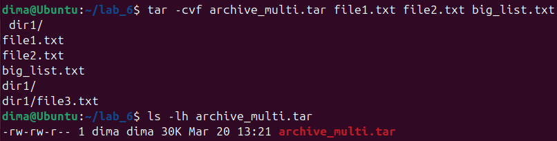
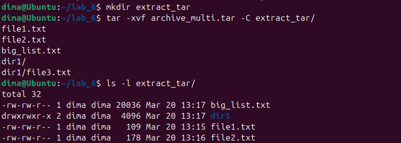
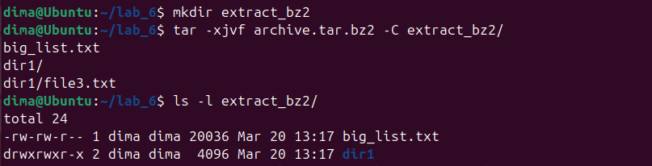
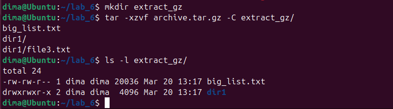

# Лабораторна робота №6
## Дисципліна: Операційні системи
## Тема: “Команди Linux для архівування та стиснення даних. Робота з текстом”**  
### Виконав: студент групи РПЗ-33, Руденко Дмитро

---

<div align="justify"> 
  
### Мета роботи:
<span>1. Отримання практичних навиків роботи з командною оболонкою Bash.</span>   
<span>2. Знайомство з базовими командами для архівування та стиснення даних.</span>  
<span>3. Знайомство з базовими діями при роботі з текстом у терміналі.</span> 

### Матеріальне забезпечення занять:  
<span>1. ЕОМ типу IBM PC.</span>    
<span>2. ОС сімейства Windows та віртуальна машина Virtual Box (Oracle).</span>    
<span>3. ОС GNU/Linux (будь-який дистрибутив).</span>   
<span>4. Сайт мережевої академії Cisco netacad.com та його онлайн курси по Linux.</span>  

### Завдання для попередньої підготовки.

#### 1. *Прочитайте короткі теоретичні відомості до лабораторної роботи та зробіть невеликий словник базових англійських термінів з питань призначення команд та їх параметрів.

| № | Слово | Пояснення |
| :--- | :--- | :--- |
| 1 | **Compression** | Стиснення - зменшення розміру файлу на диску за допомогою алгоритмів |
| 2 | **Archiving** | Архівування - процес об'єднання багатьох файлів у один файл зі збереженням прав доступу та метаданих |
| 3 | **Lossy compression** | Стиснення із втратами - метод стиснення, при якому частина оригінальної інформації втрачається назавжди, наприклад, в MP3 або JPEG |
| 4 | **Lossless compression** | Стиснення без втрат - дозволяє повністю та точно відновити оригінальний файл |
| 5 | **Extract / Decompress** | Витягувати / Розпаковувати - відновлення файлів з архіву або зі стисненого стану |
| 6 | **Directory structure** | Структура каталогів - зберігається при використанні архіватора, наприклад, `tar` |
| 7 | **Permissions** | Права доступу - дозволи для файлів, які зберігаються під час створення архіву |
| 8 | **Standard out (stdout)** | Стандартний потік виведення - куди можна спрямувати результат команди, наприклад, за допомогою параметра `-c` |
| 9 | **Verbose output** | Детальний вивід - коли програма демонструє на екрані кожен крок своєї роботи; у `tar` за це відповідає параметр `v` |

#### 2. Вивчіть матеріали онлайн-курсу академії Cisco “NDG Linux Essentials”:

<span>- Chapter 09 - Archiving and Compression</span>  
<span>- Chapter 10 - Working With Text</span>

#### 3. Пройдіть тестування у курсі NDG Linux Essentials за такими темами:

<span>- Chapter 09 Exam</span>   
<span>- Midterm Exam (Modules 1 - 9) буде окреме завдання в гугл-класі</span>   
<span>- Chapter 10 Exam</span>  

#### 4. Додаткові матеріали для вивчення:

<span>- [Як архівувати файли в Linux](https://ittutorials.co.ua/2024/10/29/%D1%8F%D0%BA-%D0%B0%D1%80%D1%85%D1%96%D0%B2%D1%83%D0%B2%D0%B0%D1%82%D0%B8-%D1%84%D0%B0%D0%B9%D0%BB%D0%B8-%D0%B2-linux/)  
<span>- [Команда tar](https://docs.rockylinux.org/10/uk/guides/backup/tar/)  
<span>- [Стандартні потоки в Linux](https://ittutorials.co.ua/2024/08/07/%D1%81%D1%82%D0%B0%D0%BD%D0%B4%D0%B0%D1%80%D1%82%D0%BD%D1%96-%D0%BF%D0%BE%D1%82%D0%BE%D0%BA%D0%B8-%D0%B2-linux/)  
<span>- [Потоки введення / виведення в Bash](https://docs.google.com/document/d/1KFgPMczSDduN6ETikkTAeSmQqCTjPrQrWhzeJVlvtlU/edit?usp=sharing)

#### 5. На базі розглянутого матеріалу дайте відповіді на наступні питання:

<blockquote>
  
**5.1.** ***Яке призначення команд  `tar`, `xz`, `zip`, `bzip`, `gzip`? Зробіть короткий опис кожної команди та виділіть їх основні параметри. Яким чином їх можна встановити.**

**<span>- 1. Команда `tar` (Tape Archive)</span>**

Використовується для створення, розпакування та управління архівами. `tar` сама по собі не стискає файли. Її головна задача — зібрати безліч файлів і каталогів в один єдиний файл-архів (який часто називають "tarball"), зберігаючи при цьому структуру каталогів, права доступу та інші метадані файлів. Для стиснення вона працює в парі з іншими утилітами (`gzip`, `bzip2`, `xz`).

Основні параметри:

`-c` (create) — створити новий архів.  
`-x` (extract) — розпакувати архів.  
`-v` (verbose) — виводити на екран детальну інформацію про процес.  
`-f` (file) — вказує ім'я файлу архіву (має йти останнім перед назвою файлу).  
`-z` — стиснути архів за допомогою `gzip` (розширення .tar.gz).  
`-j` — стиснути архів за допомогою `bzip2` (розширення .tar.bz2).  
`-J` — стиснути архів за допомогою `xz` (розширення .tar.xz).  

**<span>- 2. Команда `gzip` (GNU zip)</span>**

Потрібна для швидкого стиснення та декомпресії файлів. Використовує алгоритм DEFLATE. Це найпоширеніший інструмент у Linux для стиснення файлів. Він працює дуже швидко і споживає мало ресурсів, але забезпечує дещо менший ступінь стиснення порівняно з новішими аналогами. За замовчуванням після стиснення оригінальний файл видаляється, а замість нього з'являється файл із розширенням .gz.

Основні параметри:

`-d` (decompress) — розпакувати файл (аналог команди `gunzip`).  
`-k` (keep) — зберегти оригінальний файл після стиснення/розпакування.  
`-r` (recursive) — рекурсивно стиснути всі файли в каталозі (кожен окремо).  
`-1` ... `-9` — рівень стиснення (1 — найшвидше, 9 — найщільніше).  

**<span>- 3. Команда `bzip2` (`bzip`)</span>**

Більш щільно стискає файли порівняно з `gzip`. Використовує алгоритм блочного сортування Барроуза-Вілера. Створює файли з розширенням .bz2. Процес стиснення займає більше часу і вимагає більше оперативної пам'яті, ніж `gzip`, але результуючий файл виходить значно меншим за розміром.

Основні параметри:

`-d` (decompress) — розпакувати файл (аналог команди `bunzip2`).  
`-k` (keep) — зберегти оригінальний файл.  
`-1` ... `-9` — розмір блоку пам'яті, що використовується для стиснення.

**<span>- 4. Команда `xz`</span>**

Максимально стискає файли. Найсучасніший інструмент із перелічених, використовує алгоритм LZMA2. Забезпечує найвищий ступінь стиснення, створюючи файли .xz. Однак цей процес є найбільш ресурсоємним — він сильно навантажує процесор і потребує багато часу та пам'яті (проте розпакування відбувається відносно швидко).

Основні параметри:

`-d` (decompress) — розпакувати файл (аналог команди `unxz`).  
`-k` (keep) — зберегти оригінальний файл.  
`-0` ... `-9` — рівень стиснення (за замовчуванням зазвичай 6).  
`-e` (extreme) — екстремальний режим стиснення (дуже повільний).

**<span>- 5. Команда `zip`</span>**

Використовується для одночасного архівування та стиснення файлів у кросплатформний формат. На відміну від `gzip` або `xz`, які стискають лише один файл, `zip` створює повноцінний архів із багатьох файлів і каталогів і одразу стискає їх. Формат .zip є стандартом де-факто у системах Windows та macOS, тому ця команда часто використовується для обміну даними між різними операційними системами.

Основні параметри:

`-r` (recursive) — додати до архіву всю директорію з підкаталогами.  
`-e` (encrypt) — захистити архів паролем.  
`-u` (update) — оновити існуючий архів (додати лише змінені файли).  
`-d` (delete) — видалити конкретний файл із готового архіву.

**Як їх встановити**

У більшості сучасних дистрибутивів Linux (наприклад, Ubuntu, Debian, Mint) ці утиліти або вже встановлені за замовчуванням, або доступні в стандартних репозиторіях. Встановити їх усі разом можна за допомогою стандартного пакетного менеджера apt. Для цього потрібно виконати в терміналі команду з правами суперкористувача (root):

``` 
sudo apt update
```

```
sudo apt install tar gzip bzip2 xz-utils zip unzip
```

*(Примітка: для розпакування zip-архівів додатково встановлюється пакет `unzip`, а утиліта `xz` знаходиться у пакеті `xz-utils`).*

<br>

**5.2.** ****Наведіть три приклади реалізації архівування та стискання даних різними командами.**

У Linux для комплексного бекапу найчастіше поєднують архіватор `tar` з утилітами стиснення в одну команду.  

<span>- Створення архіву зі стисненням `gzip` (створить файл compressed.tar.gz з каталогу directory1):</span>   
`tar czvf compressed.tar.gz directory1`  

<span>- Створення архіву зі стисненням `bzip2` (створить файл bzipcompressed.tar.bz2 з каталогу directory2):</span>   
`tar cjvf bzipcompressed.tar.bz2 directory2`  

<span>- Створення архіву зі стисненням `xz` (створить файл xzcompressed.tar.xz з каталогу directory3):</span>   
`tar cJvf xzcompressed.tar.xz directory3`

<br>

**5.3.** ***Яке призначення команд  `cat`, `less`, `more`, `head` and `tail`? Зробіть короткий опис кожної команди та виділіть їх основні параметри. Яким чином їх можна встановити.**

**<span>- 1. Команда `cat` (Concatenate)</span>**

Відповідає за виведення вмісту файлів на екран, а також створення або об'єднання файлів. Команда зчитує весь вміст вказаного файлу (або кількох файлів) і миттєво виводить його у стандартний потік виведення (на екран термінала). Вона найкраще підходить для перегляду невеликих текстових файлів. Якщо файл занадто великий, текст швидко прокрутиться до самого кінця.

Основні параметри:

`-n` (number) — нумерувати всі рядки при виведенні.  
`-b` (number-nonblank) — нумерувати лише непорожні рядки.  
`-E` (show-ends) — відображати символ `$` в кінці кожного рядка.  
`-s` (squeeze-blank) — замінювати кілька порожніх рядків поспіль на один.  

**<span>- 2. Команда `less`</span>**

Зручний посторінковий перегляд великих текстових файлів. Це сучасний "пейджер" (pager). На відміну від `cat`, `less` не виводить весь файл відразу, а показує його по одній сторінці (екрану). Головна перевага `less` полягає в тому, що він дозволяє гортати текст як вперед (клавіша Space або Page Down), так і назад (клавіша b або Page Up). Крім того, він не завантажує весь файл в оперативну пам'ять перед початком роботи, тому відкриває навіть величезні логи миттєво.

Основні параметри:

`-N` — відображати номери рядків.  
`-S` — обрізати довгі рядки (щоб вони не переносилися на новий рядок, а текст можна було гортати вправо/вліво).  
`+F` — автоматично прокручувати файл до кінця і чекати на нові записи (схоже на `tail -f`).

**<span>- 3. Команда `more`</span>**

Базовий посторінковий перегляд текстових файлів. Це старіший попередник команди `less`. Він також виводить текст по одному екрану за раз, але його функціонал значно обмеженіший. Здебільшого more дозволяє гортати текст лише вперед (за допомогою клавіші Space або Enter). Рух назад або неможливий, або сильно обмежений залежно від версії.

Основні параметри:

`-d` — виводити підказки для користувача (наприклад, "Press space to continue, 'q' to quit") і не подавати звуковий сигнал при помилках.  
`-c` — очищати екран перед виведенням кожної нової сторінки (замість прокручування).  
`+num` — почати виведення тексту з рядка під номером num.  

**<span>- 4. Команда `head`</span>**

Виведення початкової частини файлу. За замовчуванням команда виводить на екран перші 10 рядків вказаного файлу. Це дуже зручно, коли потрібно швидко переглянути заголовок файлу, структуру колонок або перевірити, чи це той файл, який вам потрібен, не відкриваючи його повністю.

Основні параметри:

`-n <кількість>` — вказує, скільки саме рядків з початку файлу потрібно вивести (наприклад, `head -n 20 file.txt`).  
`-c <кількість>` — виводить задану кількість байтів з початку файлу, а не рядків.  
`-q` (quiet) — не виводити заголовки з назвами файлів, якщо обробляється кілька файлів одночасно.

**<span>- 5. Команда `tail`</span>**

Виведення кінцевої частини файлу. За замовчуванням виводить останні 10 рядків файлу. Це один із найважливіших інструментів системного адміністратора, оскільки найчастіше він використовується для перегляду свіжих записів у файлах журналів (логів), які постійно доповнюються в кінці.

Основні параметри:

`-n <кількість>` — вивести вказану кількість рядків з кінця файлу.  
`-f` (follow) — надзвичайно корисний параметр. Він не закриває файл після виведення останніх рядків, а продовжує "слухати" його і в реальному часі виводить нові рядки, щойно вони додаються до файлу іншими програмами.   
`-c <кількість>` — виводить задану кількість байтів з кінця файлу.

**Як їх встановити**

Усі ці команди є фундаментальними утилітами середовища GNU/Linux (входять до базових пакетів `coreutils` та `less`).  Вони попередньо встановлені (pre-installed) практично в кожному сучасному дистрибутиві Linux (Ubuntu, Debian, Mint, CentOS тощо) "з коробки". Тому зазвичай їх не потрібно встановлювати окремо. Якщо ж виникає потреба встановити їх у якійсь мінімальній (урізаній) системі чи контейнері, використовуються стандартні пакетні менеджери:   

```
sudo apt update
```

```
sudo apt install coreutils less
```

*(Примітка: `cat`, `head`, `tail` входять до пакунка `coreutils`, а `more` зазвичай постачається разом із пакетом `util-linux` або `moreutils`).*

<br>

**5.4.** ****Поясніть принципи роботи командної оболонки з каналами, потоками та фільтрами.**

В основі командної оболонки Linux (наприклад, Bash) лежить філософія Unix: створювати невеликі програми, які роблять одну річ, але роблять її добре, і дозволяти цим програмам легко взаємодіяти одна з одною. Ця взаємодія забезпечується через потоки та канали.

**<span>- 1. Потоки (Streams)</span>**

Коли ви запускаєте будь-яку команду в Linux, операційна система автоматично створює для неї три стандартні потоки даних (їм присвоюються номери від 0 до 2):

- 0: Стандартне введення (`stdin`) — потік, з якого програма зчитує вхідні дані. За замовчуванням це клавіатура.
- 1: Стандартне виведення (`stdout`) — потік, куди програма відправляє результати своєї успішної роботи. Наприклад, виведення розпакованого файлу можна направити у стандартний потік. За замовчуванням цей потік спрямований на екран термінала.
- 2: Стандартне виведення помилок (`stderr`) — окремий потік для повідомлень про помилки та діагностики. Він також за замовчуванням виводиться на екран, щоб помилки не змішувалися з корисними даними.

**Перенаправлення потоків:** Ви можете змінити напрямок цих потоків за допомогою спеціальних символів оболонки (операторів перенаправлення):

- `>` перенаправляє `stdout` у файл (перезаписуючи його).
- `>>` додає `stdout` у кінець існуючого файлу.
- `2>` перенаправляє лише помилки (`stderr`) у файл.
- `2>&1` об'єднує потік помилок із стандартним виведенням.

**<span>- 2. Канали (Pipes)</span>**

Канал позначається вертикальною рискою `|` і використовується для об'єднання кількох команд у так званий конвеєр. Канал бере стандартне виведення (`stdout`) програми зліва від себе і підключає його безпосередньо як стандартне введення (`stdin`) для програми справа. Це дозволяє передавати дані між програмами в оперативній пам'яті миттєво, без необхідності створювати тимчасові файли на диску.

**Приклад:** У команді `cat myfile | grep student | wc -l` вміст файлу передається команді `grep`, яка відфільтровує рядки зі словом "student", а потім результат передається команді `wc`, яка рахує кількість цих рядків.

**<span>- 3. Фільтри (Filters)</span>**

**Фільтр** — це спеціальний клас команд (утиліт), які створені для роботи всередині конвеєра. Програма-фільтр читає дані зі свого стандартного введення (`stdin`), якимось чином їх обробляє, модифікує або фільтрує, і відправляє результат у стандартне виведення (`stdout`).

**Типові приклади фільтрів:** 
- `grep` — шукає рядки, що відповідають певному шаблону.
- `sort` — сортує отримані рядки за алфавітом або числами.
- `wc` — рахує кількість слів, символів або рядків.

<br>

Разом ці три концепції дозволяють створювати складні та потужні ланцюжки команд для обробки тексту просто в терміналі.

<br>

**5.5.** ***Яке призначення команди grep?**

Команда `grep` (Global Regular Expression Print) призначена для пошуку тексту за шаблоном усередині файлів або у потоці даних. Вона зчитує вхідний текст рядок за рядком. Якщо рядок містить збіг із заданим словом, фразою або регулярним виразом, `grep` виводить цей рядок у стандартний потік виведення (на екран). Рядки, які не відповідають шаблону, відкидаються. `grep` є одним із найголовніших інструментів-фільтрів у Linux. Її дуже часто комбінують з іншими командами через канал (символ `|`), щоб відфільтрувати великий обсяг інформації. Наприклад, щоб знайти конкретний процес серед сотень запущених, або знайти повідомлення про помилку у величезному файлі системного журналу.

Основні параметри:

`-i` (ignore case) — ігнорувати регістр літер (наприклад, пошук слова "error" знайде також "Error" і "ERROR").  
`-v` (invert match) — інвертований пошук. Програма виведе всі рядки, які НЕ містять вказаного шаблону.  
`-r` або `-R` (recursive) — рекурсивний пошук. Шукає заданий текст не лише у вказаному каталозі, а й у всіх його підкаталогах та файлах.  
`-n` (line number) — перед кожним знайденим рядком виводити його порядковий номер у файлі.  
`-c` (count) — замість виведення самих знайдених рядків, вивести лише їхню загальну кількість.  
`-E` (extended regexp) — дозволяє використовувати складні розширені регулярні вирази для пошуку (є аналогом команди `egrep`).

**Як встановити:**

Як і `cat` чи `tail`, утиліта `grep` є базовою частиною будь-якої Unix/Linux системи. Вона встановлена "з коробки" практично у всіх існуючих дистрибутивах (зазвичай як частина пакету `grep` від GNU). Якщо з якихось причин у мінімальній системі її немає, встановлення виконується стандартно:

```
sudo apt update
```

```
sudo apt install grep
```

</blockquote>
  
#### 6. Підготувати в електронному вигляді початковий варіант звіту:

<span>- Титульний аркуш, тема та мета роботи</span>  
<span>- Словник термінів</span>  
<span>- Відповіді на п.4.1 та п.4.5 з завдань для попередньої підготовки</span>

## Хід роботи

#### 1. Початкова робота в CLI-режимі в Linux ОС сімейства Linux:
  
**1.1. Запустіть операційну систему Linux Ubuntu. Виконайте вхід в систему та запустіть термінал (якщо виконуєте ЛР у 401 ауд.).**

**1.2. Запустіть віртуальну машину Ubuntu_PC (якщо виконуєте завдання ЛР через академію netacad)** 

**1.3. Запустіть свою операційну систему сімейства Linux (якщо працюєте на власному ПК та її встановили) та запустіть термінал.**

<blockquote>
  
Під час виконання роботи я буду використовувати свою, встановлену під час виконання Work-case 2, операційну систему сімейства Linux:


</blockquote>

#### 2. Опрацюйте всі приклади команд, що представлені у лабораторних роботах курсу NDG Linux Essentials - Lab 9: Archiving and Compression та Lab 10: Working With Text. Створіть таблицю для опису цих команд

| Назва команди | ЇЇ призначення та функціональність |
| :--- | :--- |
| `mkdir mybackups` | Створення нової директорії mybackups у домашньому каталозі користувача |
| `tar –cvf mybackups/udev.tar /etc/udev` | Створення архіву каталогу /etc/udev |
| `tar –tvf mybackups/udev.tar` | Відображення вмісту `tar`-файлу, використовуючи доступні опції (`t` = список вмісту, `v` = детальний вивід, `f` = ім'я файлу) |
| `tar –zcvf mybackups/udev.tar.gz /etc/udev` | Cтворення стиснутого `tar`-файлу, використовуючи параметр `-z`. Параметр `-z` використовує утиліту `gzip` для виконання стиснення |
| `tar -rvf udev.tar /etc/hosts` | Додавання файлу до існуючого архіву, використовуючи параметр `-r` команди `tar` |
| `tar –tvf udev.tar` | Перевірка існування нового файлу в архіві `tar` |
| `gzip words` | Стискання копії файлу words |
| `gunzip words.gz` | Розпаковка файлу words.gz |
| `bzip2 words` | Стискання копії файлу words |
| `bunzip2 words.bz2` | Розпаковка файлу words.bz2 |
| `xz words` | Стискання копії файлу words |
| `unxz words.xz` | Розпаковка файлу words.xz |
| `zip words.zip words` | Стиснення файлу words |
| `zip -r udev.zip /etc/udev` | Стиснення каталогу /etc/udev та його вмісту за допомогою `zip`-стиснення |
| `unzip -l udev.zip` | Перегляд вмісту zip-архіву, використовуючи команду unzip з параметром `-l` |
| `rm -r etc` | Видалення файлів, створених в попередньому прикладі `tar` |
| `unzip udev.zip` | Розпаковка zip-архіву, використовуючи команду `unzip` без будь-яких опцій |
| `echo "Hello World" > mymessage` | Перенаправлення виводу зі звичайного виводу `stdout` (до терміналу) до файлу |
| `cat mymessage` | Перевірка перенаправленого виводу до файлу |
| `echo "How are you?" >> mymessage` | Додавання елементів до файлу, уникаючи пошкодження файлу | 
| `find ~ -name "*bash*"` | Пошук файлів, що починаються з вашого домашнього каталогу, що містить ім'я bash |
| `find /etc -name hosts 2> err.txt` | Перенаправлення `stderr` (повідомлення про помилки) до файлу |
| `find /etc -name hosts > std.out 2> std.err` | Перенаправлення `stdout` та `stderr` у два окремі файли |
| `find /etc -name hosts > find.out 2>&1` | Перенаправлення `stdout` у файл, а потім перенаправлення `stderr` у той самий файл, використовуючи нотацію `2>&1` для перенаправлення стандартного виводу (`stdout`) та стандартного виводу помилок (`stderr`) в один файл |
| `tr a-z A-Z` | Команда `tr` перетворює символи, але приймає лише дані зі `stdin`, а не з імені файлу, заданого як аргумент (натисніть Control+d, щоб сигналізувати команді `tr` про зупинку обробки стандартного вводу) |
| `tr A-Z a-z > myfile` | Створення файлу, що містить лише символи нижнього регістру |
| `tr a-z A-Z < myfile` | Перенаправлення `stdin` з файлу |
| `ls -l /etc \| more` | Взяття виводу команди `ls` та надсилання його команді `more`, яка відображає по одній сторінці даних за раз |
| `cut -d: -f1 /etc/passwd` | Витягнення всіх імен користувачів з бази даних під назвою /etc/passwd |
| `cut -d: -f1 /etc/passwd \| sort` | Взяття виводу команди `cut` та надсилання його команді `sort` для упорядкування виводу |
| `cut -d: -f1 /etc/passwd \| sort \| more` | Надсилання виводу команди `sort` команді `more` для запобігання прокручування виводу за межі екрана |
| `more /etc/passwd` | Відображення всього вмісту файлу /etc/passwd |
| `less /etc/passwd` | Відображення всього вмісту файлу /etc/passwd |
| `head /etc/passwd` | Відображення верхньої частини файлу. За замовчуванням команда `head` відображає перші десять рядків файлу |
| `tail /etc/passwd` | Відображення останніх десяти рядків файлу /etc/passwd |
| `head -2 /etc/passwd` | Відображення перших двох рядків файлу /etc/passwd |
| `ls /etc \| tail -5` | Перенаправлення виводу команди `ls` до команди `tail`, відобразивши останні п'ять імен файлів у каталозі /etc |
| `head -n -20 /etc/passwd` | Відображення рядків 1-7, виключаючи останні двадцять рядків |
| `grep sshd passwd` | Виведення всього рядка, що містить збіг |
| `grep '^root' passwd` | Відображення лише рядків, що починаються з кореня |
| `grep 'sync' passwd` | Зіставлення синхронізації шаблону будь-де на рядку |
| `grep 'sync$' passwd` | Зіставлення зі шаблоном синхронізації в кінці рядка |
| `grep '.y' passwd` | Пошук будь-якого символу, за яким йде літера «y» |
| `grep 'sshd\|root\|operator' passwd` | Спроба пошуку sshd, root або operator |
| `grep -E 'sshd\|root\|operator' passwd` | Використання параметра `-E`, для дозволу `grep` працювати в розширеному режимі, щоб розпізнавати оператор чергування |
| `egrep 'no(b\|n)' passwd` | Використання ще одного розширеного регулярного вираз, цього разу з `egrep` з чергуванням у групі для відповідності шаблону (рядки nob та non) |
| `head passwd \| grep '[0-9]'` | Якщо потрібно збігатися з числовим символом, можна вказати [0-9] |
| `grep -E '[0-9]{3}' passwd` | Використання числового кваліфікатора вимагає розширеного режиму `grep` |

#### 3. Ознайомтесь з командою tar та за її допомогою виконати у терміналі наступні дії:

<span>- створити файл з розширенням .tar;</span> 


<span>- створити файл з розширенням .tar, що складається з декількох файлів і каталогів одночасно;</span>



<span>- перегляду вмісту файлу;</span>


<span>- витягти вміст файлу tar;</span>

> Щоб наочно показати розпакування і не переплутати файли з оригіналами, створимо окрему папку і розпакуємо туди:



<span>- створити архівний файл tar, стиснений за допомогою bzip;</span>

> Запакуємо великий список і папку, щоб алгоритму стиснення було з чим працювати:


<span>- витягти вміст файлу tar bzip;</span>

> Знову розпакуємо в окрему папку для чистоти експерименту:



<span>- створити архівний tar файл, стисненого за допомогою gzip;</span>


<span>- витягти вміст файлу tar gzip.</span>



#### 4. *Як буде відбуватись перенаправлення потоків виведення в bash для наступних дій з командами (позначено як cmd) та файлами (позначено як file):

| Команда | Що виконує ця команда | 
| :--- | :--- |
| `cmd 1> file` | Перенаправляє стандартний потік виведення (`stdout`) команди у файл. Якщо файл існує, його вміст буде перезаписано, якщо ні — створено новий. Помилки виводяться на екран |
| `cmd > file` | Робить абсолютно те саме, що й попередня команда (оскільки дескриптор 1 мається на увазі за замовчуванням). Перезаписує файл стандартним виведенням |
| `cmd 2> file` | Перенаправляє потік помилок (`stderr`) команди у файл (із перезаписом). Стандартне виведення (успішний результат) з'явиться на екрані |
| `cmd >> file` | Перенаправляє стандартний потік виведення (`stdout`) у файл, але додає текст у кінець файлу, не видаляючи його попередній вміст |
| `cmd &> file` | Одночасно перенаправляє і стандартне виведення (`stdout`), і потік помилок (`stderr`) у файл file із перезаписом |
| `cmd > file 2>&1` | Класичний синтаксис, що робить те саме, що й попередня команда: направляє і `stdout`, і `stderr` у файл із перезаписом (спочатку `stdout` направляється у файл, а потім `stderr` перенаправляється туди ж, куди вказує `stdout`) |
| `cmd >> file 2>&1` | Одночасно перенаправляє і `stdout`, і `stderr` у файл, додаючи їх у кінець файлу (без перезапису) |
| `cmd 2>&1 > /dev/null` | Перенаправляє потік помилок (`stderr`) на екран, а стандартне виведення (`stdout`) відправляє у /dev/null (тобто повністю знищує/ігнорує його). На екрані ви побачите лише помилки |
| `cmd 2> /dev/null` | Приховує (знищує) повідомлення про помилки, направляючи їх у /dev/null. Стандартне виведення при цьому відображатиметься на екрані як зазвичай |
| `cmd1 \| cmd2` | cmd2` |
| `cmd1 2>&1 \| cmd2` | cmd2` |

#### 5. **Розгляньте наведені нижче приклади та поясніть, що виконують дані команди та який тип перенаправлення потоків вони використовують:

| Команда (контейнер команд) | Що виконує команда? | Який потік перенаправлення? |
| :--- | :--- | :--- |
| `echo "It is a new story." > story` | Записує текстовий рядок "It is a new story." у файл з назвою story. Якщо такого файлу немає, він створюється, якщо є — перезаписується | Перенаправлення стандартного виведення (`stdout`) у файл із перезаписом (`>`) |
| `date > date.txt` | Визначає поточну системну дату та час і записує цю інформацію у файл date.txt (замість виведення на екран) | Перенаправлення стандартного виведення (`stdout`) у файл із перезаписом (`>`) |
| `cat file1 file2 file3 > bigfile` | Зчитує вміст трьох файлів (file1, file2, file3), об'єднує їх один за одним і зберігає загальний результат у новий файл bigfile | Перенаправлення стандартного виведення (`stdout`) у файл із перезаписом (`>`) |
| `ls -l >> directory` | Формує детальний список файлів поточної директорії та додає цей текст у кінець файлу з назвою directory (не знищуючи те, що там вже було) | Перенаправлення стандартного виведення (`stdout`) у файл із додаванням в кінець (`>>`) |
| `sort < file1_unsorted > file2_sorted` | Команда `sort` бере вхідні дані з файлу file1_unsorted, сортує рядки за алфавітом і зберігає відсортований результат у файл file2_sorted | Одночасне перенаправлення введення (`stdin`) з файлу (`<`) та виведення (`stdout`) у файл (`>`) |
| `find -name '*.txt' > file.txt 2> /dev/null` | Шукає всі файли .txt. Список знайдених файлів зберігає у file.txt. Якщо виникають помилки доступу (Permission denied), вони приховуються (відправляються в "чорну діру") | Перенаправлення `stdout` у файл (`>`) та перенаправлення потоку помилок (`stderr`) у /dev/null (`2>`) |
| `cat file1_unsorted \| sort > file2_sorted` | Читає невідсортований файл і передає його по каналу команді `sort`. Відсортований результат зберігається у новий файл (результат аналогічний команді вище) | Канал (`\|`) передає stdout на `stdin` наступної команди. Потім `stdout` перенаправляється у файл (`>`) |
| `cat myfile \| grep student \| wc -l` | Читає файл, передає текст фільтру grep (який залишає лише рядки зі словом "student"). Потім ці рядки передаються утиліті `wc -l`, яка просто рахує їхню кількість | Використовується два канали (`\|`) для послідовної передачі `stdout` однієї команди на `stdin` іншої |

### Контрольні запитання

**1. Надайте порівняльну характеристику процесам стискання та архівування.**

Архівування дозволяє об'єднати багато файлів у єдиний файл-архів зі збереженням оригінальної структури каталогів, прав доступу та метаданих. Стиснення, натомість, використовує математичні алгоритми для безпосереднього зменшення розміру файлу на диску. Зазвичай ці два процеси комбінують.

**2. Які програми, окрім наведених в роботі, можуть використовуватись для стискання та архівування файлів та каталогів в ОС Linux? Наведіть приклади та їх короткий опис.**

Окрім розглянутих утиліт, в Linux часто використовують програму 7z, яка забезпечує дуже високий ступінь стиснення завдяки власному алгоритму LZMA, а також утиліти `rar` та `unrar` для створення та розпакування популярних пропрієтарних архівів формату RAR.

**3.** ***Порівняйте алгоритми стискання, що використовуються в командах (програмах), використовуваних в Linux. Які з алгоритмів можна вважати найшвидшим та найефективнішим?**

Найшвидшим та найбільш ефективним з точки зору використання системних ресурсів є алгоритм "DEFLATE", який використовується утилітою gzip. Найефективнішим за ступенем стиснення (створює найменші файли) є алгоритм LZMA2 в утиліті `xz`, проте він працює значно повільніше і потребує більше пам'яті. Алгоритм "Burrows-Wheeler" в утиліті `bzip2` є проміжним варіантом між ними.

**4.** ***Опишіть програмні засоби для стискання та архівування, що можуть бути використані у вашому мобільному телефоні.**

На сучасних смартфонах (iOS та Android) базові функції роботи з архівами (переважно формату ZIP) вбудовані у стандартні системні файлові менеджери. Для роботи з іншими форматами та складнішого стиснення використовуються сторонні мобільні додатки, такі як ZArchiver, RAR або iZip.

**5.** ***Опишіть та порівняйте програмні засоби для стискання та (де)архівування даних у ОС сімейства Windows.**

У Windows вбудована базова підтримка архівів формату ZIP (через "Провідник"). Найпопулярнішими сторонніми програмами є WinRAR (потужний комерційний інструмент, що підтримує створення RAR-архівів) та 7-Zip (безкоштовна альтернатива з відкритим вихідним кодом, яка відрізняється високим ступенем стиснення у форматі 7z).

**6.** ****Поясніть яким чином стиснення та архівування даних може бути використано для резервування даних. В яких ще задачах системного адміністрування воно може бути використано.**

Ці інструменти дозволяють зручно створювати резервні копії, зберігаючи всі необхідні дані в одному захищеному компактному файлі. У системному адмініструванні це також допомагає економити дисковий простір, зменшувати навантаження на мережу під час передачі даних та ефективно розповсюджувати пакети програмного забезпечення.

**7.** ****Яке призначення директорії файлу /dev/null?**

Файл /dev/null у системах Linux є спеціальним віртуальним пристроєм, який працює як "чорна діра". У системному адмініструванні його використовують для перенаправлення туди непотрібного виведення команд або повідомлень про помилки, щоб вони безслідно знищувалися і не засмічували екран термінала.


## Conclusions:

During this laboratory work, I gained practical skills in using the Bash command shell within the Linux operating system environment.  

I familiarized myself with the principles of creating and managing archives using the tar utility. I also learned how to use popular data compression tools such as gzip, bzip2, and xz, and understood the differences in their efficiency. Additionally, I practiced using basic commands for viewing, filtering, and processing text files (cat, less, more, head, tail, grep).   

Furthermore, I successfully consolidated the principles of data stream management. I learned how to redirect standard output and errors into files (using the >, >>, and 2> operators) and how to link multiple programs into pipelines using pipes (|). This enables the automation and significant optimization of information processing directly within the terminal.


