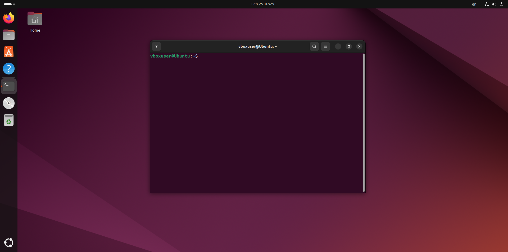

# Лабораторна робота №6
## Дисципліна: Операційні системи
## Тема: “Команди Linux для архівування та стиснення даних. Робота з текстом”**  
### Виконав: студент групи РПЗ-33, Руденко Дмитро

---

 
  
### Мета роботи:
1. Отримання практичних навиків роботи з командною оболонкою Bash.   
2. Знайомство з базовими командами для архівування та стиснення даних.  
3. Знайомство з базовими діями при роботі з текстом у терміналі. 

### Матеріальне забезпечення занять:  
1. ЕОМ типу IBM PC.    
2. ОС сімейства Windows та віртуальна машина Virtual Box (Oracle).    
3. ОС GNU/Linux (будь-який дистрибутив).   
4. Сайт мережевої академії Cisco netacad.com та його онлайн курси по Linux.  

### Завдання для попередньої підготовки.

#### 1. *Прочитайте короткі теоретичні відомості до лабораторної роботи та зробіть невеликий словник базових англійських термінів з питань призначення команд та їх параметрів.

#### 2. Вивчіть матеріали онлайн-курсу академії Cisco “NDG Linux Essentials”:

- Chapter 09 - Archiving and Compression  
- Chapter 10 - Working With Text

#### 3. Пройдіть тестування у курсі NDG Linux Essentials за такими темами:

- Chapter 09 Exam   
- Midterm Exam (Modules 1 - 9) буде окреме завдання в гугл-класі   
- Chapter 10 Exam  

#### 4. Додаткові матеріали для вивчення:

- [Як архівувати файли в Linux](https://ittutorials.co.ua/2024/10/29/%D1%8F%D0%BA-%D0%B0%D1%80%D1%85%D1%96%D0%B2%D1%83%D0%B2%D0%B0%D1%82%D0%B8-%D1%84%D0%B0%D0%B9%D0%BB%D0%B8-%D0%B2-linux/)
- [Команда tar](https://docs.rockylinux.org/10/uk/guides/backup/tar/)
- [Стандартні потоки в Linux](https://ittutorials.co.ua/2024/08/07/%D1%81%D1%82%D0%B0%D0%BD%D0%B4%D0%B0%D1%80%D1%82%D0%BD%D1%96-%D0%BF%D0%BE%D1%82%D0%BE%D0%BA%D0%B8-%D0%B2-linux/)
- [Потоки введення / виведення в Bash](https://docs.google.com/document/d/1KFgPMczSDduN6ETikkTAeSmQqCTjPrQrWhzeJVlvtlU/edit?usp=sharing)

#### 5. На базі розглянутого матеріалу дайте відповіді на наступні питання:

<blockquote>
  
**5.1.** ***Яке призначення команд  tar, xz, zip, bzip, gzip? Зробіть короткий опис кожної команди та виділіть їх основні параметри. Яким чином їх можна встановити.**

**5.2.** ****Наведіть три приклади реалізації архівування та стискання даних різними командами.**

**5.3.** ***Яке призначення команд  cat, less, more, head and tail? Зробіть короткий опис кожної команди та виділіть їх основні параметри. Яким чином їх можна встановити.**

**5.4.** ****Поясніть принципи роботи командної оболонки з каналами, потоками та фільтрами.**

**5.5.** ***Яке призначення команди grep?**

</blockquote>
  
#### 6. Підготувати в електронному вигляді початковий варіант звіту:

- Титульний аркуш, тема та мета роботи
- Словник термінів
- Відповіді на п.4.1 та п.4.5 з завдань для попередньої підготовки

## Хід роботи

#### 1. Початкова робота в CLI-режимі в Linux ОС сімейства Linux:
  
**1.1. Запустіть операційну систему Linux Ubuntu. Виконайте вхід в систему та запустіть термінал (якщо виконуєте ЛР у 401 ауд.).**

**1.2. Запустіть віртуальну машину Ubuntu_PC (якщо виконуєте завдання ЛР через академію netacad)** 

**1.3. Запустіть свою операційну систему сімейства Linux (якщо працюєте на власному ПК та її встановили) та запустіть термінал.**

<blockquote>
  
Під час виконання роботи я буду використовувати свою, встановлену під час виконання Work-case 2, операційну систему сімейства Linux:

</blockquote>

#### 2. Опрацюйте всі приклади команд, що представлені у лабораторних роботах курсу NDG Linux Essentials - Lab 9: Archiving and Compression та Lab 10: Working With Text. Створіть таблицю для опису цих команд

| Назва команди | ЇЇ призначення та функціональність |
| :--- | :--- |
| mkdir mybackups   | Створення нової директорії mybackups у домашньому каталозі користувача |

##### 3. Ознайомтесь з командою tar та за її допомогою виконати у терміналі наступні дії:

- створити файл з розширенням .tar; 

- створити файл з розширенням .tar, що складається з декількох файлів і каталогів  одночасно;

- перегляду вмісту файлу;

- витягти вміст файлу tar;

- створити архівний файл tar, стиснений за допомогою bzip;

- витягти вміст файлу tar bzip;

- створити архівний tar файл, стисненого за допомогою gzip;

- витягти вміст файлу tar gzip.

#### 4. *Як буде відбуватись перенаправлення потоків виведення в bash для наступних дій з командами (позначено як cmd) та файлами (позначено як file):

