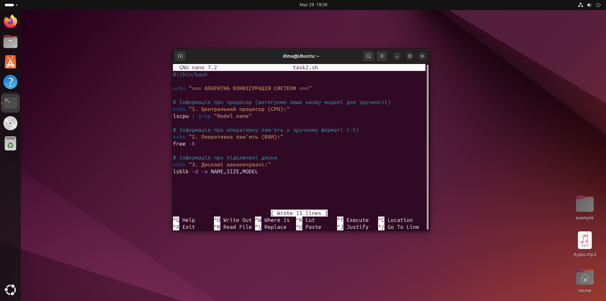

# Лабораторна робота №7
## Дисципліна: Операційні системи
## Тема: “Створення скриптових сценаріїв та визначення апаратної конфігурації системи”**  
### Виконав: студент групи РПЗ-33, Руденко Дмитро

---

 
  
### Мета роботи:
1. Отримання практичних навиків роботи з командною оболонкою Bash.   
2. Знайомство знайомство з базовими діями при роботі зі скриптовими сценаріями.  

### Матеріальне забезпечення занять:  
1. ЕОМ типу IBM PC.    
2. ОС сімейства Windows та віртуальна машина Virtual Box (Oracle).    
3. ОС GNU/Linux (будь-який дистрибутив).   
4. Сайт мережевої академії Cisco netacad.com та його онлайн курси по Linux.  

### Завдання для попередньої підготовки.

#### 1. *Прочитайте короткі теоретичні відомості до лабораторної роботи та зробіть невеликий словник базових англійських термінів з питань призначення команд та їх параметрів.

| № | Слово | Пояснення |
| :--- | :--- | :--- |
| 1 | **Shell** | Командна оболонка - програма-інтерпретатор (наприклад, Bash), яка приймає команди від користувача або зі скрипта та виконує їх |
| 2 | **Script** | Скрипт (сценарій) - текстовий файл із послідовністю команд для автоматичного виконання |
| 3 | **Variable** | Змінна - іменована область пам'яті для зберігання даних (тексту або чисел) під час роботи скрипта |
| 4 | **Condition** | Умова / Умовний оператор (if, case) - логічна конструкція, що дозволяє скрипту приймати рішення |
| 5 | **Loop** | Цикл (for, while) - конструкція, що дозволяє багаторазово виконувати один і той самий блок коду |
| 6 | **Motherboard** | Материнська плата - головна плата комп'ютера, до якої підключаються всі інші компоненти |
| 7 | **CPU (Central Processing Unit)** | Центральний процесор - головний обчислювальний центр системи, що виконує інструкції програм |
| 8 | **RAM (Random Access Memory)** | Оперативна пам'ять - швидка енергозалежна пам'ять, де зберігаються дані програм під час їх виконання |
| 9 | **Partition** | Розділ диска - логічно виділена частина фізичного накопичувача, яка працює як окремий диск |
| 10 | **Mount** | Монтування - процес підключення файлової системи (наприклад, флешки чи розділу диска) до дерева каталогів Linux, щоб зробити її вміст доступним для роботи |

#### 2. Вивчіть матеріали онлайн-курсу академії Cisco “NDG Linux Essentials”:

- Chapter 11 - Basic Scripting  
- Chapter 12 - Understanding Computer Hardware

#### 3. Пройдіть тестування у курсі 	NDG Linux Essentials за такими темами:  

- Chapter 11 Exam     
- Chapter 12 Exam 

#### 4. На базі розглянутого матеріалу дайте відповіді на наступні питання:

<blockquote>
  
**4.1.** ***Охарактеризуйте поняття скриптового сценарію у командній оболонці.**

**Скриптовий сценарій (shell script)** — це текстовий файл, який містить набір команд, що виконуються командною оболонкою. Коли цей файл запускається, кожна команда виконується послідовно. Сценарії мають доступ до всіх можливостей оболонки, включаючи логічні операції, перевірку наявності файлів, аналіз виведення команд та зміну поведінки системи залежно від умов. Їх головне призначення — автоматизація рутинної та повторюваної роботи, що економить час та забезпечує стабільність виконання завдань.

**4.2.** ***Яким чином створюються та редагуються скрипти, що треба зробити щоб запустити скрипт?**

Скрипти створюються як звичайні текстові файли за допомогою консольних текстових редакторів, таких як nano, vi або vim. Першим рядком у файлі зазвичай вказується "shebang" (наприклад, #!/bin/sh або #!/bin/bash), який повідомляє системі, який саме інтерпретатор потрібно використати для запуску коду. Далі просто вводяться потрібні команди.   
Є два основні способи запустити скрипт. Передати файл як аргумент командній оболонці (наприклад, sh test.sh) або запустити його безпосередньо (наприклад, ./test.sh). Для прямого запуску скрипту необхідно надати права на виконання за допомогою команди chmod +x ./test.sh, інакше система видасть помилку "Permission denied".

**4.3.** ****Які основні компоненти материнської плати ви знаєте?**

Материнська плата є головною платою комп'ютера. До її основних компонентів належать:

- Сокет (гніздо) процесора - місце для встановлення центрального процесора (CPU).  
- Слоти оперативної пам'яті (RAM) - роз'єми для встановлення модулів пам'яті.  
- Чипсет - набір мікросхем, який керує обміном даними між процесором, пам'яттю та периферійними пристроями.  
- Слоти розширення (PCI, PCIe) - використовуються для підключення відеокарт, мережевих чи звукових адаптерів.  
- Роз'єми накопичувачів - інтерфейси (наприклад, SATA, M.2) для підключення жорстких дисків (HDD) та твердотільних накопичувачів (SSD).  
- Мікросхема BIOS/UEFI - зберігає базове мікропрограмне забезпечення для ініціалізації обладнання під час увімкнення комп'ютера.  
- Порти вводу/виводу - зовнішні роз'єми на задній панелі (USB, аудіо, HDMI/DisplayPort, Ethernet).

**4.4.** ****Коротко охарактеризуйте для яких пристроїв оперують поняттями MBR та GPT?**

Поняттями MBR (Master Boot Record) та GPT (GUID Partition Table) оперують при роботі з фізичними накопичувачами даних, такими як жорсткі диски (HDD), твердотільні накопичувачі (SSD) та USB-флешки. Це два різні стандарти таблиць розділів, які визначають, як саме дисковий простір розбивається на логічні розділи (томи), щоб операційна система могла розпізнати структуру диска, зберігати на ньому файли та правильно завантажуватися.

**4.5.** ****В чому суть операції монтування, для чого вона потрібна?**

**Операція монтування (mounting) в ОС Linux** — це процес підключення файлової системи, що розташована на фізичному пристрої (наприклад, розділі диска, CD-ROM або флешці), до певної порожньої директорії (точки монтування) в єдиному ієрархічному дереві каталогів.  
Монтування потрібне для того, щоб операційна система та користувачі отримали доступ до вмісту цього пристрою. У Linux немає дисків "C:" або "D:" як у Windows; натомість усі пристрої повинні бути "примонтовані" до існуючої структури папок (наприклад, у /mnt або /media), щоб з ними можна було працювати.

</blockquote>
  
#### 5. Підготувати в електронному вигляді початковий варіант звіту:

- Титульний аркуш, тема та мета роботи  
- Словник термінів  
- Відповіді на п.4.1 та п.4.5 з завдань для попередньої підготовки

## Хід роботи

#### 1. Початкова робота в CLI-режимі в Linux ОС сімейства Linux:
  
**1.1. Запустіть операційну систему Linux Ubuntu. Виконайте вхід в систему та запустіть термінал (якщо виконуєте ЛР у 401 ауд.).**

**1.2. Запустіть віртуальну машину Ubuntu_PC (якщо виконуєте завдання ЛР через академію netacad)** 

**1.3. Запустіть свою операційну систему сімейства Linux (якщо працюєте на власному ПК та її встановили) та запустіть термінал.**

<blockquote>
  
Під час виконання роботи я буду використовувати свою, встановлену під час виконання Work-case 2, операційну систему сімейства Linux:

</blockquote>

#### 2. Опрацюйте всі приклади команд, що представлені у лабораторних роботах курсу NDG Linux Essentials - Lab 11: Basic Scripting та Lab 12: Understanding Computer Hardware. Створіть таблицю для опису цих команд

**Lab 11:**

| Назва команди | ЇЇ призначення та функціональність |
| :--- | :--- |
| `vi myfile` | Створити новий файл |
| `dw` | Видалити слово |
| `u` | Скасувати останню операцію |
| `2dw` | Видалити два слова |
| `xxxx` | Видалити чотири символи по одному |
| `4u` | Скасувати останні 4 операції та відновити видалені символи |
| `14x` | Видалити 14 символів |
| `5X` | Видалити п'ять символів ліворуч від курсора |
| `dd` | Видалити поточний рядок |
| `p` | Вставити видалені рядки під поточний рядок |
| `2dd` | Видалити два рядки, поточний та наступний |
| `4w` `D` | Перейти до четвертого слова, а потім видалити з поточної позиції до кінця рядка Shift+D |
| `J` | З'єднати два рядки, поточний та наступний |
| `yw` | Скопіювати (або «витягнути») поточне слово |
| `P` | Вставити (або «помістити») скопійоване слово перед поточним курсором, натиснувши Shift+p |
| `1G` `3J` | Перейти до першого рядка, потім об'єднати три рядки |
| `:%s/text //g` | Пошук та видалення слова текст (додавання пробілу після слова текст) |
| `1G` | Перейти на потчаток файлу (Shift+G) |
| `i` | Увійти в режим вставки |
| `Hello and` | Додати текст до документа з пробілом після «and» |
| `ESC` | Вийти з режиму вставки та повернутись до режиму команд, натиснувши клавішу Escape |
| `l` | Мала літера «L» переміщує вперед на один пробіл |
| `~` | Shift+` змінює літеру на малу |
| `:w` | Записати файл |
| `j` | Перейти вниз до другого рядка |
| `10l` | 10, а потім мала літера «L» |
| `a` | Увійти в режим вставки |
| `text` | Текст, за яким йде пробіл |
| `o` | Відкрити порожній рядок під поточним рядком |
| `:x` | Зберегти та закрити файл |
| `:wq` | Записати у файл і завершити роботу |
| `:wq!` | Записати у файл лише для читання, якщо це можливо, та завершити роботу |
| `ZZ` | Зберегти та закрити. В цьому випадку двокрапка : не використовується. |
| `:q!` | Вийти без збереження змін |
| `:e!` | Відхилити зміни та перезавантажити файл |
| `:w!` | За можливості записати в режим лише для читання |
| `n` | Знайти наступний екземпляр слова line |
| `?line` | Пошукати рядок зі словом у зворотному напрямку |
| `cw` | Перейти в режим вставки для можливості друку поверх рядка зі словами |
| `I` | Додати рядок |
| `A` | Додати текст в кінець рядка |
| `echo $PATH` | Знайти введені команди |
| `read age` | Прочитати введений користувачем текст та помістити його у змінну $age |
| `if test $age -lt 16` | test $age -lt 16 повертає "true", якщо $age числово менше за 16 |
| `if [ $age -lt 16 ]` | Оператор test викликається автоматично, коли ви поміщаєте його аргументи в квадратні дужки [], оточені пробілами |
| `do` | Виконати код з do по done, якщо тестова умова має значення "true" |
| `done` | Завершує оператор while |

**Lab 12:**

| Назва команди | ЇЇ призначення та функціональність |
| :--- | :--- |
| `lscpu` | Визначити тип процесора |
| `head -n 20 /proc/cpuinfo` | Переглянути перші 20 рядків файлу cpuinfo |
| `free -m` `free -g` | Дізнатись скільки оперативної пам'яті та простору підкачки використовується |
| `lspci` | Побачити, які пристрої підключені до шини PCI |
| `lspci -k` | Показати пристрої разом із драйвером ядра та використовуваними модулями |
| `lsusb` | Спробувати переглянути список підключених USB-пристроїв |
| `lsmod` | Переглянути поточні завантажені модулі |
| `fdisk -l` | Переглянути список дискових пристроїв |

#### 3. Створіть скриптові сценарії з виводом текстових повідомлень для користувача (продемонструйте скріншоти):

- сценарій має виводити привітання до поточного користувача вказуючи поточну дату та інформацію про поточну систему;

- *сценарій має виводити інформацію про апаратну конфігурацію поточної системи (використовуйте команди розглянуті в Lab 12: Understanding Computer Hardware);

- **наведіть свій приклад скриптового сценарію.

### Контрольні запитання

**1. В чому відмінність між командами arch та lscpu?**

**2. Якою командою можна отримати інформацію про стан використання RAM поточною системою?**

**3.** ***Яким чином у скриптах можна опрацьовувати змінні та створювати розгалужені та циклічні сценарії?**

**4.** ***Які команди для перегляду стану підключення периферійних пристроїв можна використати в терміналі?**

**5.** ****Які можливості застунку gparted?** 

