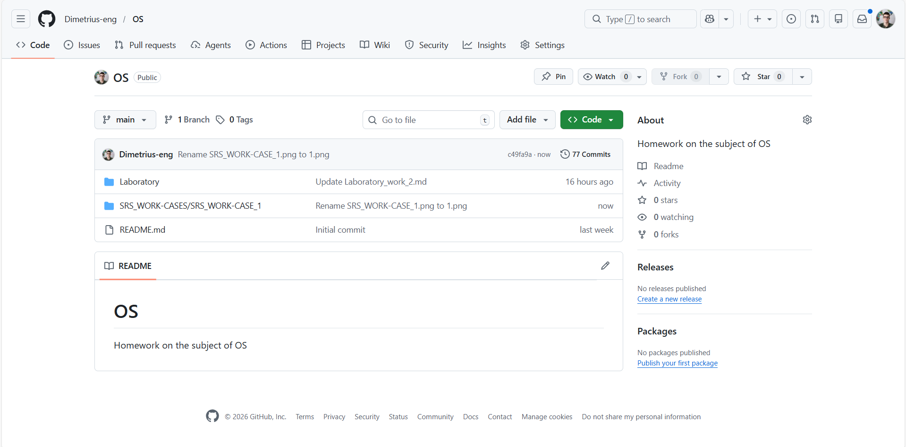

# Work-case 1

**Виконав: студент групи РПЗ-33, Руденко Дмитро**

 

#### 1. Опишіть для чого використовують git, які основні дії та команди в ньому виконують.

<blockquote>
  
**1.1. Для чого використовують Git?**
  
**Git** — це розподілена система керування версіями (VCS). Вона представляє собою своєрідну "машину часу" для коду. 
- Git може **відстежувати зміни**, запам'ятовуючи кожен рядок коду, який було змінено. Якщо після оновлення скрипта наш продукт перестав працювати, ми можемо за секунду повернутися до версії, яка була годину тому.
- Також тут забезпечено **спільну роботу**, коли декілька програмістів можуть працювати над одним файлом одночасно. Git допоможе об'єднати їхні правки.
- **Гілкування (Branching)** виявляється у можливості створення окремої гілки для тестування нової механіки гри. Якщо ідея виявиться невдалою — можна просто видалити гілку, не пошкодивши основний робочий код.
- Завдяки сервісам типу GitHub або GitLab, код зберігається в хмарі. Якщо з ноутбуком щось станеться, проєкт не зникне (забезпечено **резервне копіювання**).

**1.2. Основні стадії стану файлів у Git**

- **Working Directory:** робоча папка, де ми просто пишемо код.
- **Staging Area (Index):** "чернетка" або "зона очікування". Сюди ми додаємо зміни, які хочемо включити у наступний "знімок".
- **Repository (.git folder):** місце, де Git назавжди зберігає історію наших коммітів.

**1.3. Основні дії та команди**

| Категорія | Команда | Опис дії |
| :--- | :--- | :--- |
| **Початок роботи** | **git init** | Створює новий порожній репозиторій у поточній папці |
| | **git clone [url]** | Копіює існуючий проєкт із сервера (наприклад, з GitHub) на комп'ютер |
| **Щоденний цикл (Add, Commit, Push)** | **git status** | Показує, які файли було змінено і що ще не додано до звіту |
| | **git add [file]** | Додає файл у Staging Area. Команда git add . додає одразу всі змінені файли |
| | **git commit -m "Опис змін"** | Створює "знімок" проєкту. Важливо писати зрозумілі коментарі (наприклад, "Fixed player jump logic") |
| | **git push** | Відправляє локальні комміти на сервер (наприклад, у репозиторій на GitHub) |
| **Робота з гілками (Branching)** | **git branch** | Показує список усіх гілок |
| | **git checkout -b [name]** | Створює нову гілку і перемикається на неї |
| | **git merge [name]** | Об'єднує вказану гілку з тією, у якій ми зараз перебуваємо |
| **Отримання змін** | **git pull** | Завантажує останні зміни з сервера та автоматично об'єднує їх із кодом. Корисно, якщо працюємо у команді або з двох різних ПК |

**1.4. Чому це важливо для моїх проєктів?**

Коли я розробляв свій VBA-інструмент в Excel або веб-гру Alias, я стикався з тим, що помилка в одному рядку ламала все. З Git я просто можу написати git checkout ., і всі помилкові зміни скасуються.
Також у папці проєкту завжди варто створювати файл .gitignore. Наприклад, для Unity він відфільтровує тимчасові файли папок Library та Temp, щоб репозиторій не важив гігабайти непотрібного сміття.

</blockquote>

#### 2. Що таке "комміт", як він дозволяє відслідковувати зміни у файлах?

<blockquote>
  
**Комміт (commit)** — це одна з найважливіших операцій у Git. Якщо пояснювати просто, це «знімок» (snapshot) стану проєкту в конкретний момент часу.
Коли ми робимо комміт, Git не просто копіює змінені файли. Він створює запис у своїй базі даних, який містить:

- **Знімок дерева файлів:** посилання на стан усіх файлів проєкту на цей момент.
- **Метадані:** хто зробив зміни (автор), коли це сталося (дата/час) та унікальний ідентифікатор (Хеш-сума SHA-1).
- **Коментар:** наш опис того, що саме було зроблено.
- **Посилання на батьківський коміт:** кожен новий коміт знає, який був до нього, що створює безперервний ланцюжок історії.

Git відстежує зміни через порівняння станів, порівнюючи поточний знімок із попереднім. Він бачить, які файли були додані, змінені або видалені. Також Git використовує спеціальні алгоритми (хешування). Якщо було змінено хоча б одну кому в коді, хеш-сума файлу зміниться, і Git миттєво це зафіксує. Завдяки тому, що кожен комміт посилається на попередній, можна переглянути всю історію змін за допомогою команди git log. Це дозволяє побачити різницю між будь-якими двома моментами розробки.

</blockquote>

#### 3. Зареєструйте власний git-аккаунт (gitlab, github або інша платформа). Створіть новий публічний репозиторій, який будете використовувати для додавання всіх виконаних робіт з дисципліни «Операційні системи» (якщо працюєте в команді долучіть інших учасників команди до його редакторів).

Для виконання робіт з дисципліни «Операційні системи» я використовую свій раніше створений профіль на платформі GitHub. У межах цього профілю було створено публічний репозиторій під назвою "OS", призначений для зберігання та систематизації всіх звітів, кодів та проєктів, виконаних під час навчання. 

**Посилання на репозиторій:** [Репозиторій для ОС](https://github.com/Dimetrius-eng/OS/tree/main).

Репозиторій налаштований для відстеження змін у файлах лабораторних робіт. Нижче наведено скріншот головної сторінки репозиторію, що підтверджує його назву, структуру та наявність файлів README.md.

У створеному репозиторії організовано певну структуру папок. У папці під назвою "Laboratory" зберігаються лабораторні роботи ("Laboratory_work_1", "Laboratory_work_2" тощо). У папці "SRS_WORK_CASES" знаходяться ворк-кейси і тд (з часом буду вносити певні оновлення щодо структури), це забезпечує зручну навігацію та версійність для кожного етапу дисципліни.

#### 4. Розмістіть свій перший колективний звіт про виконаний Work-case 1 (рекомендовано робити як md-сторінку) у даному репозиторії. У git мають бути комміти від кожного учасника команди.

Згідно з умовами завдання, я самостійно підготував та розмістив звіт про виконаний Work-case 1 у своєму публічному репозиторії. Звіт оформлено у вигляді .md сторінки, що забезпечує коректне відображення структури, таблиць та графічних матеріалів безпосередньо в інтерфейсі GitHub. Під час розміщення звіту я використовував стандартний робочий цикл Git (Add, Commit, Push). Оскільки роботу я виконував одноосібно, історія комітів відображає послідовні етапи моєї роботи над файлом. 

Посилання на файл у репозиторії: [SRS_WORK-CASE_1.md](https://github.com/Dimetrius-eng/OS/blob/main/SRS_WORK-CASES/SRS_WORK-CASE_1/SRS_WORK-CASE_1.md)

#### Словник англійських термінів

| № | Слово | Пояснення |
| :--- | :--- | :--- |
| 1 | **Version Control System (VCS)** | Система керування версіями; інструмент для відстеження змін у коді та документації протягом усього часу розробки |
| 2 | **Repository (Repo)** | Репозиторій; сховище проєкту, де зберігається вся історія змін, службові файли та конфігурації |
| 3 | **Commit** | Комміт — фіксація змін; «знімок» стану файлів у певний момент часу з унікальним ідентифікатором та метаданими |
| 4 | **Branch** | Гілка; паралельна версія репозиторію, яка дозволяє розробляти нові функції незалежно від основного коду |
| 5 | **Merge** | Злиття; процес об'єднання змін з однієї гілки (наприклад, розробницької) в іншу (наприклад, основну головну гілку) |
| 6 | **Staging Area (Index)** | Зона очікування; проміжне сховище для файлів, які вже підготовлені до фіксації, але ще не зафіксовані в комміті |
| 7 | **Working Directory** | Робоча директорія; папка на власному комп'ютері, де ми безпосередньо редагуємо та створюємо файли проєкту |
| 8 | **Remote** | Віддалений репозиторій; копія проєкту, що зберігається на зовнішньому сервері, такому як GitHub, GitLab або Bitbucket |
| 9 | **Clone** | Клонування; процес створення повної локальної копії віддаленого репозиторію з усією історією змін на власному пристрої |
| 10 | **Push** | Надсилання; операція відправки локально зафіксованих комітів із власного комп'ютера на віддалений сервер |
| 11 | **Pull** | Отримання; завантаження останніх актуальних змін із сервера та їх автоматичне об'єднання з локальним кодом |
| 12 | **Conflict** | Конфлікт; ситуація, коли Git не може автоматично об'єднати різні зміни в одному і тому ж рядку файлу від різних користувачів |
| 13 | **Issue** | Проблема/завдання; спеціальний інструмент на GitHub для обговорення знайдених багів, пропозицій або планування майбутніх етапів роботи |
| 14 | **Markdown (.md)** | Мова розмітки тексту, що використовується для створення структурованих звітів, документацій та файлів README у Git |

#### Conclusions

&nbsp;&nbsp;&nbsp;Through this practical assignment, I have gained a comprehensive understanding of version control principles using Git and GitHub. I have mastered the essential workflow of managing a project, which includes initializing repositories, tracking changes through commits, and synchronizing local work with remote servers using push and pull operations. Understanding the concept of a commit as a permanent snapshot of the project has provided me with a reliable way to monitor the evolution of my code and maintain a detailed history of all modifications.   
&nbsp;&nbsp;&nbsp;Furthermore, I have successfully demonstrated the ability to organize project documentation by creating and hosting a professional report in Markdown format. Even though I completed this work individually, I followed the standard industry practices for repository management, including branch logic and descriptive commit messaging. This experience has not only improved my technical skills in command-line tools and web-based hosting platforms, but has also prepared me for future collaborative development environments where version control is critical for success.

