# Work-case 2

**Виконав: студент групи РПЗ-33, Руденко Дмитро**

 

#### 1. Встановіть на своїй домашній робочій станції гіпервізор ІІ типу – Virtual Box, VMWare Workstation, Hyper-V (або інший на Ваш вибір).

Для виконання роботи я обрав гіпервізор Oracle VM VirtualBox. Мій вибір зумовлений тим, що це програмне забезпечення з відкритим кодом (Open Source), яке є кросплатформним та рекомендованим у навчальних курсах Cisco. Він стабільно працює в моїй системі Windows, не вимагає високих апаратних ресурсів для власної роботи та має інтуїтивно зрозумілий інтерфейс для керування віртуальними середовищами. Процес встановлення був стандартним: я завантажив інсталятор з [офіційного сайту](https://www.virtualbox.org/wiki/Downloads) та слідував підказкам майстра налаштування.
На скрішоті зображено вже запущену програму:

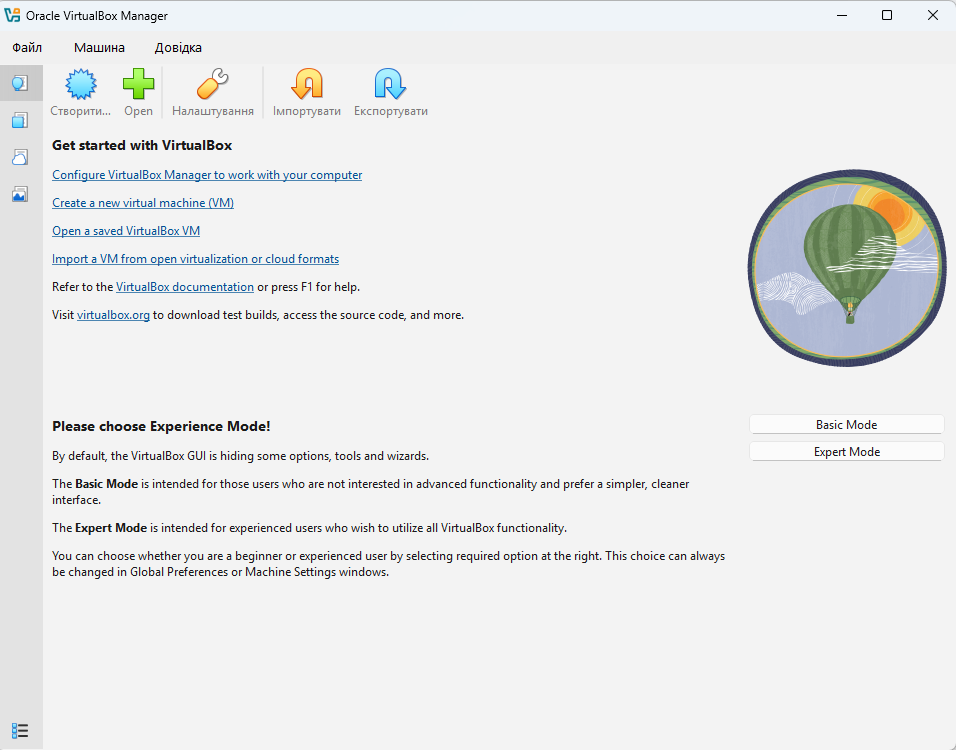

#### 2. Опишіть набір базових дій в встановленому Вами гіпервізорі:

- Створення нової віртуальної машини;

<blockquote>
  
Процес ініціалізації нової системи складається з наступних кроків:

**- Запуск майстра**: Натискання кнопки «Створити» (New) на головній панелі.  
**- Ідентифікація**: Вказання імені машини, вибір типу ОС (Linux) та версії (Ubuntu 64-bit).  
**- Вибір образу**: Підключення ISO-файлу операційної системи.

</blockquote>

- Вибір/додавання доступного для віртуальної машини обладнання;

<blockquote>
  
Гіпервізор дозволяє гнучко емулювати залізо у вкладці «Settings» (Налаштування):

**- System -> Motherboard:** Налаштування об’єму оперативної пам’яті (RAM). Для Ubuntu оптимально від 2048 MB.  
**- System -> Processor:** Вибір кількості віртуальних ядер (vCPU).  
**- Display:** Регулювання відеопам'яті (Video Memory). Для стабільної роботи графічних оболонок (GNOME/XFCE).  
**- Storage:** Додавання віртуальних жорстких дисків (VDI/VHD) або нових контролерів (SATA/NVMe).

</blockquote>

- Налаштування мережі та підключення до точок Wi-Fi;

<blockquote>

У віртуальних машинах робота з мережею має свою специфіку. VM зазвичай не бачить Wi-Fi адаптер безпосередньо, а використовує «міст» через ПК:

**- Тип підключення NAT:** Віртуальна машина отримує інтернет через комп'ютер, але знаходиться в окремій внутрішній мережі.  
**- Тип підключення Bridged Adapter (Мережевий міст):** Машина стає повноправним членом домашньої мережі (отримує власну IP-адресу від роутера).  
**- Wi-Fi:** Щоб машина використовувала Wi-Fi, у налаштуваннях Network треба вибрати свій фізичний Wi-Fi адаптер у режимі "Bridged", тоді Linux сприйматиме його як дротове підключення зі швидкістю Wi-Fi.

</blockquote>

- Можливість роботи з зовнішніми носіями (flash-пам’ять).
  
<blockquote>

Для того, щоб Ubuntu побачила реальну флешку, виконуються такі дії:

**- Встановлення Extension Pack:** На основну систему (Windows) потрібно встановити пакет розширень VirtualBox.  
**- Прокидання порту:** У налаштуваннях машини розділ «USB» -> Натиснути іконку «плюс» -> Обрати назву своєї флешки зі списку підключених до ПК.  
**- Монтування:** Після цього флешка «відключається» від Windows і з'являється всередині Linux як стандартний накопичувач у каталозі /media/.

</blockquote>
  
#### 3. Встановіть в вашому гіпервізорі операційну систему GNU/Linux (будь-який зручний Вам дистрибутив) у базовій конфігурації з графічною оболонкою.

<blockquote>
  
Перед створенням віртуальної машини я завантажив прообраз операційної системи Ubuntu Desktop 24.04.4 LTS на [офіційному сайті](https://ubuntu.com/download)). 

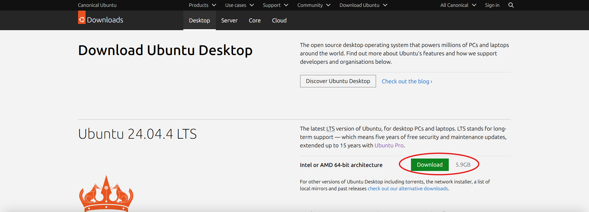

Після чого, за допомогою кнопки "Створити" в головному меню VirtualBox вказав назву нової віртуальної машини, шлях до ISO-образу та тип ОС (Linux). Це дозволило автоматично підібрати базові параметри конфігурації. 

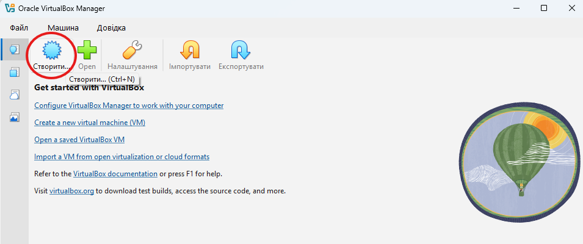

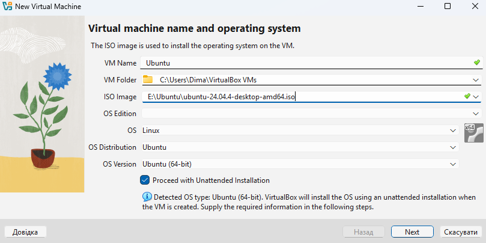

Далі я задав пароль для входу в систему.

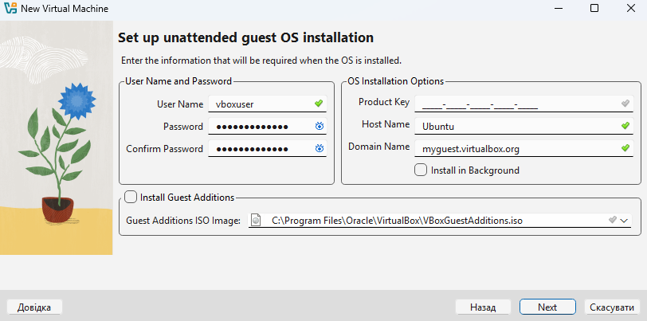

На цьому етапі я зіткнувся з проблемою нестачі ресурсів на диску, що призводило до критичних помилок при завантаженні графічної оболонки. Також Стандартні налаштування (16 МБ відеопам'яті та 1 ядро) виявилися недостатніми для сучасної оболонки GNOME, тому відеопам'ять було збільшено до 128 Мб, а кількість ядер до 2 для оптимальної роботи. 

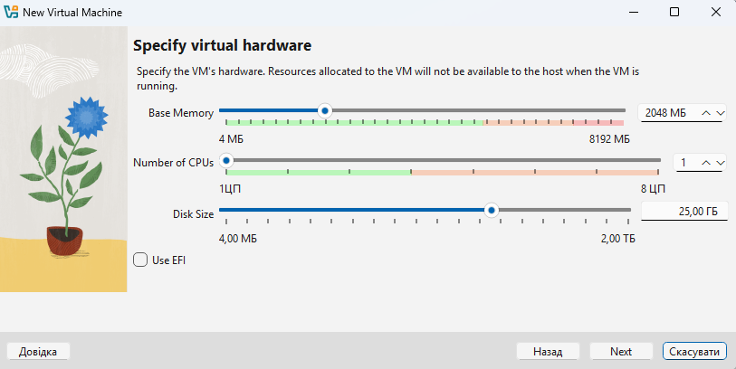

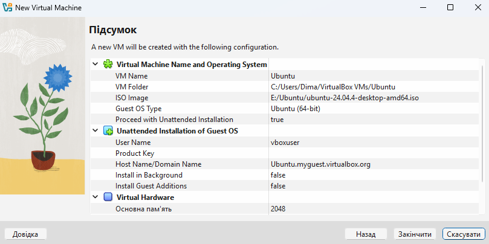

Далі я запустив створену віртуальну машину та увійшов в систему.

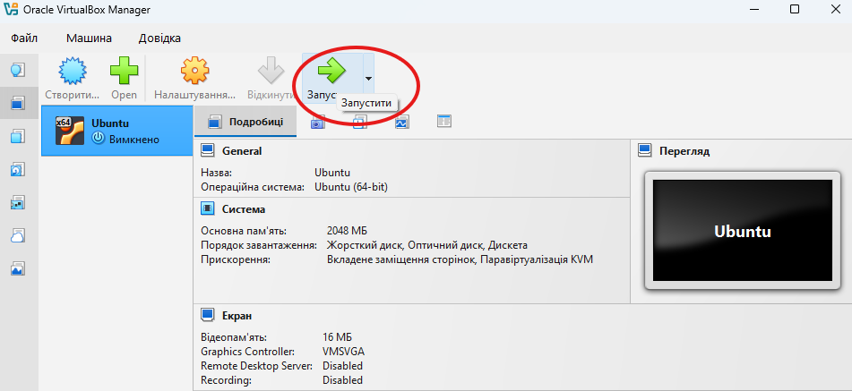

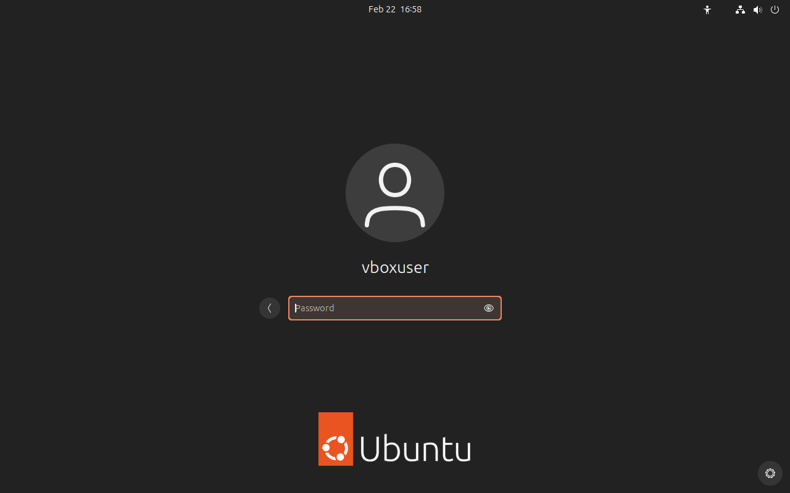

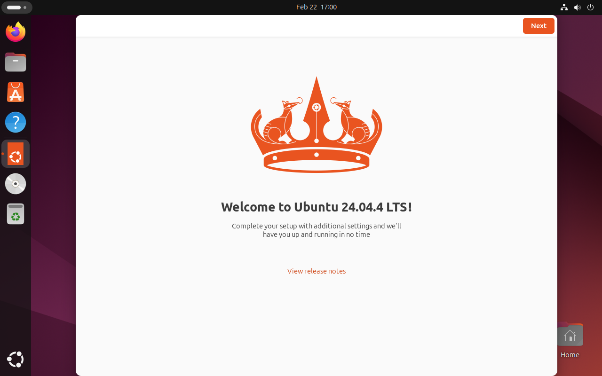

Наступним етапом було налаштування гостьової ОС, який виявився найскладнішим. Тут я боровся за можливість працювати у повноекранному режимі. 

- Першою перешкодою був конфлікт пристроїв, де віртуальний дисковод був зайнятий інсталяційним ISO-образом Ubuntu, що не давало вставити диск із драйверами. Я це виправив за допомогою примусового вилучення образу диска через налаштування (Storage (Носії) -> Remove disk from virtual drive).
- Другою перешкодою виявилася відсутність інструментів збірки, через що система не могла скомпілювати драйвери за відсутністі базових пакетів. Я використав термінал для встановлення необхідних залежностей (_sudo apt update && sudo apt install build-essential dkms linux-headers-$(uname -r_).
- Останньою перешкодою було зависання на 100% під час оновлення гостьових доповнень (Devices -> Upgrade Guest Additions) всередині запущеної машини. Процес оновлення «завмер» на фінальній стадії. Оскільки файли вже були скопійовані, проблему вирішило примусове перезавантаження (Reset) машини, після чого нові драйвери активувалися автоматично. Після виконання вищезазначених кроків система отримала повну інтеграцію з хост-машиною (Windows).

В результаті досягнуто підтримку повноекранного режиму (Auto-resize Guest Display) та оптимізовано швидкість роботи інтерфейсу завдяки виділенню додаткових ядер процесора. Система тепер готова до встановлення альтернативних графічних оболонок (XFCE) та подальших експериментів.

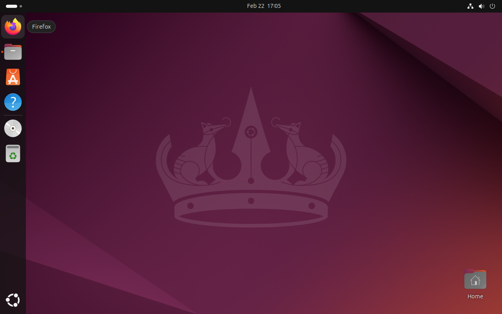

</blockquote>

#### 4. Створіть другу віртуальну машину та виконайте для неї наступні дії:

- Встановіть у мінімальній конфігурації з термінальним вводом-виводом без графічного інтерфейсу операційну систему GNU/Linux;

- Встановіть графічну оболонку GNOME поверх встановленої в попередньому пункті ОС;

- Встановіть додатково ще другу графічну оболонку (їх можливий перелік можна знайти в лабораторній роботі №1) та порівняйте її можливості з GNOME.
