# Work-case 3

**Виконав: студент групи РПЗ-33, Руденко Дмитро**

 

#### 1. В робочому середовищі віртуальної машини Virtual Box, VMWare Workstation (або інший на Ваш вибір) необхідно виконати:

- Клонування вашої віртуальної робочої ОС (Work-case 2). Яким чином це можна зробити? Продемонструйте всі етапи;

<blockquote>
  
Клонування дозволяє створити точну копію наявної віртуальної машини з усіма налаштуваннями та файлами.
Спочатку необхідно вимкнути базову віртуальну машину, після чого натиснути на неї правою кнопкою миші у списку зліва та вибрати "Клонувати" (Clone):

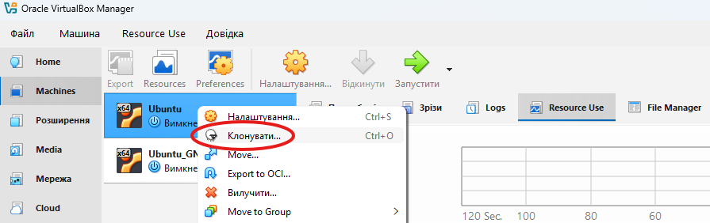

Потім у вікні слід вказати нове ім'я (наприклад, Ubuntu_Clone).
У розділі "Політика MAC-адрес" обов'язково треба виберати "Згенерувати нові MAC-адреси для всіх мережевих адаптерів". Якщо цього не зробити, в обох машин буде однакова апаратна адреса, і в мережі виникне конфлікт.
Наступним етапом йде вибіп типу клонування "Повне клонування" (Full Clone). Це створить повністю незалежну копію (на відміну від зв'язаного клону, який залежить від оригіналу). На завершення натискаємо "Готово" і чекаємо завершення процесу:

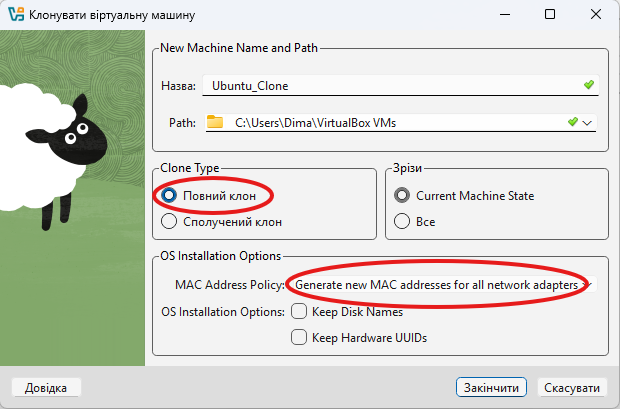

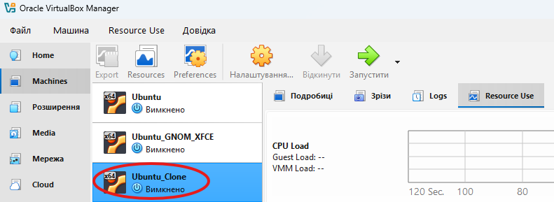

</blockquote>
  
- Може виникнути необхідність перенесення (клонування) ОС у інше віртуальне середовище. Які треба виконати дії для експорту вашої віртуальної робочої ОС?

<blockquote>
  
Експорт дозволяє запакувати віртуальну машину в єдиний файл формату OVA/OVF, який можна відкрити на іншому комп'ютері або навіть в іншому гіпервізорі (наприклад, VMware).
Першим кроком у головному меню VirtualBox потрібно обрати Файл -> Експортувати конфігурацію (Export Appliance):

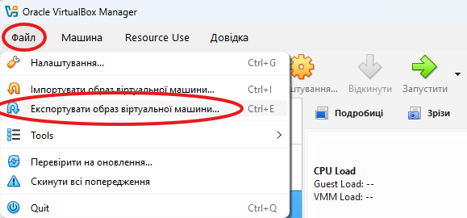

Потім вибрати бажану для експорту віртуальну машину:

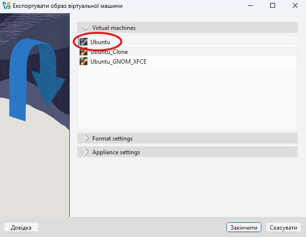

Після чого переходимо до вибору формату (рекомендується Open Virtualization Format 1.0 або 2.0 - .ova) та вказуємо шлях збереження файлу на реальному жорсткому диску. Натискаємо "Експорт" і чекаємо, поки система створить архів:

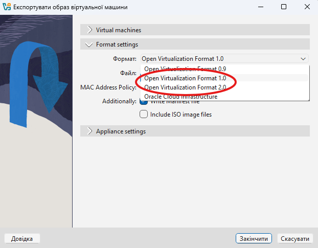

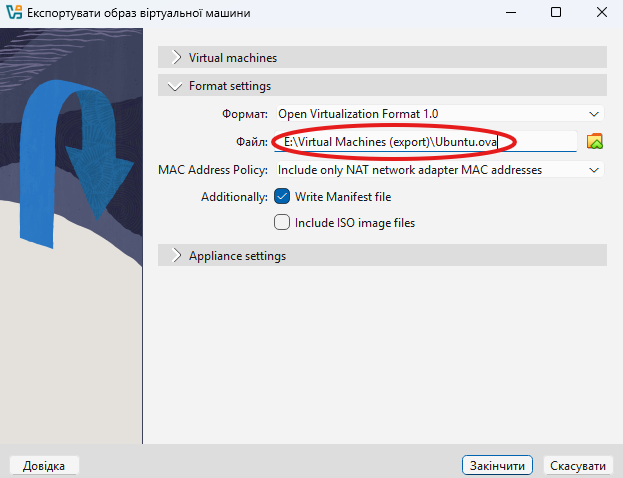

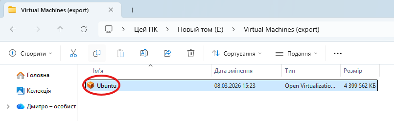

</blockquote>

#### 2. В ході роботи одна робоча віртуальна машина може взаємодіяти з іншою. Для цього необхідно між ними розгорнути мережу. Опишіть які типи організації мережевих з’єднань підтримуються в середовищі віртуальних машин, в чому особливість кожного з них:
   
- Трансляція мережевих адрес (NAT);

<blockquote>
  
Режим за замовчуванням. Віртуальна машина отримує вихід в Інтернет через IP-адресу основної (хостової) ОС. Вона ізольована тобто інші комп'ютери (і інші віртуальні машини) не можуть до неї підключитися ззовні, що є особливістю цього типу.

</blockquote>
  
- Мережевий міст (Bridged);

<blockquote>
  
Віртуальна машина підключається безпосередньо до поточної фізичної мережі (через Wi-Fi або кабель). Вона отримує власну IP-адресу від вашого домашнього роутера і стає повноправним учасником мережі, як і ваш основний ПК. Ідеально для створення серверів та взаємодії між усіма пристроями.

</blockquote>
  
- Віртуальний адаптер хоста (Host-only);

<blockquote>
  
Створює ізольовану мережу виключно між вашою основною ОС (хостом) та віртуальними машинами. Виходу в Інтернет у цьому режимі немає.

</blockquote>
  
- Внутрішня мережа (Internal Network).

<blockquote>

Найбільш ізольований режим. Мережа існує тільки між віртуальними машинами. Ані основна ОС (хост), ані зовнішній Інтернет не мають сюди доступу. Використовується для безпечного тестування.
  
</blockquote>

#### 3. Розгорніть мережу між вашою робочою ОС та її клоном (завдання 1):

Щоб обидві машини мали Інтернет і могли бачити одна одну, найкраще налаштувати їх мережеві адаптери в режим Мережевий міст (Bridged) або Мережа NAT (NAT Network). Далі розглянемо варіант з "Мережевим мостом".

- Продемонструйте базові команди для налаштування мережевих параметрів ОС, поясніть, що вони виконують.

<blockquote>

Запустимо обидві машини та відкриємо термінал.

- Команда `ip a` (або `ip addr show`) показує всі мережеві інтерфейси та їхні IP-адреси. Знайдемо адресу першої ОС:

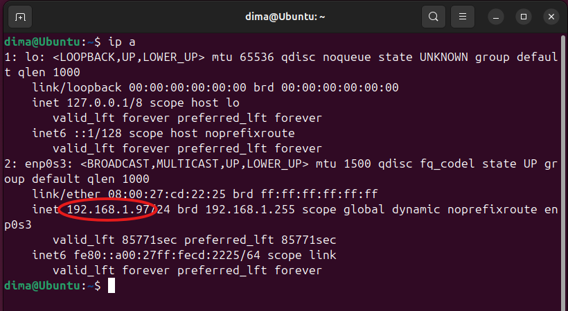

та клона:

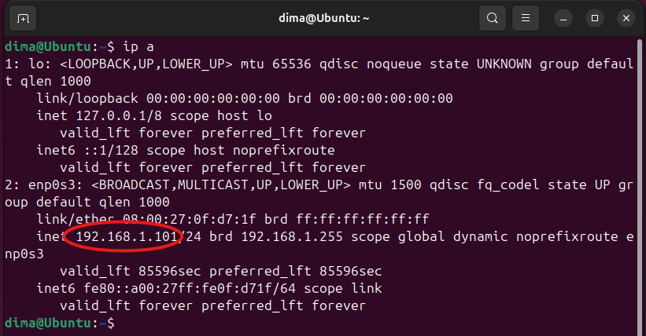

  
- Команда `ping <IP-адреса>` перевіряє наявність зв'язку з іншим вузлом у мережі. Якщо машини "бачать" одна одну, ми побачемо безперервний потік рядків, які виглядають наступним чином:

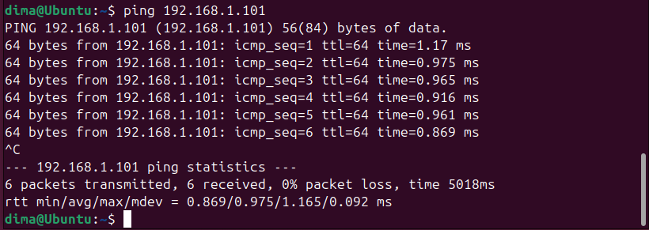

64 bytes from... означає, що інша машина отримала сигнал і успішно відповіла. time=1.17 ms — це час (у мілісекундах), за який пакет долетів туди і повернувся назад. Чим менше, тим краще.

**Важливий нюанс Linux:** на відміну від Windows, де ping робить 4 спроби і зупиняється, у Linux він буде відправляти пакети нескінченно. Щоб його зупинити, необхідно натиснути комбінацію клавіш Ctrl + C. Після цього буде відображено коротку статистику (скільки відправлено, скільки отримано, 0% packet loss).

- Команда `ip route` показує таблицю маршрутизації (набір правил, які вказують системі, куди саме відправляти мережеві пакети (наприклад, як дістатися до іншої віртуальної машини, а як — до серверів YouTube)):

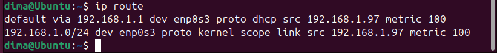

Тут зазвичай є два найважливіших рядки: 

- Рядок, що починається зі слова default via... - це наш шлюз за замовчуванням (Default Gateway). У наведеному скріншоті це 192.168.1.1 — IP-адреса домашнього Wi-Fi роутера. Цей рядок означає: "Якщо я не знаю, куди відправити пакет (наприклад, ти відкрив youtube.com), я відправлю його на роутер, а він вже розбереться". Якщо цей рядок є, віртуальна машина має доступ до Інтернету.
- Рядок з підмережею (наприклад, 192.168.1.0/24 dev enp0s3...) є правилом для наявної локальної мережі. Воно означає: "Будь-які пристрої, IP-адреси яких починаються на 192.168.1.X, знаходяться поруч зі мною в одній мережі, і я можу спілкуватися з ними напряму через мережевий адаптер enp0s3". Завдяки цьому правилу перша віртуальна машина знає, як відправити повідомлення (ping або чат nc) на другу віртуальну машину, не звертаючись до глобального Інтернету.

</blockquote>

- Обидві ОС мають мати вихід у мережу Інтернет. Відкрийте браузер та перегляньте будь-яке відео в youtube.

<blockquote>
  
Відкриємо браузер (наприклад, Firefox) на обох віртуальних машинах і перейдіть на YouTube. Якщо адаптери налаштовані як Bridged або NAT, відео завантажиться успішно.

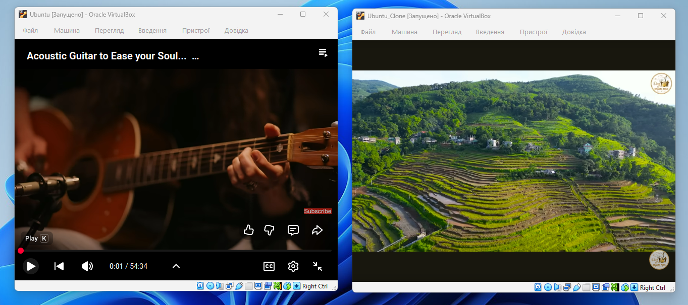

</blockquote>
  
- Налаштуйте та продемонструйте обмін повідомленнями між двома ОС по локальній мережі. Які команди в терміналі при цьому необхідно ввести?

<blockquote>
  
Найпростіший спосіб надіслати повідомлення з однієї ОС на іншу — використати утиліту netcat (nc). На Віртуальній машині 1 (Клон, приймач) відкриємо порт для прослуховування за допомогою команди `nc -l 8080`:

На Віртуальній машині 2 (Оригінал, відправник) підключимося до IP-адреси Клона на цей порт (замінимо IP на той, що ми дізналися через ip a) командою `nc 192.168.1.11 8080`:

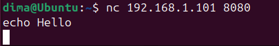

Тепер все, що ми напишемо і відправимо клавішею Enter у терміналі другої машини, миттєво з'явиться в терміналі першої машини:

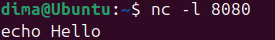

</blockquote>

- Налаштуйте спільну мережеву папку для обох ОС. Спробуйте скопіювати файли з цієї директорії в домашній каталог користувача (віртуальна робоча ОС) та на робочій стіл (клон віртуальної робочої ОС).

<blockquote>

Щоб обидві ВМ мали спільну папку, найпростіше використати функцію Shared Folders самого гіпервізора. Для цього створимо папку на основній ОС Windows:

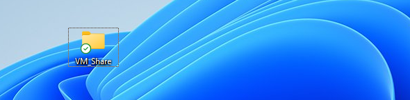

У налаштуваннях обох віртуальних машин зайдемо у розділ "Спільні папки" (Shared Folders). Додамо створену папку VM_Share, поставимо галочки "Автомонтування" та "Створити постійну папку":

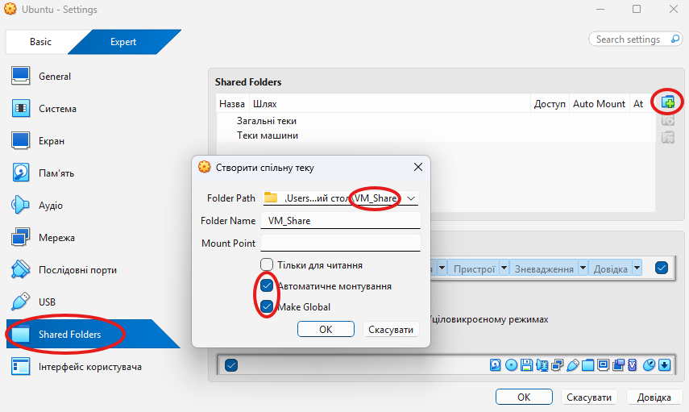

У Linux вона з'явиться в директорії /media/sf_VM_Share. Скопіюємо файл (або папку) з цієї директорії в домашній каталог 1-ї ОС командою `cp -r /media/sf_VM_Share/Folder ~/`:

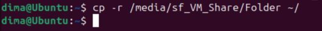

На Клоні скопіюємо файл на робочий стіл командою `cp /media/sf_VM_Share/file.txt ~/Desktop/`:

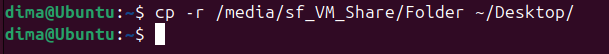

Створена папка чи файл з'явиться на робочому столі віртуальної машини:

**Примітка:** щоб мати доступ до `/media/sf_...`, користувач Linux має бути доданий до групи vboxsf: `sudo usermod -aG vboxsf $USER`, після чого треба перезавантажити ВМ.

</blockquote>

4. Яким чином можна організувати обмін інформацією між вашою основною ОС (наприклад Windows) та віртуальними ОС? Скопіюйте довільний аудіо-файл з вашої основної ОС на робочий стіл віртуальної ОС та її клона. Як зробити зворотну дію, коли треба документ з робочого столу віртуальної ОС скопіювати до вашої основної робочої ОС?

Окрім спільних папок, найзручнішим способом обміну є функція Drag and Drop (Перетягування) та Shared Clipboard (Спільний буфер обміну). Щоб це налаштувати, обов'язково мають бути встановлені додатки гостьової ОС (Guest Additions) на створених Linux-машинах. У меню вікна ВМ потрібно виберати Пристрої -> Підключити образ диска Додатків гостьової ОС і встановити їх. Далі в меню вікна віртуальної машини потрібно обрати Пристрої (Devices) -> Drag and Drop (Перетягування) -> Двонаправлений (Bidirectional). Варто зробіти те саме для: Пристрої -> Спільний буфер обміну -> Двонаправлений.

Для копіювання аудіо-файлу з основної ОС на робочий стіл віртуальної ОС та її клона, спочатко згорнимо вікно VirtualBox так, щоб бачити робочий стіл Windows і робочий стіл Linux. Після чого затиснимо будь-який аудіофайл (.mp3) на Windows лівою кнопкою миші і перетягнемо його безпосередньо у вікно віртуальної машини на робочий стіл Linux. Відпустимо, після чого файл скопіюється.

Для викконання зворотньої дії варто створити або взяти будь-який текстовий документ на робочому столі Linux, затиснути його мишкою і перетягнути за межі вікна VirtualBox на робочий стіл Windows.
