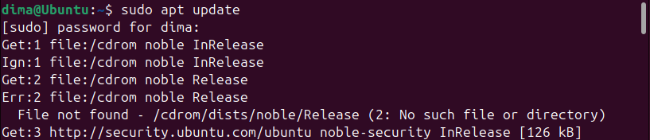
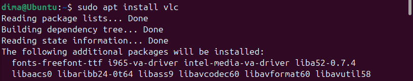
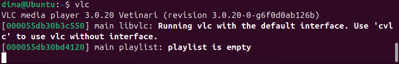
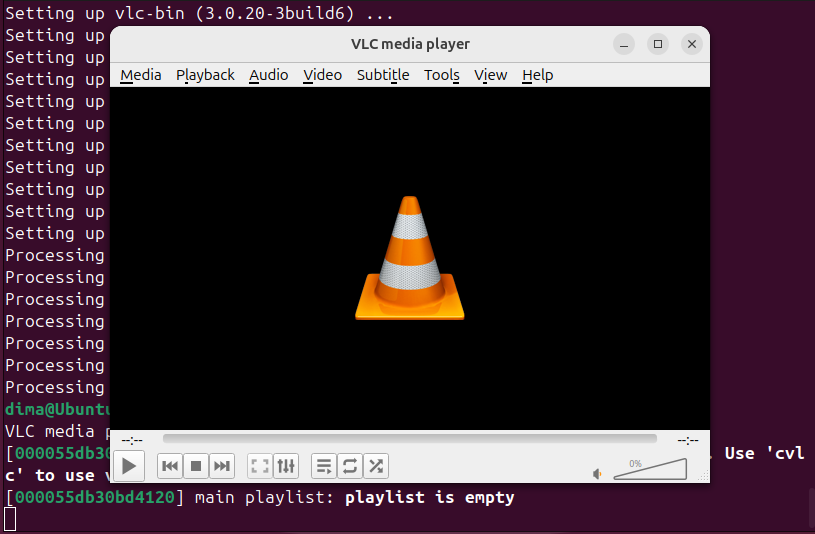

# Work-case 4

**Виконав: студент групи РПЗ-33, Руденко Дмитро**

 

#### 1. В ході роботи досить часто виникає необхідність встановлювати нові програми та додатки. Для цього необхідно в терміналі вміти працювати з менеджерами пакетів: 

- Дайте розгорнуте визначення таким поняттям як «пакет» та «репозиторій».  

<blockquote>

**Пакет (Package)** — це стиснутий архів, який містить скомпільовані виконувані файли програми, конфігураційні файли, документацію, а також метадані (інформацію про саму програму, її версію та список залежностей — інших пакетів, необхідних для її роботи). 
Це стандартизований формат розповсюдження ПЗ у Linux.  
**Репозиторій (Repository)** — це централізоване сховище (зазвичай віддалений сервер) пакетів програмного забезпечення, спеціально налаштоване для вашого дистрибутиву. Звідси менеджер пакетів автоматично завантажує самі програми та всі необхідні для 
їхньої роботи залежності.

</blockquote>

- Надайте короткий огляд існуючих менеджерів пакетів у Linux. Охарактеризуйте їх основні можливості.

<blockquote>

- **APT (Advanced Package Tool):** Стандарт для Debian, Ubuntu, Linux Mint. Працює з пакетами формату .deb. Вміє автоматично вирішувати складні ланцюжки залежностей.  
- **DNF / YUM:** Використовуються у Fedora, Red Hat (RHEL), CentOS. Працюють з пакетами формату .rpm. DNF є сучаснішим та швидшим наступником YUM.  
- **Pacman:** Менеджер пакетів для Arch Linux та Manjaro. Відомий своєю швидкістю та простотою, використовує стиснені архіви .pkg.tar.zst.  
- **Zypper:** Використовується в openSUSE. Має потужний алгоритм вирішення залежностей та підтримує роботу з кількома репозиторіями одночасно.  
- **Snap / Flatpak:** Універсальні (незалежні від дистрибутиву) системи керування пакетами. Вони встановлюють програми в ізольованих "контейнерах" разом з усіма залежностями, що гарантує їхню роботу на будь-якому Linux, але такі пакети займають більше місця.

</blockquote>

#### 2. Визначте який менеджер пакетів використовує ваш дистрибутив Linux. Опишіть основні команди для роботи з ним.

Мій дистрибутив Linux використовує менеджер пакетів APT.

Основні команди для роботи з APT:

- Пошук, скачування та установка необхідних пакетів, яких у Вашій системі немає (зі сховища по замовчуванню, з нового репозиторію тощо).

<blockquote>

- Пошук пакету за ключовим словом: `apt search назва_програми`   
- Встановлення зі стандартного репозиторію: `sudo apt install назва_програми`  
- Додавання нового стороннього репозиторію (PPA) та встановлення з нього:

&nbsp;&nbsp;&nbsp;`sudo add-apt-repository ppa:назва_ppa/репозиторій`  
&nbsp;&nbsp;&nbsp;`sudo apt update`  
&nbsp;&nbsp;&nbsp;`sudo apt install назва_програми`  

</blockquote>

- Перегляд інформації про встановлені та доступні пакети.  

<blockquote>

Детальна інформація про конкретний пакет: `apt show назва_програми`  
Перегляд усіх встановлених у системі пакетів: `apt list --installed`

</blockquote>

- Видалення непотрібних або застарілих пакетів.  

<blockquote>

Стандартне видалення програми (залишає конфігураційні файли): `sudo apt remove назва_програми`   
Повне видалення (разом з конфігураціями): `sudo apt purge назва_програми`  
Видалення "сміття" (залежностей, які більше не потрібні жодній програмі): `sudo apt autoremove`

</blockquote>

- Оновлення менеджера пакетів.  

<blockquote>

Оновлення локального списку пакетів (опитування репозиторіїв на наявність нових версій): `sudo apt update`
Безпосереднє встановлення оновлених версій для всіх програм: `sudo apt upgrade`

</blockquote>

#### 3. Встановіть у терміналі через менеджер пакетів на свою систему:

- Новий відео- чи аудіоплейер.</sapn>  

<blockquote>

Встановимо мультиплеєр VLC: 

</blockquote>

- Середовище для мови програмування, що ви вивчаєте. 

<blockquote>

</blockquote>

#### 4. Яким чином можна встановити нові програми через магазини додатків та менеджери пакетів у графічному середовищі. Наведіть свої приклади.
