# Work-case 4

**Виконав: студент групи РПЗ-33, Руденко Дмитро**

 

#### 1. В ході роботи досить часто виникає необхідність встановлювати нові програми та додатки. Для цього необхідно в терміналі вміти працювати з менеджерами пакетів: 

- Дайте розгорнуте визначення таким поняттям як «пакет» та «репозиторій».  

<blockquote>

**Пакет (Package)** — це стиснутий архів, який містить скомпільовані виконувані файли програми, конфігураційні файли, документацію, а також метадані (інформацію про саму програму, її версію та список залежностей — інших пакетів, необхідних для її роботи). 
Це стандартизований формат розповсюдження ПЗ у Linux.  
**Репозиторій (Repository)** — це централізоване сховище (зазвичай віддалений сервер) пакетів програмного забезпечення, спеціально налаштоване для вашого дистрибутиву. Звідси менеджер пакетів автоматично завантажує самі програми та всі необхідні для 
їхньої роботи залежності.

</blockquote>

- Надайте короткий огляд існуючих менеджерів пакетів у Linux. Охарактеризуйте їх основні можливості.

<blockquote>

- **APT (Advanced Package Tool):** Стандарт для Debian, Ubuntu, Linux Mint. Працює з пакетами формату .deb. Вміє автоматично вирішувати складні ланцюжки залежностей.  
- **DNF / YUM:** Використовуються у Fedora, Red Hat (RHEL), CentOS. Працюють з пакетами формату .rpm. DNF є сучаснішим та швидшим наступником YUM.  
- **Pacman:** Менеджер пакетів для Arch Linux та Manjaro. Відомий своєю швидкістю та простотою, використовує стиснені архіви .pkg.tar.zst.  
- **Zypper:** Використовується в openSUSE. Має потужний алгоритм вирішення залежностей та підтримує роботу з кількома репозиторіями одночасно.  
- **Snap / Flatpak:** Універсальні (незалежні від дистрибутиву) системи керування пакетами. Вони встановлюють програми в ізольованих "контейнерах" разом з усіма залежностями, що гарантує їхню роботу на будь-якому Linux, але такі пакети займають більше місця.

</blockquote>

#### 2. Визначте який менеджер пакетів використовує ваш дистрибутив Linux. Опишіть основні команди для роботи з ним.

Мій дистрибутив Linux використовує менеджер пакетів APT.

Основні команди для роботи з APT:

- Пошук, скачування та установка необхідних пакетів, яких у Вашій системі немає (зі сховища по замовчуванню, з нового репозиторію тощо).

<blockquote>

- Пошук пакету за ключовим словом: `apt search назва_програми`   
- Встановлення зі стандартного репозиторію: `sudo apt install назва_програми`  
- Додавання нового стороннього репозиторію (PPA) та встановлення з нього:

&nbsp;&nbsp;&nbsp;`sudo add-apt-repository ppa:назва_ppa/репозиторій`  
&nbsp;&nbsp;&nbsp;`sudo apt update`  
&nbsp;&nbsp;&nbsp;`sudo apt install назва_програми`  

</blockquote>

- Перегляд інформації про встановлені та доступні пакети.  

<blockquote>

Детальна інформація про конкретний пакет: `apt show назва_програми`  
Перегляд усіх встановлених у системі пакетів: `apt list --installed`

</blockquote>

- Видалення непотрібних або застарілих пакетів.  

<blockquote>

Стандартне видалення програми (залишає конфігураційні файли): `sudo apt remove назва_програми`   
Повне видалення (разом з конфігураціями): `sudo apt purge назва_програми`  
Видалення "сміття" (залежностей, які більше не потрібні жодній програмі): `sudo apt autoremove`

</blockquote>

- Оновлення менеджера пакетів.  

<blockquote>

Оновлення локального списку пакетів (опитування репозиторіїв на наявність нових версій): `sudo apt update`
Безпосереднє встановлення оновлених версій для всіх програм: `sudo apt upgrade`

</blockquote>

#### 3. Встановіть у терміналі через менеджер пакетів на свою систему:

- Новий відео- чи аудіоплейер.</sapn>  

<blockquote>

Встановимо мультиплеєр VLC: 

</blockquote>

- Середовище для мови програмування, що ви вивчаєте. 

<blockquote>

Я буду встановлювати середовище розробки Visual Studio code та мову програмування Go (Golang).  
Для початку зайду на офіційний сайт Visual Studio code та встановлю файл завантаження для моєї системи Linux (Ubuntu):

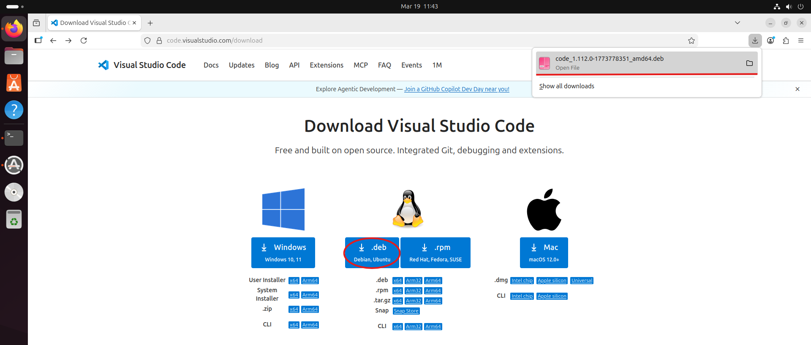

Потім перейду до вкладки "Setup" -> "Linux" та буду слідувати інструкції щодо встановлення: 

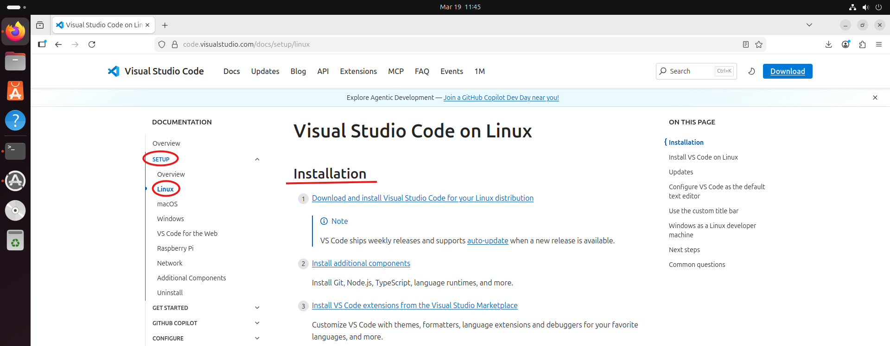

Перевірю наявність завантаженого файлу, перейшовши до папки Downloads та переглянувши її вміст:

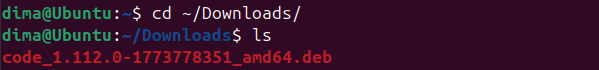

Встановлю VS code, виконавши нижче наведену команду:

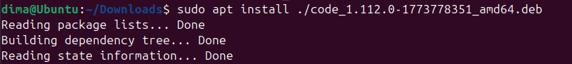

У спливаючому вікні виберу "Yes" для продовження встановлення:

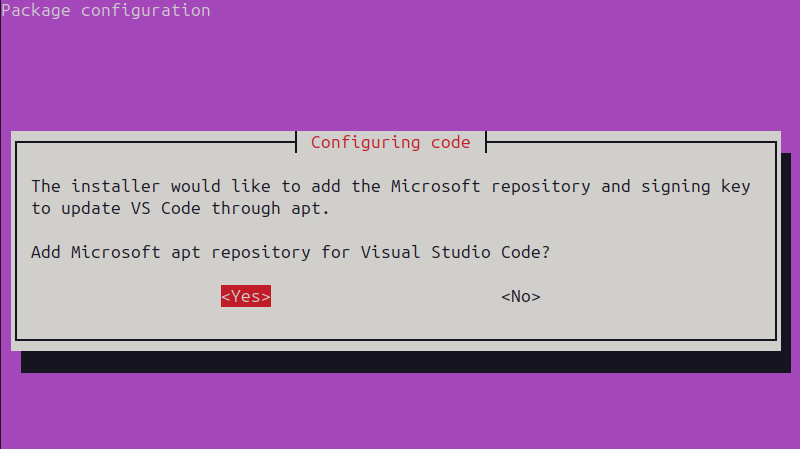

Оскільки мені не потрібен інсталяційний файл для повторного використання чи резерву, його можна сміливо видаляти:

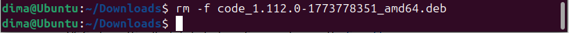

Бачимо, що VS code встановлено:

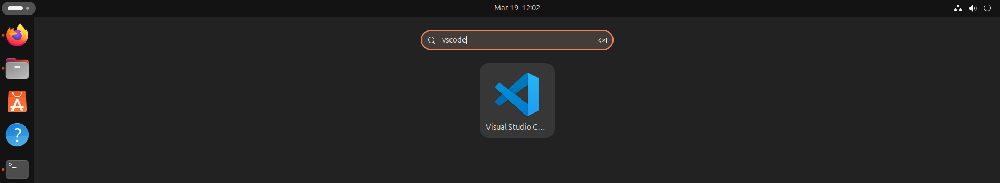

Перейдемо до встановлення Go. Для цього відкриємо офіційний сайт та встановимо необхідну версію. У моєму випадку це буде `go1.26.1.linux-amd64.tar.gz`, бо моя ВМ працює на 64-бітній архітектурі x86 (можна перевірити командою `uname -m` в терміналі):

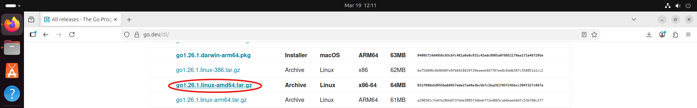

На самому початку сторінки буде посилання на інструкцію щодо встановлення, переходимо за ним:

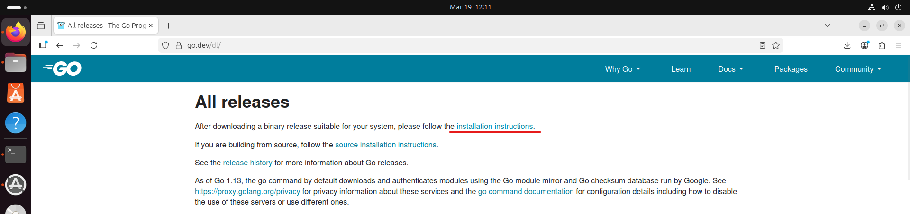

Якщо в нас вже є попередні інсталяції Go, наступна команда видалить їх:

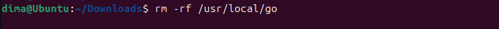

Потім встановимо нову версію Go:

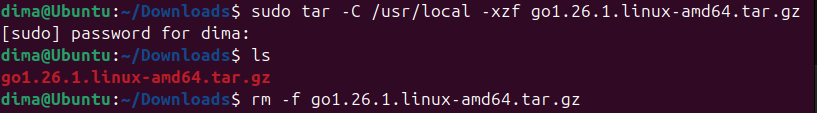

Наразі Go не буде працювати коректно, ми все ще будемо отримувати повідомлення про помилку, ввівши `go version`. Це стається через те, що наш цільовий Go лежить не на нашому виконуваному шляху. Щоб зробити все правильно, потрібно знати оболонку (Shell). Для bash я спочатку відкрию вже встановлений VS code:

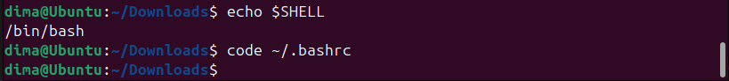

Потім, прогортавши весь вміст до низу задамо новий шлях та збережемо файл (Ctrl + S):

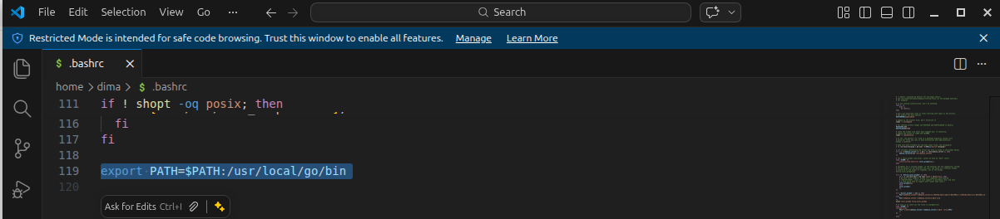

Перезапустимо термінал та перевіримо версію Go. Створимо нову папку для проєкту на робочому столі та запустимо VS code:

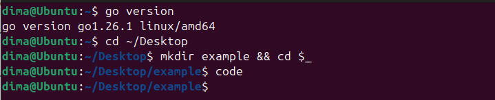

Створимо новий файл у папці під назвою `main.go`:

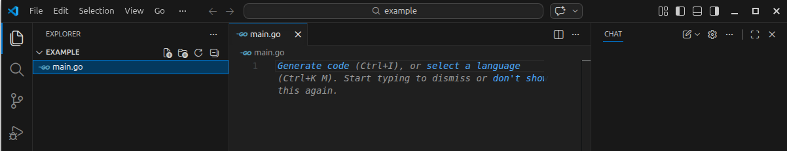

Встановимо необхідний пакет для роботи з обраною мовою:

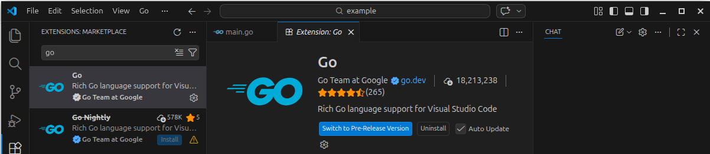

Перевіримо, чи все працює:

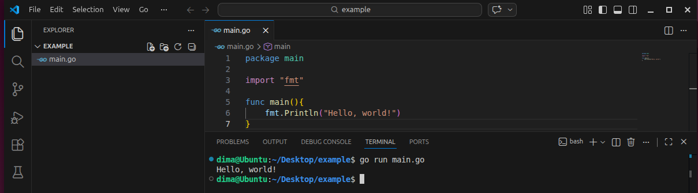

</blockquote>

#### 4. Яким чином можна встановити нові програми через магазини додатків та менеджери пакетів у графічному середовищі. Наведіть свої приклади.

Встановити ПЗ можна не лише через термінал, а й за допомогою "Магазинів додатків" (Software Centers), які працюють за тим самим принципом, що і Google Play або App Store.

Приклади графічних менеджерів:

- **Ubuntu Software (App Center):** Вбудований магазин додатків в Ubuntu.  
Щоб встановити, потрібно відкрити програму, ввести назву в рядок пошуку (наприклад, Visual Studio Code або Unity Hub), натиснути кнопку "Install" (Встановити) та ввести пароль адміністратора. Магазин автоматично завантажить програму (часто у форматі Snap) та встановить її.

&nbsp;&nbsp;&nbsp;&nbsp;&nbsp;&nbsp;&nbsp;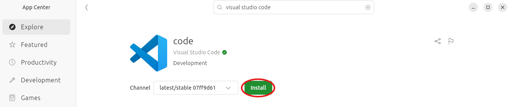

- **Synaptic Package Manager:** Більш просунутий графічний інтерфейс для APT.  
Дозволяє зручно ставити галочки напроти сотень бібліотек або системних утиліт, бачити всі залежності перед встановленням і застосовувати зміни натисканням однієї кнопки "Apply".

- **GDEBI:** Графічна міні-утиліта для встановлення окремо завантажених '.deb' файлів. Якщо ви завантажили пакет через браузер (наприклад, Google Chrome), подвійний клік по ньому відкриє вікно встановлення, де достатньо натиснути "Встановити пакет".

#### Словник англійських термінів

| № | Слово | Пояснення |
| :--- | :--- | :--- |
| 1 | **Package** | Пакет - стиснутий архів, що містить скомпільовану програму, конфігурації та список залежностей |
| 2 | **Package Manager** | Менеджер пакетів - системна утиліта (наприклад, APT, DNF), яка автоматизує процеси встановлення, оновлення та видалення пакетів |
| 3 | **Repository (Repo)** | Репозиторій (сховище) - віддалений сервер або локальна директорія, де зберігаються і звідки завантажуються пакети для певного дистрибутиву |
| 4 | **Dependency** | Залежність - інша програма або бібліотека, яка обов'язково потрібна для правильної роботи пакета, що встановлюється |
| 5 | **Install** | Встановити - команда для завантаження та встановлення нового програмного забезпечення (напр., `apt install`) |
| 6 | **Remove / Uninstall** | Видалити - команда для видалення програми із системи (напр., `apt remove`) |
| 7 | **Purge** | Очистити (повне видалення) - видалення програми разом з усіма її індивідуальними конфігураційними файлами налаштувань |
| 8 | **Update** | Оновити (список) - оновлення локальної бази даних пакетів інформацією про нові версії з репозиторіїв (напр., `apt update`) |
| 9 | **Upgrade** | Оновити (програми) - процес фактичного завантаження та встановлення новіших версій вже встановлених програм (напр., `apt upgrade`) |
| 10 | **GUI (Graphical User Interface)** | Графічний інтерфейс користувача - візуальне середовище взаємодії (вікна, кнопки), на противагу текстовому терміналу (CLI) |
| 11 | **Software Center / App Center** | Центр програмного забезпечення - графічний магазин додатків для зручного пошуку та встановлення програм за допомогою миші |
| 12 | **Environment** | Середовище	- набір інструментів, компіляторів та бібліотек, необхідних для розробки певною мовою програмування |

#### Conclusions:

&nbsp;&nbsp;&nbsp;In this work-case, I successfully learned the fundamental concepts of software management in a Linux operating system. I explored the definitions of software packages, dependencies, and repositories, and reviewed the most popular package managers used in different Linux distributions.  
&nbsp;&nbsp;&nbsp;Practically, I mastered the core commands of the APT package manager via the command-line interface. I learned how to search for, install, update, and remove software packages efficiently. During the practical part, I successfully installed the VLC media player and set up the necessary programming environment VS code, particularly for Go. Additionally, I learned how to install applications using graphical Software Centers. Overall, this task provided me with essential skills for system administration and software configuration in Linux.

